# 
La etiqueta html < dialog >.

En HTML5 es posible crear ventanas de diálogo personalizadas sin necesidad de Javascript (o mediante muy poco Javascript), de forma nativa, e incluso crear ventanas modales. Todo ello, se realizará mediante la etiqueta HTML < dialog > en diferentes modalidades:

   - Ventana de diálogo: Se denomina así a una ventana que comunica el sistema o máquina con el usuario, para anunciarle información y pedirle confirmación, para pedirle datos, etc.

   - Ventana de diálogo modal: Se denomina así a una variación de la anterior, donde se obliga al usuario a atenderla y responderla, impidiendo hacer ninguna otra tarea mientras.

## La etiqueta < dialog >.
A partir de HTML5.1, se incorpora una etiqueta < dialog > mediante la cuál podemos construir nuestras propias ventanas de diálogo personalizadas. Dichas ventanas pueden contener toda la información HTML que queramos: texto, imágenes, botones, video o cualquier otra cosa, y ser personalizada mediante CSS.

Un ejemplo básico podría ser el siguiente:

html:
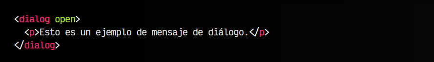

vista:
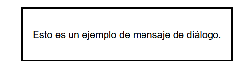

Al igual que vimos en la etiqueta < details >, la etiqueta < dialog > tiene un atributo open que de no establecerlo, se considera que la ventana de diálogo está cerrada (tiene un display: none de CSS por defecto), por lo que no se muestra.

Como puedes ver, la forma de crear ventanas de diálogo es muy sencilla. En el interior de < dialog > puedes indicar toda la información que queramos mostrar en la ventana:

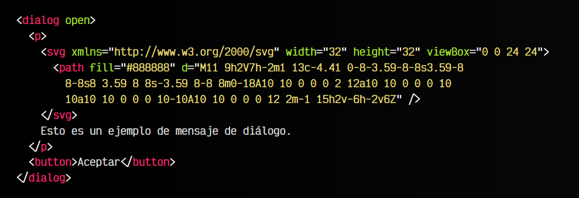

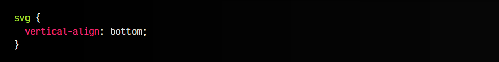

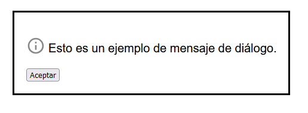

Además, aunque la etiqueta < dialog > ya tiene un CSS mínimo para que se vea bien, mediante CSS podemos darle estilo como a cualquier otro elemento HTML, convirtiendo nuestra ventana de diálogo en algo más bonito de lo que viene por defecto, aplicando colores de borde, fondo, gradientes, sombras y otros detalles.

## Interacción con la ventana.
Sin embargo, habrás comprobado que en el ejemplo anterior, a pesar de existir un botón, este no tiene funcionalidad, ya que aún carece de código Javascript donde darle la funcionalidad. Además, también sería interesante tener un botón (o una forma) de abrir el mensaje de diálogo, y que por defecto esté cerrado (oculto).

Para ello, tenemos que usar algo de Javascript. Observa el siguiente ejemplo. Comprobarás que no aparece nada visualmente (es normal, sigue leyendo):

html:
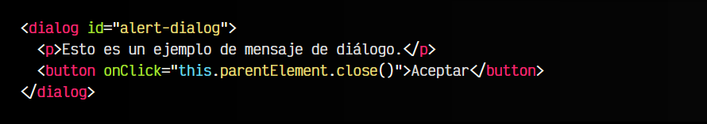

vista:

En este fragmento de código hemos añadido varios detalles:

   - La etiqueta < dialog > tiene un id para identificarla posteriormente.
   - La etiqueta < dialog > no tiene atributo open por lo que estará oculta por defecto.
   - Al < button > del diálogo, le hemos puesto un evento onClick
   - Ese evento, hace referencia al botón (this), al < dialog > que es su elemento padre (this.parentElement) y ejecuta el método .close() de ese elemento padre, para cerrarlo.

Pero insistimos, no aparece nada en el navegador.

Esto ocurre porque el < dialog > no tiene el atributo open. Añadimos otro botón externo con el id con valor show-button. Mediante Javascript, vamos a darle funcionalidad a este botón para que abra la ventana de diálogo:

html:
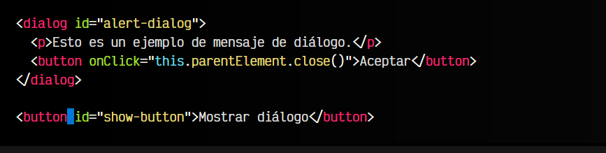

js:
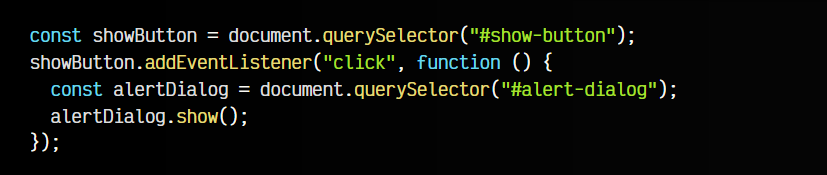

vista:
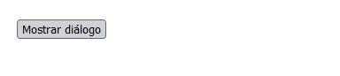
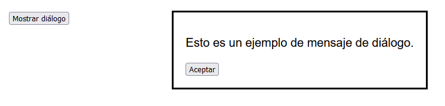

En este caso, estamos localizando el botón con id a #show-button y escuchando los eventos de click sobre él. Cuando ocurra alguno, localizamos la ventana de diálogo con id a #alert-dialog y la mostramos ejecutando el método .show().

## Diálogos modales.
Como hemos comentado anteriormente, una ventana modal es un tipo de ventana que se muestra al usuario, generalmente, para avisarle de algo o pedirle una información necesaria para continuar. Se caracteriza en que una vez se muestra, no se le permite interactuar con cualquier otro elemento de la página hasta que atienda el mensaje de esa ventana modal.

Para crear una ventana modal con la etiqueta < dialog > usaremos exactamente el mismo código anterior, sólo tendremos que cambiar el método .show() por .showModal():

html:
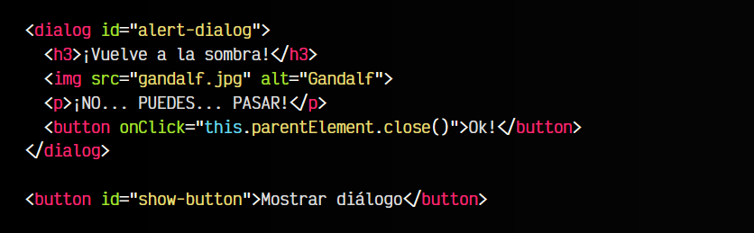

css:
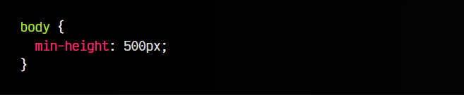

js:
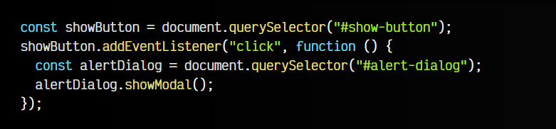

vista:
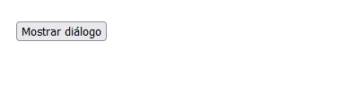
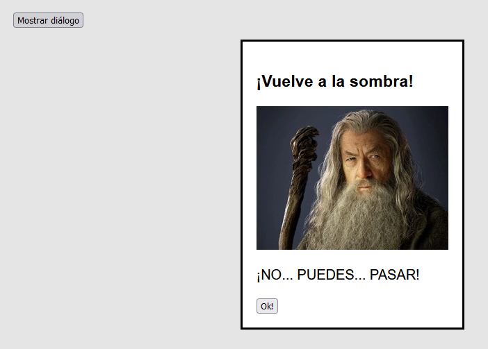

Esto nos permitiría mostrar una ventana modal, que tiene algunas diferencias con el ejemplo anterior de la ventana de diálogo no modal:

Diferencias:

   - Por defecto, el fondo se oscurece un poco.
   - La ventana se suele centrar también verticalmente, para centrar la atención en ella.
   - Sólo puede haber una ventana modal, ventanas normales pueden existir varias.
   - La más importante: No deja interactuar con ningún otro elemento de la página.

## Estilo del fondo del modal.
Aunque el navegador ya nos muestra algunos cambios visuales en el fondo de una ventana modal, nosotros podemos hacer más cambios utilizando el pseudoelemnto CSS ::backdrop sobre la ventana de diálogo. De esta forma, podremos darle estilos al fondo de la ventana modal, y así enfatizar la importancia de nuestra ventana:

html:
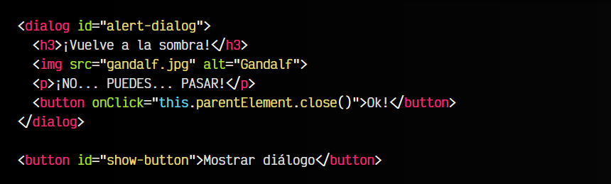

css:
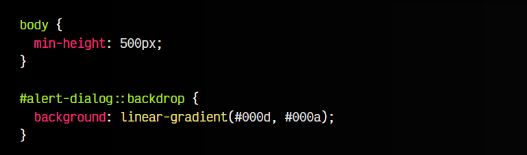

js:
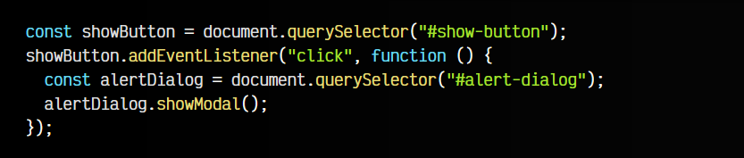

vista:
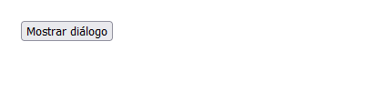
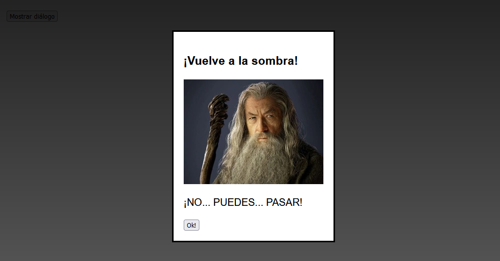

Observa que hemos establecido un fondo con un gradiente lineal CSS que va desde un color negro con cierta transparencia, hasta otra tonalidad de color negro con algo más de transparencia. Por supuesto, el desarrollador puede personalizar estos estilos a su gusto para que encajen con el diseño de la página o la situación correspondiente.