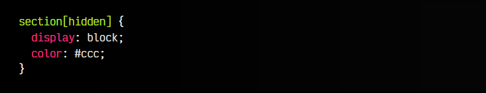

# 
El atributo hidden.

En muchas ocasiones, cuando queremos ocultar un elemento lo hacemos con CSS utilizando las propiedades display: none, visibility: hidden, opacity: 0 o alguna similar. Sin embargo, es complicado saber por qué razón hemos ocultado ese elemento. Lo ideal sería tener una forma de saber si semánticamente tiene sentido que un elemento esté oculto, por ejemplo, por que estamos enfocados en otra sección, y la sección oculta no es relevante en este momento.

## Ocultación semántica.
Con el atributo hidden hacemos desaparecer visualmente un elemento HTML (y todo su contenido, si está en una etiqueta contenedora). Hasta ahora, para realizar esta tarea teníamos que recurrir a CSS, ya que se trata de una cuestión de presentación visual.

Por otro lado, el attributo hidden se debe utilizar en situaciones donde el usuario ha realizado una acción y hay una serie de elementos que queremos ocultar porque ya no son relevantes para el estado en el que se encuentra la web o aplicación, independientemente de los estilos que se le estén aplicando en la página:

html:

vista:

Observa el fragmento de código anterior y comprobarás que hay dos secciones, donde la segunda está oculta por defecto, ya que queremos que el usuario se enfoque en la primera. Si accede a la segunda sección o realiza una acción determinada, tendríamos que hacer el cambio para que se oculte la primera y se elimine el atributo de la segunda.

## El atributo hidden vs display: none
.
El atributo hidden no tiene ninguna magia extraña. Simplemente se trata de un atributo, que cuando un elemento lo incorpore, el mismo tendrá un display: none por defecto. Sin embargo, nosotros podemos cambiar el estilo mediante CSS si lo deseamos. Por ejemplo, queremos que nuestro elemento con atributo hidden tenga el texto visible pero en gris.

Ahora las secciones no aparecerán ocultas, sino que aparecerán con el texto de color gris, para destacar que la sección importante es la que no tiene el atributo hidden.

No hagas esto. Es sólo un ejemplo para que comprendas la «magia» que está por detrás.

## Ocultando desde Javascript.
Continuemos con el HTML del ejemplo anterior, vamos a añadirle un botón HTML y cuando el usuario pulse ese botón queremos ocultar el < section > que estamos mostrando, y mostrar el < section > que tenemos oculto. El código a ejecutar sería el siguiente:

js:

html:

vista:

De esta forma, estaríamos conmutando uno y otro. Si ampliasemos este ejemplo y añadieramos CSS, podríamos crear un sistema de pestañas o ejemplos algo más avanzados.

## El valor until-found .
Una característica interesante es la de aplicarle el valor until-found al atributo hidden. De esta forma, le indicamos al navegador que el elemento debe estar oculto hasta que el usuario vaya explícitamente a esa sección.

Veamos un ejemplo:

Al pulsar en el enlace < a > que tiene un ancla hacia el elemento con id="section-2", el navegador desbloquea ese elemento y elimina el atributo hidden, por lo que se comienza a visualizar.