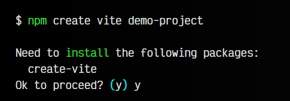
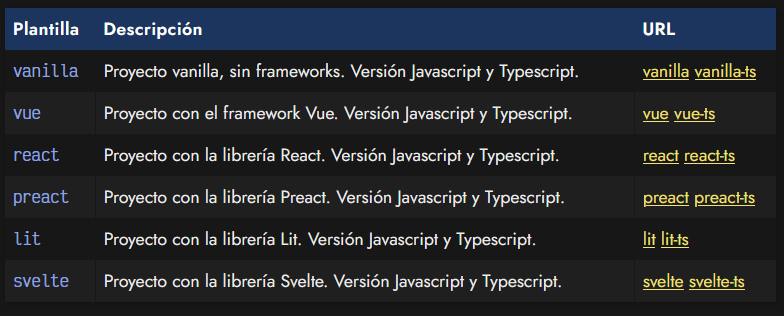

# 
Tutorial inicial de Vite.

Vite se define como una herramienta de frontend que te ayudará a crear tus proyectos de forma agnóstica (sin atarte a ningún framework concreto) y que su desarrollo y construcción final sea lo más sencilla y cómoda posible. Está desarrollada por Evan You, el creador de [Vue](https://lenguajejs.com/vuejs/).

Actualmente, Vite soporta la creación tanto de proyectos vanilla (sin utilizar frameworks), como proyectos utilizando Vue, React, Preact, Svelte o Lit (tanto usando Javascript como Typescript).

## Crear un proyecto con Vite.
Para comenzar, simplemente necesitamos tener instalado NodeJS. Utilizaremos npm para comenzar el proyecto. Escribimos desde una terminal:

El comando npm create vite hará toda la magia por nosotros. En nuestro ejemplo, demo-project sería el nombre de la carpeta del proyecto, por lo que este comando ya se encargará de crear la carpeta, ni siquiera tendremos que crearla nosotros.

Se nos advertirá que es necesario instalar el paquete create-vite de no tenerlo instalado, que es el asistente encargado de crear la aplicación web. Al responder afirmativamente, nos aparecerá un menú para seleccionar que plantilla queremos utilizar (al elegir una, luego nos preguntará si queremos la versión javascript o typescript).

## Plantillas de Vite.
Si no queremos que nos aparezca ese menú interactivo, es posible indicar un parámetro opcional --template para especificar directamente la plantilla a utilizar sin que nos salte el asistente:

Las plantillas que tenemos disponibles en Vite son las siguientes (son las que se establecen al elegir las opciones en el menú):

Una vez hecho el proceso, comprobaremos que la tarea de creación del proyecto es prácticamente instantánea. Esto ocurre así porque Vite no realiza el proceso de instalación de paquetes automáticamente, por lo que tendremos que hacerlos nosotros manualmente de forma posterior:

Con esto ya tendremos el proyecto listo para arrancarlo con el script npm run dev y comenzar a desarrollar. Ten en cuenta que en todos los proyectos que generes tendrás un script dev que lanza el modo de desarrollo de Vite y, por otro lado, tendrás un script build que lanza el modo de producción de Vite, que es el que genera la subida en la carpeta dist, que es la que irá a producción.

## El fichero vite.config.js.
En algunos proyectos de Vite encontrarás un fichero vite.config.js. Se trata de un fichero de configuración donde puedes establecer algunos detalles del funcionamiento del empaquetador en el proyecto actual. La estructura general de este fichero es la siguiente:

Dependiendo de la plantilla utilizada, este fichero de configuración puede ser diferente o incluso no existir (como es en el caso de los proyectos de Javascript vanilla).

Si te interesa utilizar un script que funcione con Vite y ya te proporcione la estructura de carpetas y los linters de Javascript y CSS preconfigurados, echa un vistazo a [mkweb](https://manz.dev/software/mkweb).

