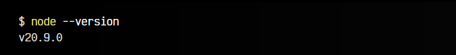
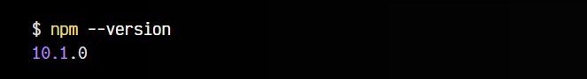

# 
¿Qué es NodeJS?

En 2009, aparece un entorno multiplataforma llamado NodeJS. La idea era sencilla: Dada la popularidad en ascenso de Javascript, que en ese momento sólo era posible utilizarlo dentro de un navegador, se ideó un sistema que «sacara» Javascript del navegador, haciendo posible ejecutarlo en cualquier lugar fuera de él, por ejemplo, en un servidor web, convirtiéndolo en un lenguaje de servidor y no sólo un lenguaje de cliente (navegador) como hasta el momento.

## Requisitos previos.
NodeJS es un entorno multiplataforma, por lo que da igual si se trata de un sistema operativo Windows, Mac o GNU/Linux, NodeJS es capaz de ejecutarse en cualquiera de ellos. Sin embargo, y de forma totalmente subjetiva por quién escribe estas lineas, si estás utilizando un sistema operativo Windows, te recomiendo tomarte un tiempo en instalar y configurar WSL.

WSL (Windows Subsystem for Linux) es un sistema que te permite disponer de una terminal de Linux como si fuese nativa, lo que simplifica muchísimo el desarrollo web, ya que en la mayoría de los casos, terminamos creando desarrollos para subirlos a máquinas Linux.

Si te interesa instalar WSL, aquí tienes una Guía de Instalación de WSL y una Lista de dudas de configuración de WSL, por si te surgen errores o problemas.

## Instalación de Node.
Javascript viene integrado en los navegadores, sin embargo, para utilizar NodeJS necesitaremos instalarlo en nuestro sistema. Esto se puede hacer desde la web oficial de NodeJS, donde se instalará de una forma u otra dependiendo del sistema operativo que utilices.

Existen varias formas de instalar NodeJS:

   - Instalar Node mediante PNPM utilizando WSL (mi recomendación)
   - Instalar NodeJS con NVM utilizando WSL
   - Instalar NodeJS mediante winget/fnm, que no requiere WSL

Antes de continuar, te recomiendo abrir una terminal y escribir el siguiente comando:

Si el comando anterior te da un error o te devuelve una versión inferior a v18, te recomiendo revisar los enlaces anteriores y actualizar tu NodeJS, pues que algunas de las cosas que veremos pueden no estar disponibles para tu versión instalada.

## Instalación de NPM.
NodeJS incorpora un sistema instalador de paquetes llamado NPM, que nos permitirá instalar las librerías de terceros que necesitemos para desarrollar nuestra aplicación de forma sencilla y rápida.

   - PNPM: Un instalador paralelo mejorado de NPM (mi recomendación)
   - Yarn: Un instalador de NPM mejorado.
   - NPM: El instalador oficial de NodeJS (ya viene instalado con NodeJS)

Nuevamente, para comprobar que todo está bien instalado y funcionando correctamente, escribe en una terminal:

Si te devuelve una versión menor a 10, te recomiendo actualizarlo.

Si estás empezando, da igual cuál uses. Incluso, es mejor NPM, que viene por defecto. Con el tiempo, probablemente NPM te parezca muy lento y quieras dar el salto a PNPM. Al principio, no importa.

## Conocimientos de Javascript.
Antes de continuar con NodeJS, debes saber que Node se basa en el lenguaje de programación Javascript, por lo que es importante que controles bien este lenguaje. Si no lo tienes, considera tu caso de los siguientes:

   - Si estás empezando a porgramar, primero lee los Fundamentos de la programación.
   - Si ya sabes programar pero no conoces Javascript, accede a Javascript para familiarizarte con el lenguaje.
   - Si ya tienes experiencia en Javascript, puedes continuar.