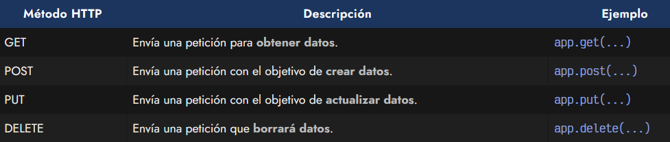
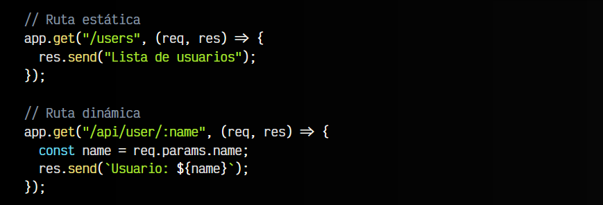
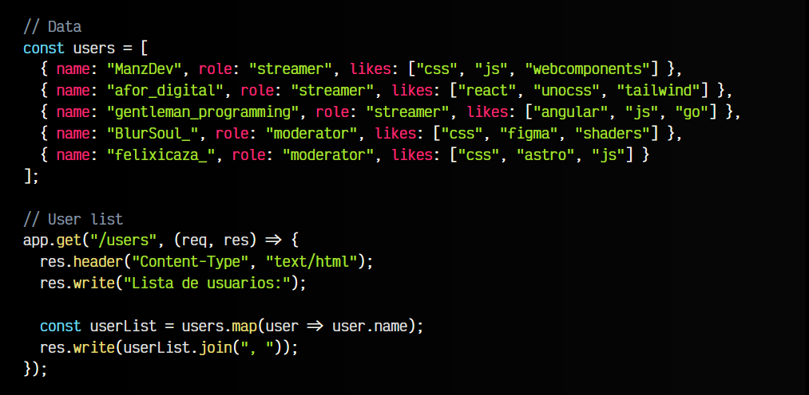
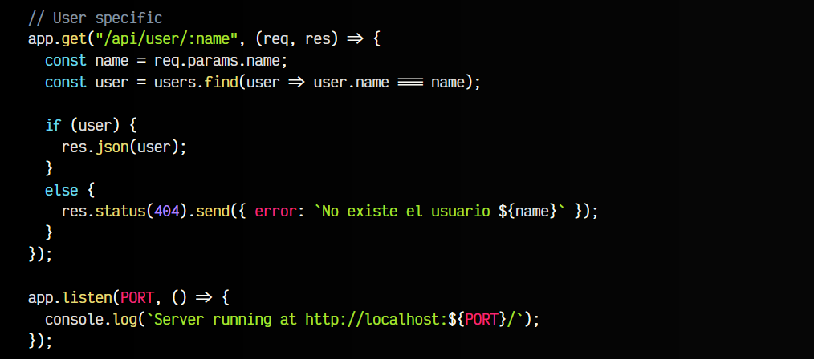

# 
Crear una API REST en Node

En el artículo anterior vimos una Introducción a Express, con la cuál podríamos crear una API restful muy sencilla. Vamos a extender sus funcionalidades para poder hacerlo más flexible.

## Verbos HTTP.
Hasta ahora, en nuestro código, habíamos creado rutas de esta forma:

Si observas el código, ten en cuenta que estamos ejecutando el método app.get(). Utilizamos get porque estamos realizando una petición GET, sin embargo, existen otros verbos que podemos utilizar (siempre con el método en minúsculas):

Dependiendo del objetivo de nuestra petición deberíamos utilizar uno u otro.

## Rutas dinámicas.
En nuestro ejemplo anterior, la ruta o endpoint /users nos mostraría una lista de usuarios. Sin embargo, si quisieramos agregar más endpoints para cada uno de los usuarios, tendríamos que ir añadiendo nuevos endpoints manualmente, y esto no es algo cómodo si tenemos muchos.

Para evitar esto, podemos utilizar rutas dinámicas. Las rutas dinámicas nos permiten definir una ruta con parámetros. Por ejemplo:

En esta situación, si accedemos a la URL http://localhost:4321/users nos mostraría el texto Lista de usuarios. Pero si accedemos a la URL http://localhost:4321/api/user/ManzDev nos mostraría el texto Usuario: ManzDev. Esto lo hace porque mediante req.params.name estamos accediendo al valor del parámetro :name, que es el nombre que le hemos dado al escribir la URL.

   - IMPORTANTE: Ten en cuenta que la información que llega a través de los parámetros de req.params viene directamente del usuario y podría ser información maliciosa. Nunca confíes en los datos que provienen del usuario. Más adelante veremos como validarlos para evitar que sean maliciosos.

## Ejemplo completo.
Vamos a construir un ejemplo completo, donde creamos un servidor que escucha las rutas del navegador y si indicamos una ruta /users o /api/user/:name nos devuelva la lista de usuarios o la información del usuario indicado:

Observa que el código empieza a crecer y se vuelve más difícil de leer. Esto puede convertirse en un problema rápidamente, porque a medida que aumentamos la aplicación, tendremos que ir añadiendo nuevas rutas.

Algunas consideraciones del código anterior:

   - 1️⃣ En el futuro, la información de los usuarios debería estar en una base de datos. De momento, la tendremos en un array o un JSON para simplificar.

   - 2️⃣ Observa que tenemos dos endpoints que tienden a crecer y ser difíciles de leer. Sería una buena idea separarlos en archivos diferentes. Es lo que haremos en el próximo artículo.

