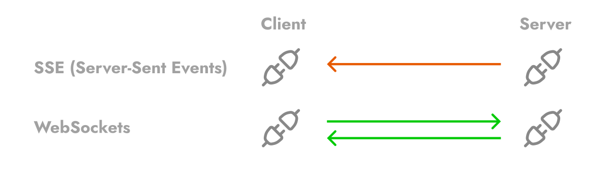

# 
¿Qué son los WebSockets?

Los WebSockets son una tecnología que está especialmente diseñada para comunicarnos de una forma rápida, ideal en aplicaciones de tiempo real. El punto principal al que nos referimos es que podemos enviar y recibir datos continuamente sin tener que estar actualizando la página.

El término socket proviene de un mecanismo de comunicación, donde dos elementos se comunican entre sí para intercambiar datos de forma ininterrumpida, fiable y ordenada. En estos esquemas de comunicación se suele utilizar una arquitectura llamada cliente-servidor, donde el elemento que pide información es el cliente y el que ofrece la información es servidor.

Antes de comenzar a hablar de WebSockets, quizás también sería conveniente hablar de SSE (Server Sent Events), una tecnología muy similar, pero con diferencias importantes.

## SSE (Server-Sent Events).
El nombre SSE viene de eventos enviados por el servidor. Es también un sistema de comunicación cliente-servidor, pero en este caso, el cliente se conecta al servidor y es el servidor el que envía los datos. El cliente se limita a recibirlos.

A grandes rasgos, en el caso de los SSE, simplemente utilizamos el sistema de eventos tradicional, pero lo adaptamos a una tecnología llamada EventSource, que se encarga de abrir una conexión persistente y enviar eventos a través de ella.

Un detalle importante es que en este tipo de comunicación, la información sólo puede fluir de servidor al cliente, pero no al revés. Sin embargo, la comunicación con el servidor es mucho más eficiente que con los WebSockets y consume menos recursos.

En el siguiente artículo puedes ver un ejemplo de comunicación utilizando [Server-Sent Events](https://lenguajejs.com/nodejs/websockets/server-sent-events/).

## WebSockets.
En el caso de los WebSockets, también hablamos de una comunicación cliente-servidor, pero la principal diferencia respecto a los SSE es que los WebSockets son bidireccionales, y por lo tanto pueden transmitir información tanto desde servidor a cliente como de cliente a servidor.

Por citar un aspecto negativo, el consumo de recursos al utilizar WebSockets es más elevado que al utilizar Server-Sent Events. Por norma general, el uso de Server-Sent Events podría estar justificado si no requieres una comunicación bidireccional. En caso contrario, usar WebSockets suele ser una mejor opción.

En el siguiente artículo puedes ver un ejemplo de comunicación utilizando WebSockets.

## Alternativas.
Existen algunas herramientas relacionadas con WebSockets y el ecosistema de NodeJS, como por ejemplo las que puedes ver reflejadas en esta tabla:

