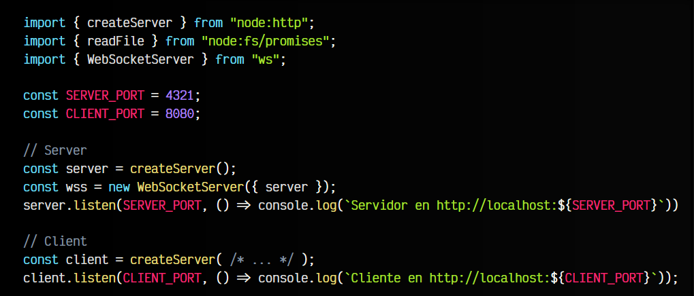
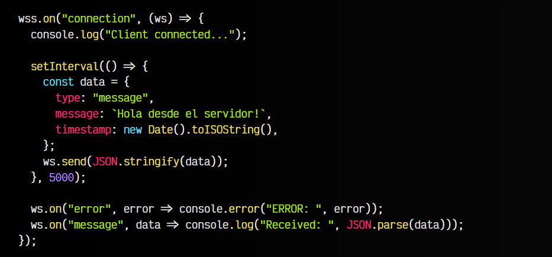
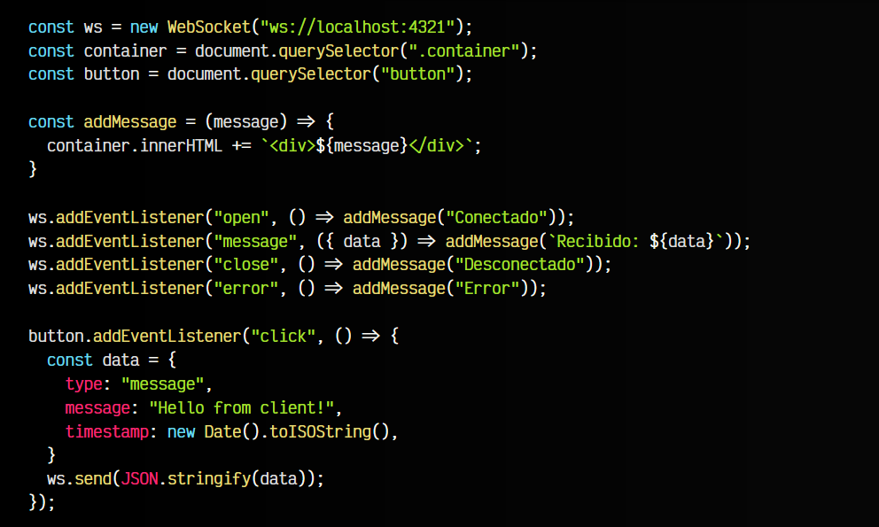
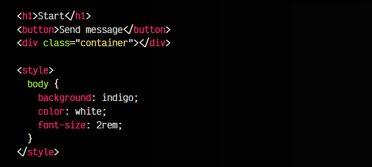

# 
Usando WebSockets con ws

En el artículo anterior hicimos un ejemplo con Server-Sent Events. Ahora vamos a ver como hacerlo utilizando WebSockets y así poder enviar y recibir mensajes desde ambos extremos, tanto desde el cliente como desde el servidor.

## Estructura principal del ejemplo.
o primero es crear la estructura general del ejercicio. En este caso vamos a hacer dos servidores: server escuchando en el puerto 4321 y client escuchando en el puerto 8080. Observa que estamos creando un servidor de WebSockets con la librería ws, pasándole el servidor server que creamos como parámetro:

Atento a wss, que es la instancia del servidor de Web Socket Server con la que vamos a estar trabajando a continuación.

## El servidor.
Vamos ahora a implementar el servidor. Observa que todo ocurre dentro del evento connection, que se produce cuando se realiza una conexión de un cliente con el servidor de WebSockets (lo veremos más adelante, en El cliente).

En ese fragmento de código, lo más importante es el objeto ws que tenemos como parámetro, que es el WebSocket en cuestión:

Una vez el cliente se conecte, ejecutamos un setInterval() que enviará mensajes al cliente cada 5 segundos utilizando ws.send(). Además, estará escuchando mensajes de error y mensajes recibidos desde el cliente, para mostrarlos por consola.

## El cliente.
Por otro lado, recuerda que en este ejemplo estamos abriendo un cliente y un servidor. El cliente está escuchando en el puerto 8080, por lo que si accedemos a http://localhost:8080´ nos abrirá el fichero index.html`, similar a como hicimos en el post Devolviendo una página estática.

Dicha página index.html tiene el siguiente contenido:

   - 1️⃣ Un HTML donde tenemos un < h1 >, un < button > y un contenedor para los mensajes.
   - 2️⃣ Una etiqueta < style > donde tenemos los estilos CSS básicos de la página.
   - 3️⃣ Una etiqueta < script > donde tenemos la funcionalidad del cliente.

js:

html:

En la etiqueta < script >  lo que hacemos es conectarnos al servidor WebSocket ws://localhost:4321 que iniciamos en el apartado anterior.

Observa que escuchamos los eventos open, message, close y error. Cuando se produzca uno de ellos, añadiremos un mensaje en la página. Además, cuando hagamos click en el botón de la página, enviaremos un mensaje al servidor utilizando ws.send().

Como puedes ver, un ejemplo sencillo que nos permite enviar mensajes desde el servidor al cliente y desde el cliente al servidor. Ten en cuenta que incluso podrían ser aplicaciones diferentes.