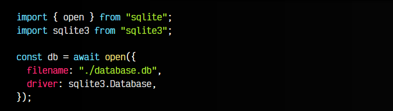
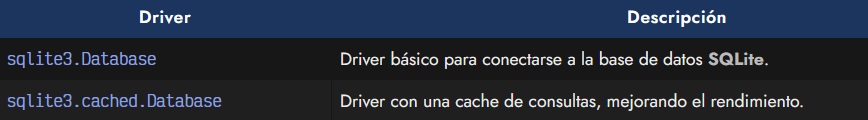
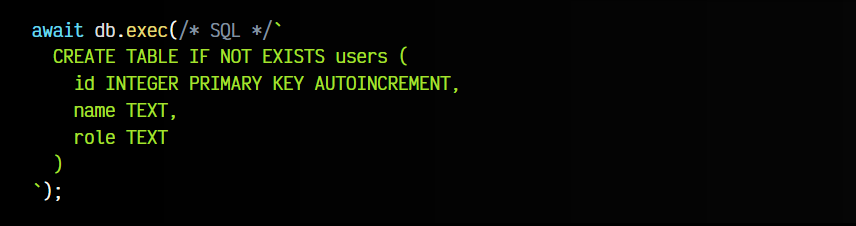
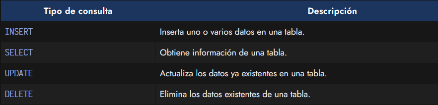
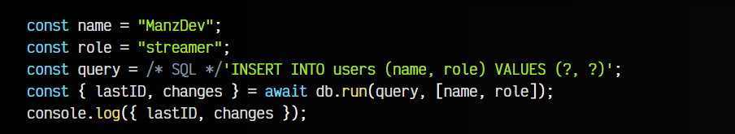
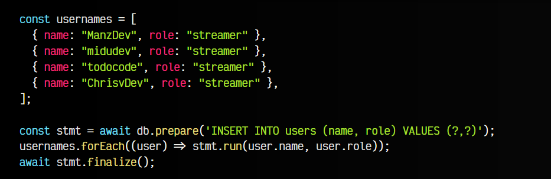
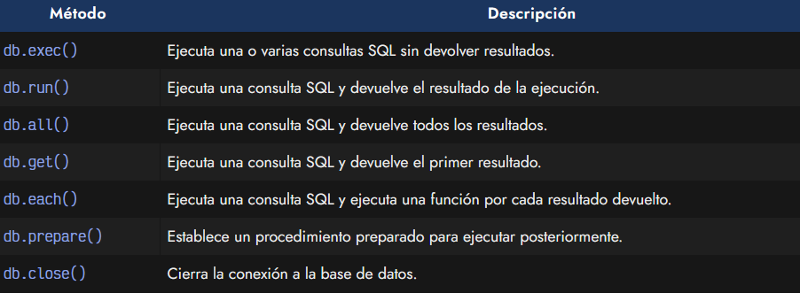

# 
Introducción a SQLite

Uno de los puntos más importantes de una aplicación web es la de administrar la información y datos de la misma. De forma ideal, dicha información debería estar aislada del código de la aplicación para que sea fácil de gestionar, mantener y actualizar. Para ello, se suelen utilizar las bases de datos.

En este artículo vamos a crear una base de datos SQLite y trabajar con ella. SQLite es un motor de bases de datos relacionales que se caracteriza por ser ligero, rápido y muy portable, ya que está basado en un sólo fichero, lo que hace muy sencillas sus tareas de mantenimiento.

En nuestro caso, es una excelente forma de empezar a trabajar con bases de datos e ir aumentando su complejidad o pasar a otra base de datos en el futuro si la situación lo requiere.

## Instalación y configuración.
En nuestro caso, vamos a utilizar sqlite, una librería para utilizar SQLite en NodeJS que no tiene dependencias y es compatible con promesas. Su configuración y utilización es muy sencilla. Para instalarla, simplemente ejecutamos en nuestro proyecto el siguiente comando:

Observa que también instalaremos sqlite3, paquete necesario para conectarse a la base de datos SQLite (driver), como veremos a continuación. Podríamos usar otros paquetes, siempre y cuando sean compatibles con la API de sqlite3.

Recomiendo la extensión de VSCode es6-string-html para escribir /* SQL */ antes de un consulta SQL, y dar un resaltado de sintaxis a color.

## Conexión a la base de datos.
Una vez instalados los paquetes, vamos a ver como conectarnos a la base de datos y crear una tabla inicial, que es donde vamos a guardar los datos.

Observa el siguiente fragmento de código:

Un poco más adelante, abrimos el fichero database.db, que es donde se guarda la base de datos. Si no existe, crea un fichero vacío para utilizarla. Observa que debajo indicamos un driver para conectarnos a la base de datos SQLite.

## Creación de la base de datos.
En SQLite (y en las bases de datos SQL en general) los datos se guardan en una estructura de datos llamada tabla. Dicha tabla debe tener varios campos, donde indiquemos el tipo de contenido que va a contener. Así que, antes de empezar, debemos formalizar estas reglas.

Lo haremos ejecutando el siguiente comando:

El método .exec() ejecuta una operación SQL que está creando una tabla users en la base de datos (si no existe, si existe mantiene sin cambios la que ya hay). Observa que en ese código indicamos los campos que tendrá la base de datos:

   - Un id numérico que se autoincrementa al insertar un nuevo usuario.
   - Un name, que será el nombre del usuario.
   - Un role, que será el rol del usuario.

Con esto tendríamos la base de datos creada y lista para utilizar.

## Realizar consultas.
Veamos ahora como se pueden hacer consultas a la base de datos. SQLite funciona mediante consultas SQL, de hecho, la anterior CREATE TABLE ha sido un ejemplo de consulta SQL para crear una tabla, indicando sus características.

En SQL existen varios tipos de consultas, las más populares se denominan CRUD (Create, Read, Update y Delete) y son las siguientes:

Existe muchos otros tipos de consultas, pero para empezar esta introducción vamos a realizar un SELECT para recuperar los datos que están en ese momento en la base de datos:

En este momento, como tenemos la tabla users recién creada, no tenemos datos en ella y está vacía, por lo que nos devuelve un array vacío. Así pues, vamos a realizar un INSERT para añadir datos a la base de datos:

En este caso, observa que estamos realizando una consulta de tipo INSERT donde pasamos por parámetro los datos a insertar en una consulta sencilla. En el valor devuelto por la función run(), desestructuramos el lastID y changes:

   - El elemento lastID nos devuelve el id del último usuario insertado.
   - El elemento changes nos devuelve el número de elementos que se insertaron.

Ahora, si volvemos a recuperar la información de de la base de datos, si que nos devolverá información que fue insertada en la consulta SQL anterior:

## Procedimientos almacenados.
Lo anterior eran simples consultas SQL lanzadas contra la base de datos. Sin embargo, existe otro mecanismo denominado procedimientos almacenados. Son algo más interesantes ya los envíamos a la base de datos para que los procese de forma anticipada y se anticipe a procesos de inserción que quizás van a ser más frecuentes.

Observa el siguiente ejemplo donde tenemos una estructura de datos usernames que vamos a insertar en la base de datos:

Lo que hacemos es utilizar db.prepare() para preparar un procedimiento almacenado en la base de datos y devolver un statement. Observa que dicho procedimiento es genérico. Es realmente en la siguiente linea, donde recorremos con un .forEach() la estructura de datos para ejecutar run() sobre el statement devuelvo anteriormente. En esa acción lo que hacemos es devolver la información a insertar.

Observa que esa acción se realizará varias veces, por lo que para terminar realizaremos el stmt.finalize(), que indicará al sistema que ha terminado de introducir los datos. ¡No te olvides de los await de inicio y final!

## Cerrar la conexión.
Puede parecer que no es importante, pero no debes olvidarte de cerrar la conexión con la base de datos. Esta acción es importante para prevenir posibles problemas de rendimiento o consumo de recursos:

Recuerda que los cambios en la base de datos SQLite se guardan en el fichero database.db que indicamos al principio de la conexión a la base de datos.

## Métodos de SQLite.
Recuerda que SQLite tiene varios métodos interesantes para utilizar. Te hago una tabla resumen con varios de ellos:

