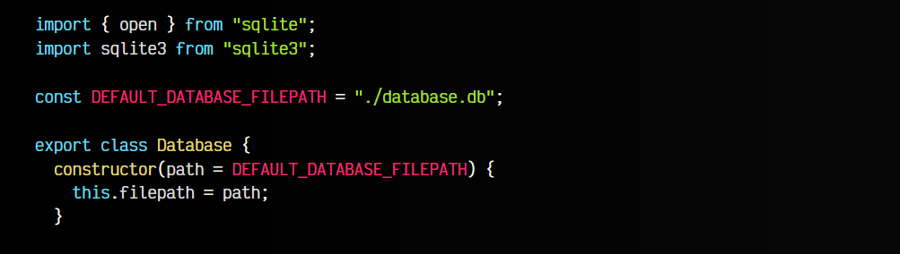
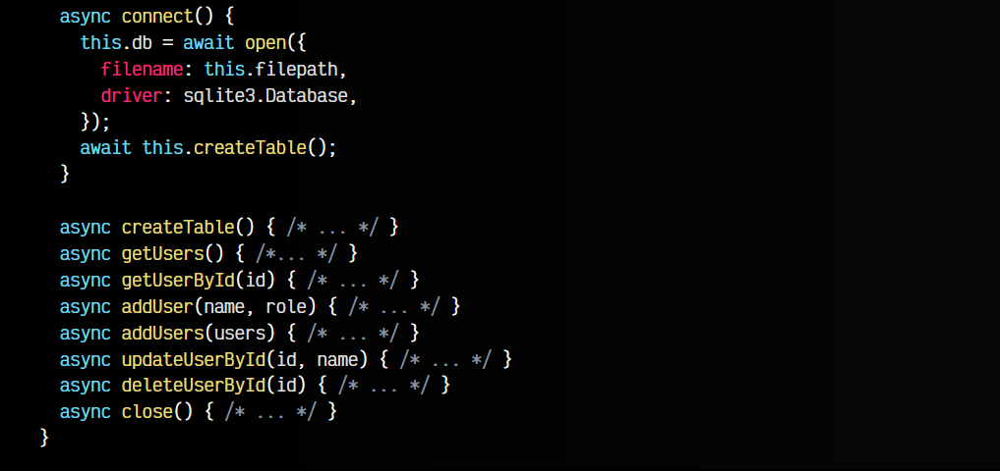
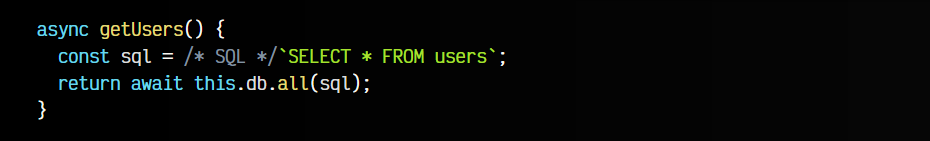
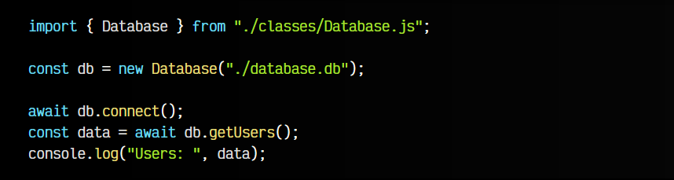
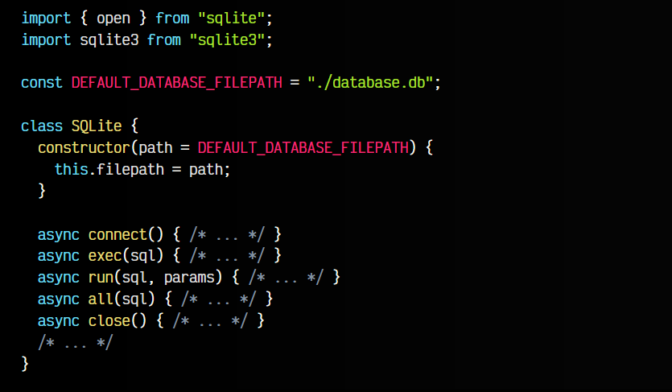
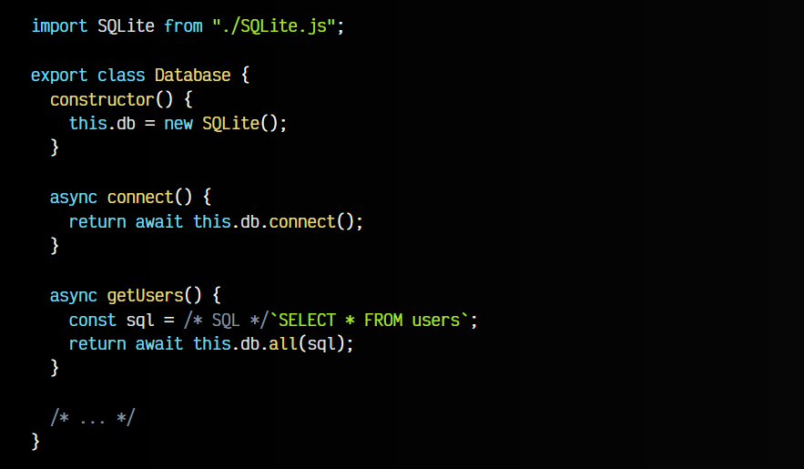

# 
Abstracción de SQLite

En el último artículo vimos unos primeros pasos para utilizar una base de datos SQLite dese NodeJS. Sin embargo, los ejemplos de código eran muy directos y simples para entender el funcionamiento. Si nuestra aplicación crece un poco más, se va a hacer difícil encontrar las cosas en el código y se complicará su mantenimiento.

La mejor forma de gestionar esto, por varias razones, es abstraer la base de datos del código de nuestra aplicación. Una forma sencilla de realizar esto es crear una clase (OOP) para encapsular los métodos que se encargan de conectarse a la base de datos y realizar las consultas SQL.

Vamos a partir del ejemplo anterior, a ampliarlo un poco y a abstraerlo en una clase llamada Database.

## Creación de la abstracción.
Observa que nos vamos a llevar casi toda la lógica del ejemplo anterior, a una clase Database donde vamos a realizar la conexión a la base de datos. Dividiremos todo en varios métodos clave y guardamos en una propiedad this.db la conexión a la base de datos cuando creemos una instancia de esta clase:

Es importante tener los métodos de connect() de conexión a la base de datos y opcionalmente createTable(), que en este caso la creamos para crear una tabla vacía en la base de datos si no existe previamente.

## Creación de la abstracción.
Observa que tendremos varios métodos como getUsers(), addUser(), addUsers(), close(), etc. que realizarán las operaciones atómicas internamente y nos permitirán que sea más limpio y claro el uso de estos métodos desde fuera de la clase.

Por ejemplo, el método getUsers() nos devuelve todos los usuarios de la base de datos:

   - El método será async, ya que utilizamos promesas y el await en su interior.
   - La constante sql tiene la consulta SQL que realizamos.
   - Mediante .all() obtenemos todos los resultados y los devolvemos.

De la misma forma habría que ir implementando el resto de métodos que vamos a ir necesitando.

## Uso de nuestra abstracciónn.
Ahora, en nuestro index.js principal, simplemente podemos escribir el siguiente código para trabajar con la base de datos:

Ten en cuenta que para simplificar este ejemplo, aún no estamos controlando errores, ni detectando cuando no se realiza correctamente la conexión, etc. Esto habría que implementarlo más adelante también.

## Abstracción del motor.
Si lo deseamos, también podemos crear otra abstracción del motor de base de datos, permitiéndonos cambiar fácilmente el motor de base de datos en el futuro, si SQLite se nos queda corto, haciendo el menor número de cambios posibles. Para ello, debemos de tener muy claros algunos detalles:

   - Las consultas SQL deben ser estándar y funcionar en uno y otro motor.
   - Debemos crear dos abstracciones: una para las consultas y otra para el motor.

Veamos un ejemplo. Primero analicemos como quedaría nuestra abstracción SQLite, que se va a encargar de todo lo que tenga relación con la base de datos SQLite:

Observa que estamos creando un wrapper, una estructura envolvente que puede ser muy parecida a SQLite o más general y adaptada a nuestro caso, pero que envuelve completamente a la base de datos que utilicemos. De esta forma, podemos crearnos una clase MariaDB.js, una clase PostgreSQL.js, una clase LowDB.js que tengan métodos comunes y cambiar de uno a otro dependiendo de la base de datos que queramos utilizar.

Por otro lado, tenemos nuestra nueva clase Database, que se encargará de gestionar las consultas y lanzarlas a la base de datos que utilicemos, independientemente de cuál sea:

Como puedes ver, esta clase se encargaría simplemente de lanzar las consultas a los métodos de la base de datos que estemos usando, sea SQLite, PostgreSQL, MariaDB, LowDB o cualquier otra.