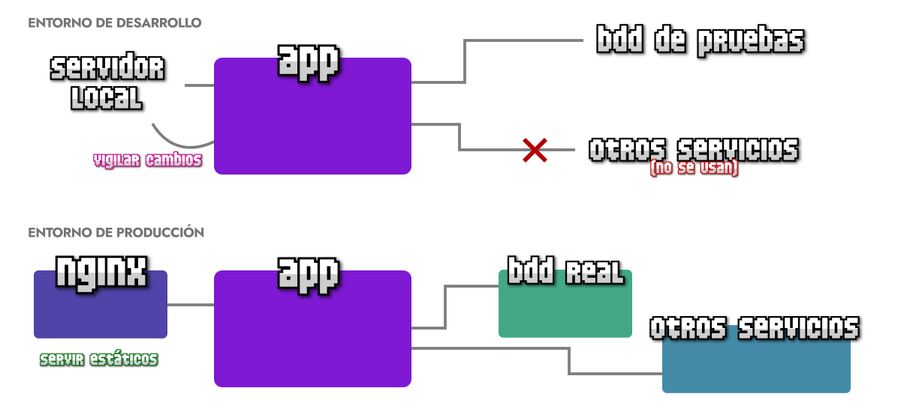

# 
¿Qué es un entorno de producción?

Podemos saber lo que es crear una aplicación de desarrollo de NodeJS, pero esto no implica que sepamos «levantar» o poner nuestra aplicación a funcionar en un servidor. Antes de nada, vamos a dar un repaso a algunos conceptos y aprender los detalles de un despliegue a producción antes de empezar a realizarlo.

## ¿Qué es «Producción»?.
Cuando estamos creando una aplicación, normalmente trabajamos en un entorno que se le llama entorno de desarrollo. Se trata de un ambiente donde vemos nuestro código fuente, lo revisamos, modificamos y mejoramos para añadir las funcionalidades que queremos que tenga nuestra aplicación o sitio web.

Por otro lado, cuando hablamos de un entorno de producción, a diferencia del entorno de desarrollo, nos referimos a un ambiente final listo para que los usuarios puedan utilizar nuestra aplicación.

¿Cuál es el objetivo de cada uno?

   - Entorno de desarrollo: Mejorar la calidad del código fuente y añadir funcionalidades.
   - Entorno de producción: Poner a disposición de los usuarios nuestra app de forma pública.

Hay que tener en cuenta que este proceso no se realiza una sola vez, sino que es constante. La creación de una aplicación o sitio web es un proceso que se suele alargar mucho en el tiempo, por lo que tenemos que estar continuamente mejorando nuestra aplicación, añadiendo características y publicando una versión estable de ella para los usuarios.

## ¿Por qué desarrollo y producción?.
Debemos ser conscientes que cuando estamos en un entorno orientado a desarrollo, utilizamos herramientas que sólo son necesarias en desarrollo:

   - 1️⃣ Linters o herramientas de búsqueda de errores de código
   - 2️⃣ Plugins o extensiones para automatizar o realizar tareas de desarrollo
   - 3️⃣ Herramientas o tareas de transpilación de código
   - 4️⃣ Levantamos un servidor local para vigilar y ver los cambios del código

De la misma forma, hay muchas herramientas que son necesarias en producción y en desarrollo están ausentes:

   - 1️⃣ Seguridad: Evitar usuarios maliciosos y ataques o uso malintencionado
   - 2️⃣ Rendimiento: Si tenemos muchos usuarios, la aplicación debe aguantar el tráfico
   - 3️⃣ Simplificación: En desarrollo se falsean datos (acceso a base de datos, datos sensibles, etc)
   - 4️⃣ Estabilidad: La aplicación debe estar funcionando mientras los desarrolladores cambian cosas

De hecho, en muchas empresas o equipos de desarrollos, hay incluso más entornos diferentes: entornos de pruebas, entornos de pre-producción, etc. Todo depende de la situación y exigencias de cada proyecto.

## ¿Qué es un despliegue?.
Se le llama despliegue al proceso de pasar una aplicación de un entorno de desarrollo a un entorno de producción. Puede parecer una tarea sencilla, pero dependiendo de nuestra aplicación, de la estrategia utilizada, de la cantidad de personas trabajando y del tamaño de la misma, puede ser un proceso verdaderamente complejo.

Una vez tenemos la aplicación funcionando en desarrollo, con las características desarrolladas de forma adecuada, lo ideal es automatizar el proceso de forma que sea muy sencillo «pulsar un botón» y pasar esa versión de la aplicación a producción sin tener que preocuparse por los detalles técnicos.

Para llegar a esto, tenemos que conocer bien nuestra aplicación y automatizar todos sus cambios, de forma que sea muy sencillo a la hora de desplegar.

Veamos un hipotético ejemplo:

Observa que en nuestro entorno de desarrollo ocurren varias cosas:

   - Usamos un servidor local que vigila ante cambios de código para recargar: Esta funcionalidad no es necesaria en producción. De hecho, este tipo de servidores están enfocados a desarrollo, no son ideales para usarse de cara a los usuarios.

   - Nuestra app se conecta a una base de datos de pruebas que utilizamos en desarrollo, pero en producción debe conectarse con la base de datos real, que tendrá otro nombre, dirección, etc... es decir, otra configuración.

   - Nuestra aplicación de desarrollo es posible que no utilice otros servicios, pero a la hora de ponerla en producción, debe funcionar con otros servicios correctamente, por lo que debe estar correctamente configurada.

De todo esto sacamos una conclusión, en el entorno de desarrollo necesitamos una configuración, mientras que en el entorno de producción necesitamos otra diferente. Lo ideal sería sacar estos datos que son diferentes dependiendo del entorno, y aislarlos de nuestro código fuente.

¿Cómo lo hacemos? Esto se suele hacer utilizando algo que se llama variables de entorno (Environment variables) y que veremos en el siguiente artículo.