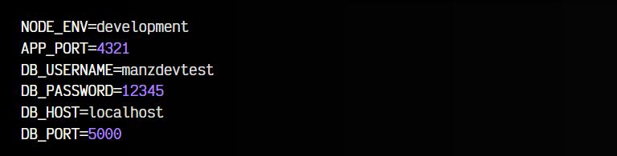
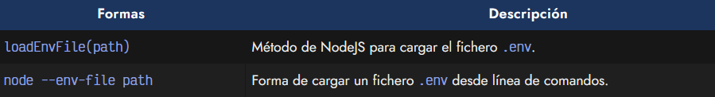
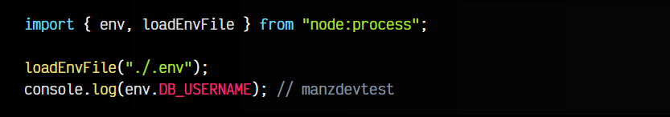
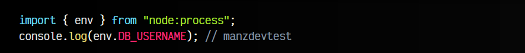

# 
Variables de entorno en NodeJS

Como hablamos en el post ¿Qué es un entorno de producción?, necesitamos separar la configuración sensible a nuestro entorno de desarrollo y producción y separarlo en archivos de configuración aislados del código. Y para eso vamos a utilizar variables de entorno.

## ¿Qué es una variable de entorno?.
Las variables de entorno (environment variables) son un conjunto de variables que nos permiten almacenar datos sobre nuestra aplicación que varía dependiendo del entorno que estés usando. Por ejemplo, en nuestro entorno de desarrollo conectamos a una base de datos de prueba, mientras que en producción nos conectamos a una base de datos real.

En nuestro código, en lugar de utilizar la dirección de la base de datos directamente, utilizaremos una variable especial que tendrá la dirección de la base de datos de prueba si estamos trabajando en el entorno de desarrollo y la dirección de la base de datos real si estamos en el entorno de producción.

Estas variables se suelen guardar en un archivo llamado .env y en ella se suelen guardar datos que varían dependiendo del entorno, así como nombres de usuario o contraseñas, que son también sensibles a cambios frecuentes y no queremos que estén acoplados al código fuente.

## Creando variables de entorno?.
Como hemos dicho, el primer paso es crear un fichero .env en nuestro raíz del proyecto. En su interior crearemos las variables en mayúsculas (separadas por guión bajo si se necesita) seguido de un = con el valor correspondiente:

Observa que todos estos datos son los que utilizaremos en nuestro entorno de desarrollo.

## Leyendo variables de entorno.
Para leer variables de entorno desde NodeJS, podemos utilizar dos formas diferentes. El método loadEnvFile() de node:process o ejecutar el parámetro --env-file desde la línea de comandos. En ambos casos, le pasamos la ruta del fichero .env que contiene las variables de entorno que queremos leer en nuestra aplicación:

Ten en cuenta que aunque solo estamos hablando de un archivo .env, podemos tener varios ficheros. Por ejemplo, un archivo .env.dev o .env.development para las variables del entorno de desarrollo, y un fichero .env.prod o .env.production para las variables del entorno de producción.

Veamos un ejemplo las dos formas para cargar ficheros de variables de entorno, con su linea de comando correspondiente para ejecutar dicho código.

## Usando el método loadEnvFile().
Mediante el método loadEnvFile() podemos cargar las variables del fichero .env que le indicamos por parámetro. Todas las variables quedarán cargadas en el objeto env de node:process:

js:

bash:

Si lo deseas, puedes desestructurar de env y sacar las variables fuera.

## Usando el parámetro --env-file.
Otra forma de cargar las variables de entorno, si no queremos indicarlo específicamente en el código, es indicarlo como un parámetro al ejecutar node desde la línea de comandos:

js:

bash:

Tradicionalmente, para obtener las variables de entorno se utilizaban aplicaciones de terceros como [dotenv](https://www.npmjs.com/package/dotenv). Sin embargo, en NodeJS ya se puede hacer de forma nativa y muy sencilla.
