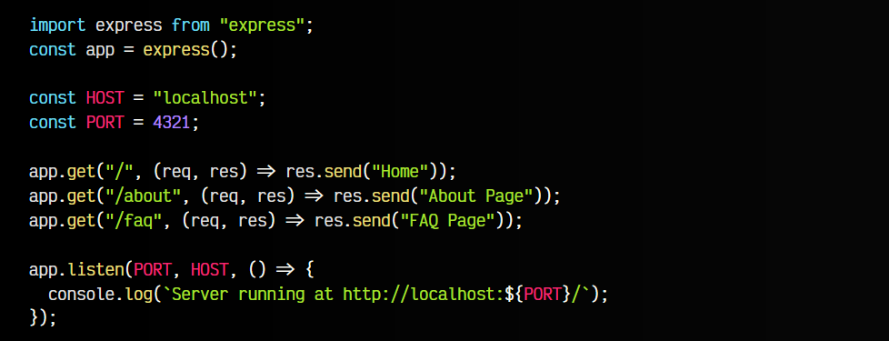
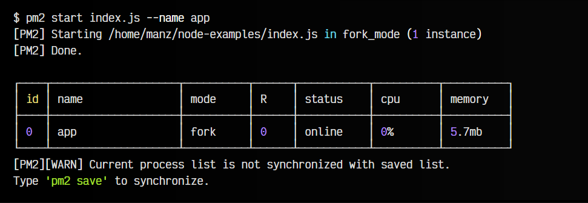
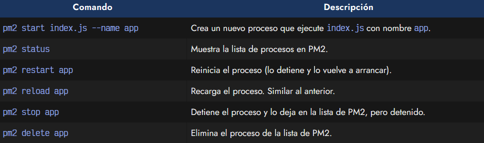
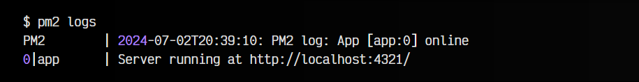
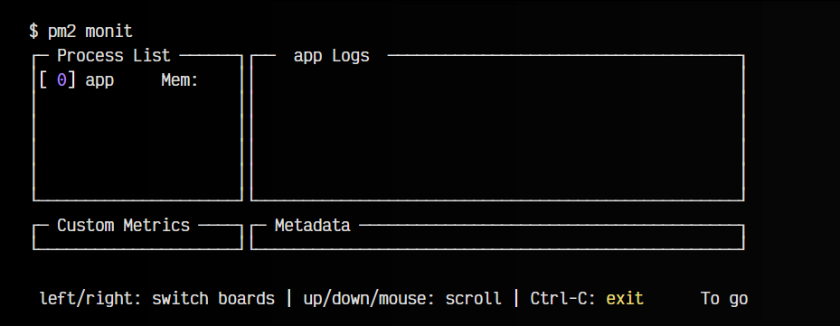
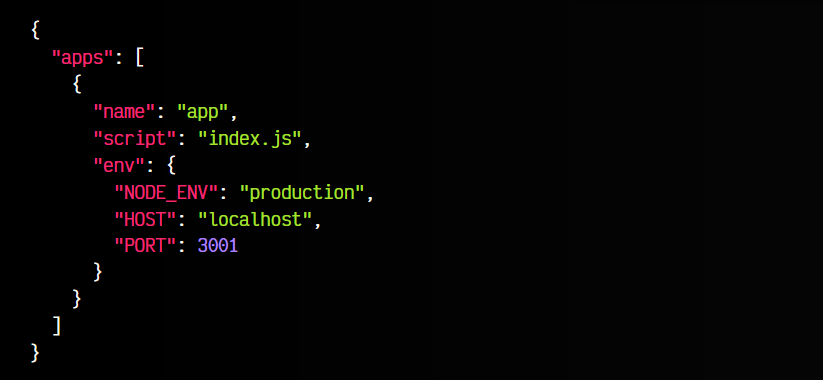
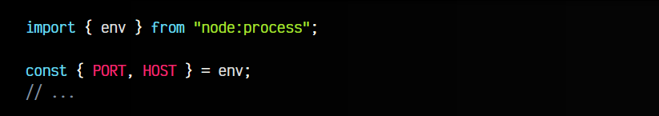

# 
PM2: Gestor de procesos

Realmente, pm2 es un sistema que nos permite gestionar los procesos activos en una máquina o servidor, y no tiene relación directa con NodeJS, sin embargo, se suele utilizar para gestionar el servicio de NodeJS, aunque es agnóstico a otras tecnologías.

## ¿Qué es PM2?.
PM2 es un sistema para gestionar los procesos que queremos mantener activos en una máquina. Esto nos permite dejar activos ciertos servicios de forma más cómoda, controlada y automatizada, sin tener que hacerlo de forma manual.

## Instalación de PM2.
Para instalar PM2, necesitaremos tener instalado NodeJS, por lo que si ya lo tenemos, sólo tenemos que instalarlo de forma global:

Esto pondrá a nuestra disposición el comando pm2, mediante el cuál podemos gestionar los procesos que queremos mantener activos.

## Añadir nuestra app a PM2.
Para empezar, vamos a crear un servidor muy sencillo con lo que hemos visto en el apartado de Introducción a Express. Creamos un fichero index.js como el siguiente:

Observa que este servidor está escuchando en http://localhost:4321 y tiene los endpoints /, /about y /faq, por si quieres probarlos cuando lo arranques.

Para ejecutar esta aplicación en desarrollo, necesitamos escribir node index.js en una línea de comandos, sin embargo, en lugar de esto podemos añadir el comando a PM2 para que se ejecute automáticamente, incluso cada vez que reiniciemos nuestra máquina.

La forma de añadir un script de node a PM2 es escribir el siguiente comando:

   - pm2 Es el nombre del gestor de procesos
   - start es el comando que indica a pm2 que vas a arrancar un proceso
   - index.js es el fichero que queremos que arranque. Vale con otros comandos también.
   - --name app es el nombre que le damos al proceso, para identificarlo.

Al ejecutar dicho comando, obtendríamos una salida parecida a la siguiente:

Observa que tras el mensaje de confirmación, aparece un panel que nos muestra todos los procesos añadidos a PM2 y sus características (si está activo, consumo de CPU, de memoria RAM, etc...). Recuerda que esta acción es temporal, si queremos guardar los cambios en PM2 y que sean permanentes, tienes que sincronizar los datos escribiendo pm2 save:

A parte de estos, existen varios comandos que puedes utilizar para gestionar la lista de procesos: comprobar los procesos que existen en la lista, reiniciarlos, pararlos, eliminarlos, etc:

   - Puedes indicar all en lugar del nombre de la app si quieres realizar una acción en todos los procesos.

## Revisar estado de los procesos.
Revisar estado de los procesos

Al ejecutar procesos con PM2, la salida de estos comandos no aparece en nuestra terminal, por lo que puede que nos perdamos información importante. Para ver estos mensajes, basta con ejecutar el comando pm2 logs. Observa que a la izquierda aparece el id del proceso, seguido de | y el nombre del proceso, para identificarlos.

Así, si tenemos varios procesos, sabemos que salida corresponde a cada uno:

Si lo que queremos es tener un panel de control donde aparezcan los logs y un panel de todos los procesos para ver los recursos usados, etc, podemos utilizar el comando pm2 monit, que es un monitor de recursos:

De hecho, este panel es interactivo y es un poco más sencillo para revisar y monitorizar los recursos y el estado de forma más cómoda.

## Fichero de configuración.
Por último, una buena idea sería poder utilizar PM2 de forma no interactiva, es decir, en lugar de ejecutar comandos, tenerlo todo guardado y automatizarlo. Para ello, podemos crear un archivo de configuración e indicar a PM2 que lea la información de ahí.

En primer lugar, creamos un fichero pm2.config.json. Este fichero contendrá un objeto con la propiedad apps, que a su vez contiene un array con todos los procesos que queremos que se ejecuten:

En su interior, con name o script podemos indicar los datos del proceso y en el campo env guardar la información de las variables de entorno. Si lo deseas, puedes utilizar otros mecanismos para leer las [variables de entorno](https://lenguajejs.com/nodejs/despliegue-produccion/variables-entorno/) de un fichero externo, pero PM2 tiene este sistema para evitar complicaciones.

Ahora, en nuestro código del fichero index.js, añadimos unas lineas para obtener las variables de entorno. Simplemente importamos env desde node:process y, si queremos que sea más cómodo trabajar con estas variables por separado, desestructuramos env en las variables que necesites:

Una vez hechas estas modificaciones, podemos arrancar el fichero .json creado. Esto leerá la estructura y creará los procesos definidos:

