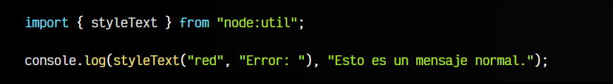
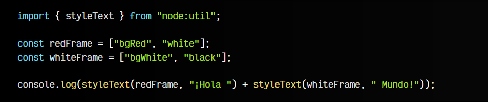
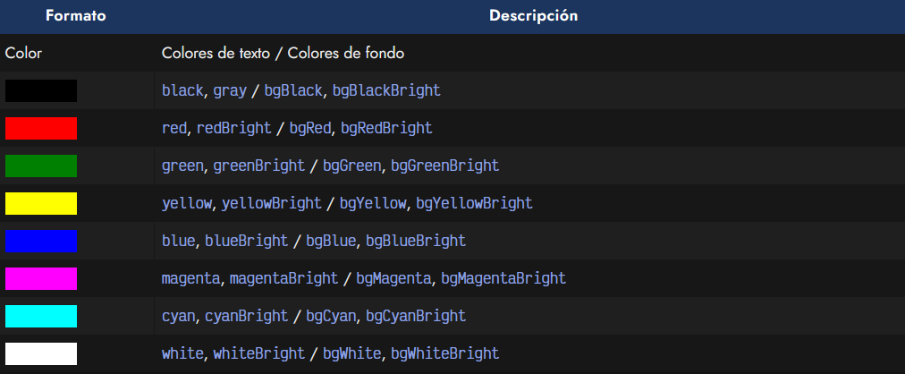
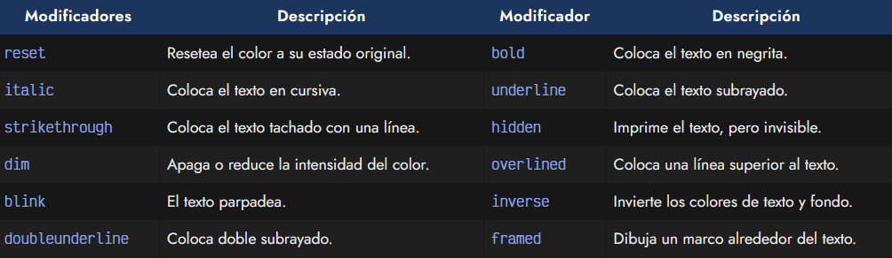
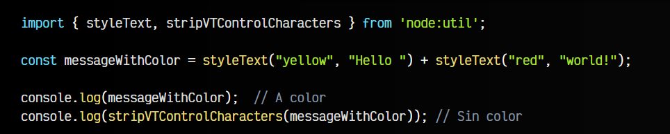

# 
Coloreando la terminal

Antes de comenzar con NodeJS, conviene adquirir cierta experiencia trabajando desde la terminal. En este artículo vamos a ver como darle color al texto que mostramos por terminal, de modo que sea más fácil de leer los textos.

## Coloreando terminal con styleText.
A partir de la versión 20.13.0 de Node, tenemos disponible la función styleText() que nos permite colorear textos en la terminal de forma muy sencilla y sin necesidad de librerías de terceros.

Simplemente debemos colocar el color o formato modificador como primer parámetro y el texto a colorear como segundo parámetro:

Observa que el texto pasado por segundo parámetro a styleText() es el que se colorea, mientras que el que está fuera se muetra sin color. Además del STRING con el color, también podemos pasar un ARRAY de STRING mezclando varios colores para aplicarlos, pudiendo utilizar colores de texto, colores de fondo e incluso estilos de formato como negrita o subrayado:

En el primer caso, redFrame combina color rojo de fondo y color blanco de texto, mientras que whiteFrame combina color blanco de fondo y color negro de texto.

## Opciones de formato.
A continuación muestro una tabla de las opciones que podemos utilizar como formato. Ten en cuenta que indico los colores de texto como los colores de fondo (prefijados por bg):

Además, también podemos utilizar modificadores para cambiar el color que estamos utilizando:

## El método stripVTControlCharacters().
Si por algún motivo, lo que queremos es eliminar el color y quedarnos con un texto sin color alguno, podemos utilizar el método stripVTControlCharacters() que se encuentra en node:util.

Observa el siguiente fragmento de código, donde creamos un mensaje a color y lo limpiamos utilizando el mencionado método:

Estas tareas de coloreado de terminal tradicionalmente se hacían con paquetes de terceros como chalk o [picocolors](https://github.com/alexeyraspopov/picocolors), sin embargo, ahora podemos hacerlo de forma nativa con NodeJS.

