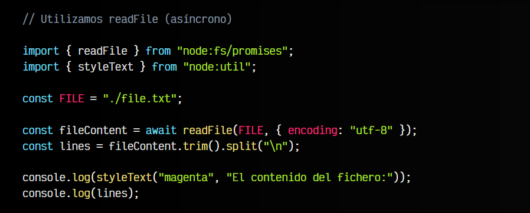
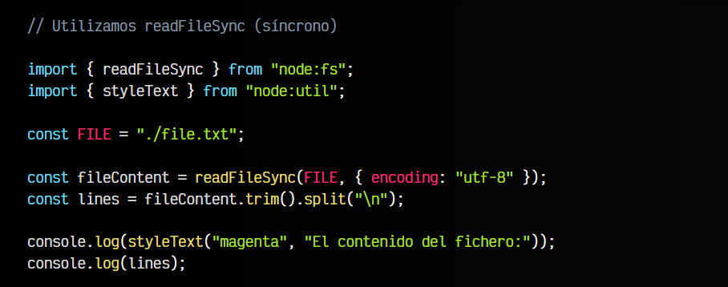
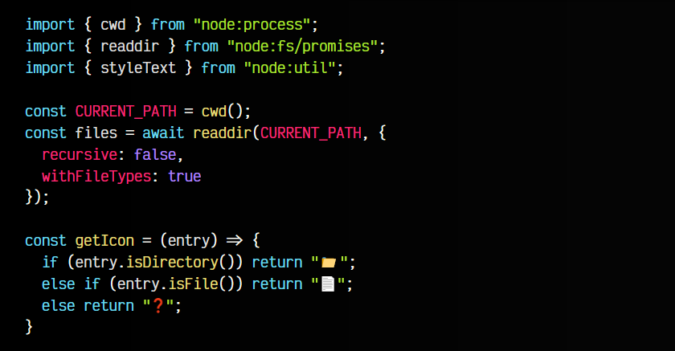
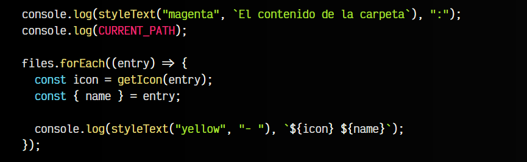
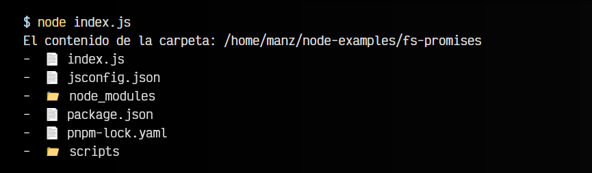
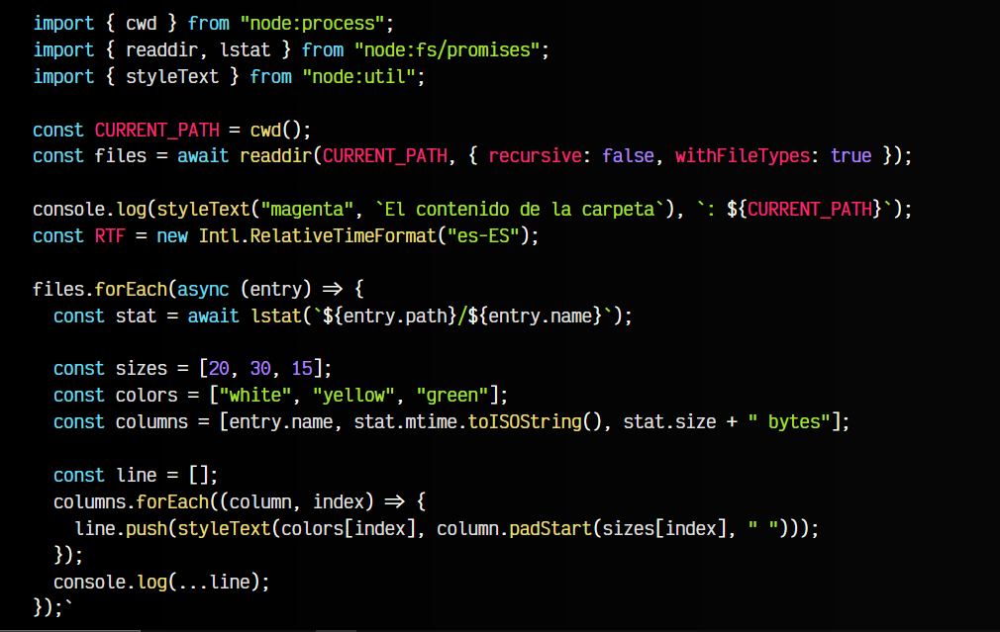
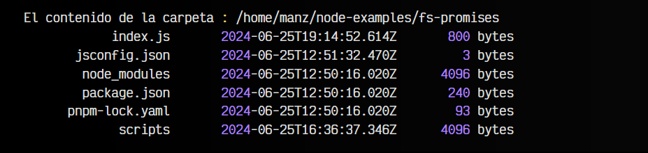
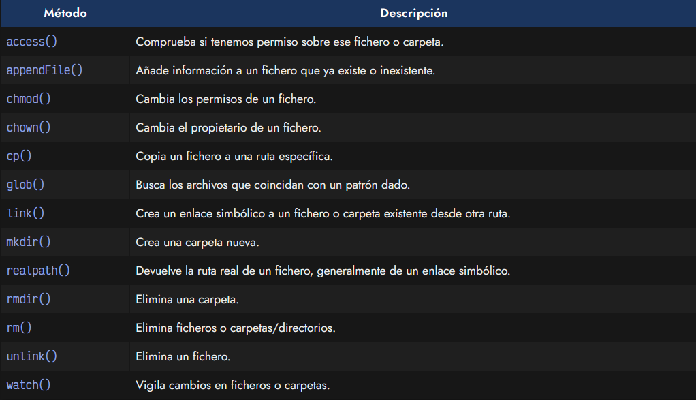

# 
Sistema de ficheros (fs)

Antes de meternos en algún proyecto más avanzado con Node, vamos a aprender a leer ficheros de texto utilizando la API fs de NodeJS. Como siempre, la importaremos utilizando node:fs y utilizaremos un método llamado readFile.

Vamos a comenzar teniendo en cuenta que tenemos un fichero llamado file.txt que contiene varias líneas de texto con una frase en cada una.

## El método readFile / readFileSync.
En NodeJS podemos utilizar dos formas de leer un fichero, readFile (versión asíncrona) y readFileSync (versión síncrona). Aquí puedes ver un ejemplo sencillo que lee el contenido del fichero de texto:

Observa que al usar readFile() le pasamos la ruta del fichero, así como un objeto de opciones donde le indicamos la codificación del fichero (generalmente, utf-8). En la siguiente línea hacemos un trim() para eliminar los espacios sobrantes al principio o final del texto.

Finalmente, dividimos el contenido por cada línea, separando por \n, es decir, por los saltos de línea (ENTER), y los mostramos por pantalla.

Observa las diferencias de la versión síncrona, que se llama readFileSync() y la versión asíncrona, donde se usa await y se importa de node:fs/promises.

De la misma forma que tenemos un readFile() y un readFileSync(), también tenemos un writeFile() y un writeFileSync() que funcionan de forma muy parecida y siguen la misma lógica. En este caso, el primer parámetro es la ruta del fichero, el segundo parámetro es el contenido que quieres guardar en el fichero, y el tercero es el objeto de opciones.

## El método readdir().
Con el método readdir() podemos leer los archivos (y carpetas) que contiene una ruta indicada. Dicha ruta la obtenemos con el método cwd(), que nos devuelve la ruta actual donde nos encontramos al ejecutar el programa.

El método readdir() nos devuelve un array de STRING con los archivos y carpetas de la ruta, en el segundo parámetro podemos indicarle un valor recursive para que revise las subcarpetas interiores y withFileTypes para que devuelva un objeto con partes separadas en lugar de un STRING:

js:

bash:

Al final del código, observa que hacemos un forEach de files obteniendo un icono y un nombre, extraído de cada entrada de readdir(). Observa que el método getIcon() utiliza métodos como .isDirectory() o .isFile() para saber si es un fichero o una carpeta. Con .name obtenemos el nombre del fichero y con .path obtenemos la ruta, entre otras cosas.

## El método lstat().
Si necesitamos más información de un fichero o carpeta, podemos utilizar el método lstat(). Por ejemplo, podemos obtener el tamaño del fichero con .size o la fecha de modificación con .mtime. En este fragmento de código, obtenemos esa información en la constante stat, y los mostramos por pantalla en forma de columna:

js:

bash:

## Otros métodos interesantes.
Existen muchos otros métodos que pueden resultar interesantes, relacionados con el sistema de ficheros y carpetas. Por ejemplo, aquí algunos:

