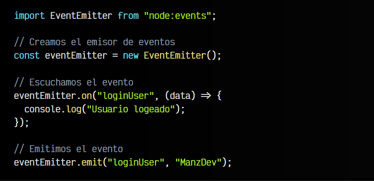
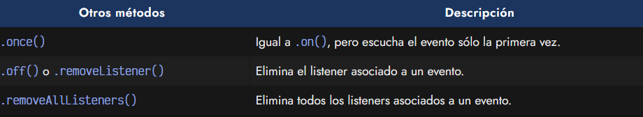
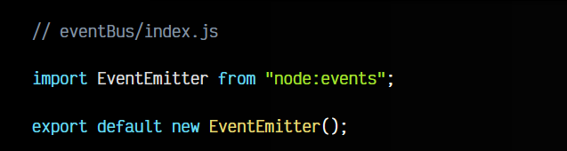
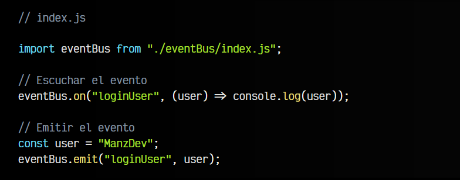
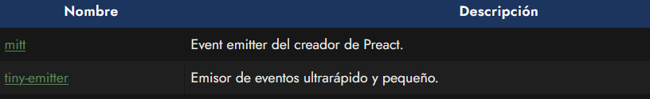

# 
Eventos en NodeJS (EventEmitter)

Cuando trabajamos en Javascript del lado del cliente, es decir, en el navegador, es muy común trabajar con eventos. Los eventos simplemente son mensajes que se envían desde un lugar de la aplicación a otro, para avisar de sucesos importantes o que requieren una forma organizada de avisar, para que desencadenen otras funciones que corresponden a otra parte del código.

En navegador, esto ocurre muy ligado al DOM, sin embargo, en Node, no tenemos el concepto de DOM ya que es algo que influye sólo a cliente, por lo que esos eventos no existen. Sin embargo, existe un módulo llamado EventEmitter que funciona de forma muy similar, sin estar ligada al DOM.

## ¿Qué es EventEmitter?.
En frontend, es muy habitual utilizar [el método .addEventListener()](https://lenguajejs.com/javascript/eventos/addeventlistener/) para escuchar los eventos que se generan en el DOM, sin embargo, en Node, utilizamos otro método llamado .on() que funciona de forma muy parecida;

El código consta de 3 partes principales:

   - 1️⃣ En primer lugar, importamos y creamos una instancia de EventEmitter.
   - 2️⃣ Con .on() podemos escuchar el evento y asociarle una función.
   - 3️⃣ Con .emit() emitimos el evento en nuestra lógica cuando corresponda.

Observa que en el .emit() podemos indicar por parámetro datos adicionales que, aunque no son obligatorios, pueden venir bastante bien en ciertas situaciones. Luego, en el .on() los recibimos a través de un parámetro de la función asociada al evento.

Existen más métodos interesantes:

## Bus de eventos.
Existe un patrón de diseño llamado Bus de eventos que nos permite centralizar la comunicación de eventos en un fichero único, simplificando y organizando mejor el proceso.

En el ejemplo anterior, en lugar de tenerlo todo junto, podríamos haber creado una instancia del EventEmitter en un archivo separado y exportarlo. De esta forma podríamos usarlo en cualquier parte de nuestro proyecto de forma sencilla:

Luego, en los ficheros que necesitemos utilizar el bus de eventos, podríamos hacer lo siguiente:

De hecho, podríamos aprovechar y, dependiendo del caso, utilizar el propio bus de eventos para mantener la lógica organizada y estructurada en un solo lugar, si así lo deseamos.

Ten en cuenta que con el tiempo, es muy frecuente que utilicemos cada vez más eventos y suele ser difícil de mantener y organizar si no llevamos un control.

## Alternativas.
En el mundo de JavaScript existen librerías de terceros que permiten gestionar eventos y mantener organizada la comunicación entre los componentes, permitiendo escribir menos código y ofreciendo características más avanzadas.

Algunas de las librerías más conocidas son:

También rozamos de cerca una categoría similar llamada Gestores de estado, que aunque tienen matices diferentes, están bastante relacionados y se usan mucho en el ecosistema Javascript. Hablaremos de ellos más adelante.