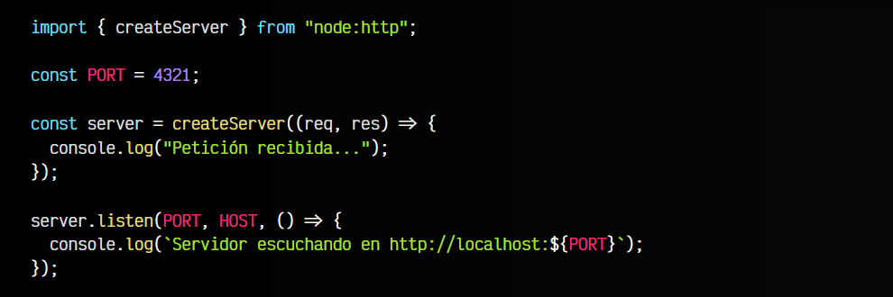
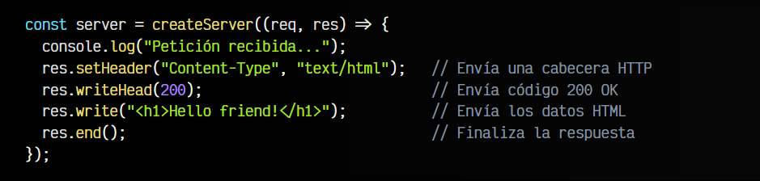
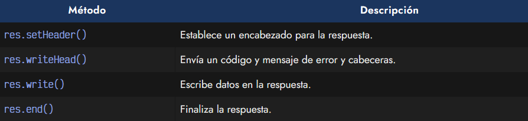
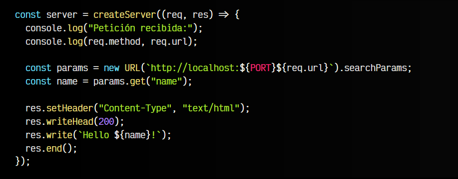
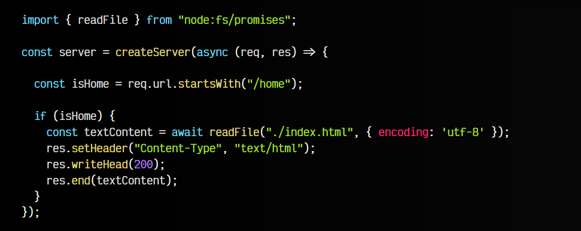

# 
CommonJS vs ES Modules

Hasta ahora hemos aprendido las bases para crear pequeños scripts de NodeJS y hacerlos funcionar desde una terminal simplemente ejecutándolos. Sin embargo, es probable que te preguntes porque hasta el momento parece tener más relación con sistemas, que con desarrollo web. Con NodeJS vamos a trabajar en un servidor backend, por lo suele ser interesante conocer estos conceptos para ser más capaces al programar.

## Creando un servidor HTTP.
A continuación vamos a crear un pequeño servidor web con NodeJS, de modo que podamos hacer peticiones y nos devuelva información, de forma similar a como funciona la comunicación con un navegador y una página web.

Para ello, vamos a importar createServer, un método de node:http que nos permitirá crear dicho servidor. Observa aque también creamos algunas constantes donde guardamos información del servidor, que se encuentra en localhost (nuestro propio equipo) y va a escuchar en el puerto 4321:

   - El código del interior de listen() se va a ejecutar al inicializar el servidor.
   - El código del interior de createServer() se va a ejecutar cuando un cliente se conecta al servidor.

Puedes hacer la prueba y ejecutar este script con node index.js y abrir en un navegador la dirección http://localhost:4321. Comprobarás que justo al abrir ese enlace, mostrará el mensaje de Petición recibida... en la consola de la terminal, porque ha detectado la petición.

## El argumento de respuestas res.
Observa que en la función createServer() tenemos una función callback en el argumento, donde existen dos parámetros: req y res. El primero es el objeto que representa la petición del cliente (el navegador que pide la web) y el segundo es el objeto que representa la respuesta del servidor al cliente.

Hasta ahora, simplemente estamos trabajando con una terminal, pero vamos a hacer que la información se muestre en el navegador del usuario. Para ello, vamos a modificar el método createServer() y a utilizar el objeto res, ya que queremos actuar sobre la respuesta que va al cliente:

En este caso usamos varios métodos:

## El argumento de petición req.
El objeto req contiene información sobre la petición que se está realizando. Por ejemplo, podemos obtener variables enviadas en la URL, por ejemplo, si abrimos la página http://localhost:4321?name=Manz. Observa que estamos definiendo en la URL una variable name con el nombre Manz:

En este ejemplo utilizamos datos de la petición como req.method o req.url y usamos URL() para parsear la URL y obtener las variables de la misma y sus valores.

## Devolviendo una página estática.
Retomando lo que aprendimos en temas anteriores, vamos recuperar la información guardada en una página llamada index.html y devolverla al navegador cuando realice la petición /home. Nuevamente, modificamos el createServer():

En este caso, si la ruta coincide con la que buscamos, leemos el contenido del archivo index.html y lo mostramos por navegador utilizando res.end(). Recuerda que debes acceder a http://localhost:4321/home para ver la página, ya que no lo hará desde la página principal.