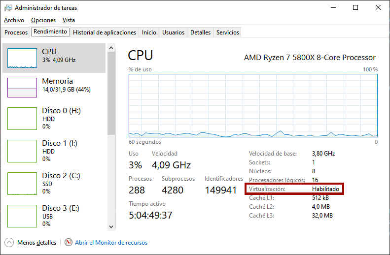

# 
Instalación de WSL2

Tradicionalmente, Windows ha proporcionado a sus usuarios una interfaz de línea de comandos que funciona bajo su propio sistema, heredado de MS-DOS y diferente a GNU/Linux. Sin embargo, a partir de Windows 10, con la irrupción de Windows Subsystem for Linux (más comunmente denominado WSL), esto ha cambiado radicalmente.

## ¿Qué es WSL?.
Ahora es posible utilizar distribuciones de GNU/Linux como Ubuntu o Debian dentro de nuestro Windows, utilizando comandos o aplicaciones de GNU/Linux, incluso las que tienen entorno gráfico. En la siguiente imagen, podemos ver una captura de un sistema GNU/Linux Debian dentro de Windows, a través de [Windows Terminal](https://apps.microsoft.com/store/detail/windows-terminal/9N0DX20HK701?hl=es-es&gl=es).

Otros sistemas operativos como GNU/Linux o Mac, disponen de una interfaz de línea de comandos, por lo que hasta el momento era bastante complejo tener compatibilidad entre estos sistemas y uno Windows. Con la adopción de WSL en Windows, Microsoft introduce una capa intermedia que funciona con un núcleo de Linux real (kernel) y en el que se pueden instalar distribuciones de GNU/Linux (desde la tienda oficial de Microsoft o de forma manual) como por ejemplo Ubuntu, Debian, Kali o incluso la distribución minimalista Alpine.

En la siguiente guía, vamos a ver como instalar WSL (Windows Subsystem for Linux) en nuestro Windows paso a paso, y luego como configurarlo correctamente (o resolver ciertos problemas si los hay).

## Requisitos previos.
Para poder disponer de una terminal de GNU/Linux en nuestro Windows, antes necesitamos asegurarnos que nuestro equipo cumple los siguientes requisitos (muchas de estas características se instalan/activan automáticamente en la instalación automática en últimas versiones de Windows):

   - Necesitaremos tener Windows 10 o superior (cualquier versión salvo Windows S).
   - La virtualización Hyper-V activada en la BIOS/UEFI (lo normal en equipos nuevos).
   - La característica Windows Subsystem for Linux activada.
   - La característica Plataforma de Máquina Virtual activada.
   - Se recomienda tener las actualizaciones de Windows al día para mayor compatibilidad.

Recientemente, Microsoft ha añadido una forma automática de instalar WSL en nuestro sistema WSL, por lo que te recomiendo echarle primero un vistazo a esta instalación automática, y si no funciona, la instalación manual.

## Instalación automática.
Desplegamos el menú de Inicio y escribimos Símbolo de Sistema, pulsamos con botón derecho y seleccionamos Ejecutar como Administrador. Nos aparece una terminal de texto, donde escribiremos el siguiente comando:

Personalmente, prefiero instalar Debian, pero existen otras distribuciones de Linux para WSL. Si simplemente omitimos el -d Debian y escribimos wsl --install, se instalará Ubuntu, ya que es la distribución por defecto.

Una vez hecho esto, reiniciamos la máquina. Esto realizará los pasos necesarios para tener WSL:

   - Habilitar las características opcionales necesarias.
   - Descargar el último kernel de Linux más reciente.
   - Establecer WSL2 como predeterminado.
   - Instalar Debian (o Ubuntu) como distribución de Linux en WSL.

Si este método ha funcionado correctamente, al ejecutar el comando wsl --list debería mostrarnos que tenemos una distribución Debian instalada. En ese caso, puedes saltarte la sección Instalación manual e ir directamente a ¿Qué distros tengo en WSL?.

## Instalación manual.
Si por alguna razón no te ha funcionado la instalación automática (o no te sirve el comando wsl --install -d Debian) detallo a continuación los pasos que habría seguir para hacerla manualmente.

## Virtualización Hyper-V.
En la BIOS/UEFI del equipo, debes tener activada la característica Virtualización Hyper-V o Hyper-threading virtualization. Para comprobar si la tenemos activada, pulsamos ++ y vamos al Administrador de tareas, a la pestaña Rendimiento. Si marcamos CPU, en las opciones inferiores podremos ver un texto que dice Virtualización: Habilitado:

En ese caso, tenemos la virtualización Hyper-V activada en la BIOS y podemos saltar al siguiente punto. En caso contrario, quizás no se encuentre habilitada y debamos activarla en la BIOS. Dicha característica puede encontrarse en un menú diferente, dependiendo de la marca y modelo de la placa.

Es posible activar esta característica desde el Símbolo de sistema de Windows como administrador, escribiendo el comando bcdedit /set hypervisorlaunchtype auto. Para volverla a desactivar, el comando sería bcdedit /set hypervisorlaunchtype off.

## Activación de características.
Por otro lado, para activar las características mencionadas anteriormente en Windows, accedemos a Inicio y buscamos Activar o desactivar características de Windows, donde encontraremos un menú de selección para activar las casillas Subsistema de Windows para Linux y Plataforma de máquina virtual:

La primera de ellas es absolutamente necesaria, puesto que es el propio WSL. La segunda de ellas es necesaria para utilizar WSL2, y es posible que no aparezca si no tienes Windows 10 actualizado. Puedes comprobarlo, accediendo a Inicio y abriendo una terminal de Windows escribiendo CMD o Símbolo de sistema y escribiendo lo siguiente:

El comando ver nos mostrará la versión instalada de Windows 10. Si es igual o superior a 10.0.19041, podremos utilizar WSL2, en caso contrario, es posible que no podamos utilizar WSL (o sólo podamos usar WSL1). Para solucionarlo, revisa las actualizaciones de Windows e instala las que tengas pendientes.

Nota: También es posible comprobar que versión tenemos instalada pulsando WIN+R y escribiendo winver. Si tenemos la compilación de SO 19041 o superior, podremos utilizar WSL2.

## ¿Qué distros tengo en WSL?.
Windows Subsystem for Linux funciona de modo que podemos tener varias distribuciones instaladas en nuestro sistema y utilizar la que queramos. Una vez hecho los pasos anteriores, deberíamos disponer de un comando wsl.

Para ver que distribuciones tenemos instaladas, abrimos una terminal de Windows pulsando WIN+R y escribiendo cmd. Luego, tecleamos el comando wsl --list:

En el caso de tener alguna distribución de Linux instalada, nos aparecerían en la lista, como veremos un poco más adelante.

Si en lugar de aparecer el mensaje anterior nos muestra un error al no encontrar el comando wsl, es posible que no tengamos aún instalada la característica Windows Subsystem for Linux que mencionamos en el apartado anterior.

## Distribuciones Linux para WSL.
WSL permite instalar una serie de distribuciones de Linux específicas, que podemos consultar escribiendo el comando wsl --list --online. En este artículo, elegiremos la distribución Debian:

Recuerda que la forma automática de instalar una de estas distribuciones es escribiendo wsl --install -d Debian, y reemplazando Debian por el nombre de la distribución deseada.

## Instalación manual.
Si por alguna razón, preferimos la instalación manual, podemos elegir una de las distribuciones siguientes:

¹ No oficial.

Las distribuciones se pueden instalar automáticamente desde la tienda oficial de Microsoft, o manualmente, ejecutando un archivo .appx que contiene la distribución de Linux a instalar. Si lo hacemos de la primera forma, se instalará de forma transparente, si lo hacemos de la segunda forma, nos mostrará una ventana similar a la siguiente:

¹ No oficial.

Las distribuciones se pueden instalar automáticamente desde la tienda oficial de Microsoft, o manualmente, ejecutando un archivo .appx que contiene la distribución de Linux a instalar. Si lo hacemos de la primera forma, se instalará de forma transparente, si lo hacemos de la segunda forma, nos mostrará una ventana similar a la siguiente:

Simplemente, pulsamos Instalar y esperamos a que termine la instalación.

## Instalación de la distro.
Una vez elegida la distribución de Linux e iniciado el proceso de instalación en nuestro sistema, tras esperar un corto espacio de tiempo, si la arrancamos por primera vez, nos aparecerá una ventana similar a la siguiente:

En ella, se nos está preguntando por el nombre de usuario y su correspondiente contraseña para utilizar en nuestra distribución de Linux de WSL. Es muy importante que apuntemos estas credenciales, puesto que son las que necesitaremos para acceder a nuestro Linux de WSL. Atento a las siguientes indicaciones:

   - El nombre de usuario debe estar en minúsculas.
   - No es necesario que coincida con el nombre de usuario de Windows.
   - No debe tener signos de puntuación o acentuación.

Ten en cuenta que el nombre de usuario que escribas va a ser el que utilizarás en WSL de forma habitual. Por ejemplo, si utilizamos el nombre de usuario manz, nuestra carpeta de usuario será /home/manz.

Listo. Ya tenemos WSL activada con nuestra distribución de GNU/Linux instalada. Ahora, lo recomendable sería revisar el apartado de [Configuración de WSL](https://terminaldelinux.com/terminal/wsl/configuracion-wsl/) para asegurarnos de que todo está correctamente o mejorar algunos apartados.