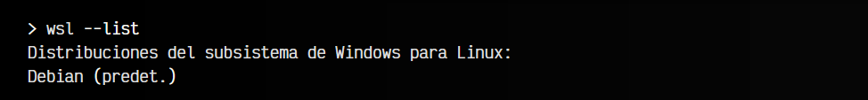
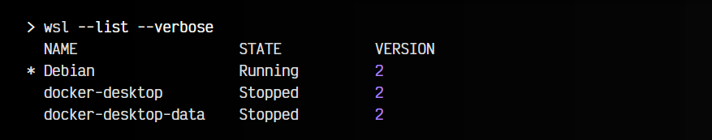
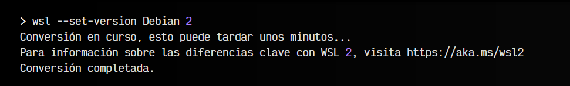
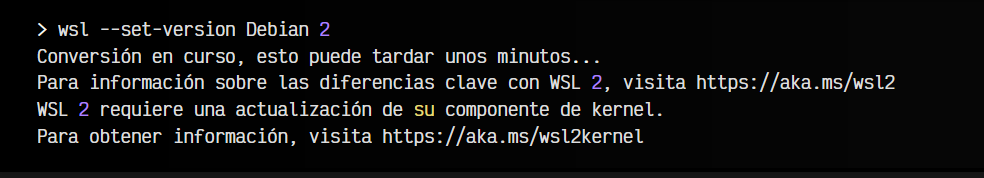
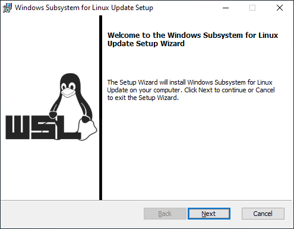
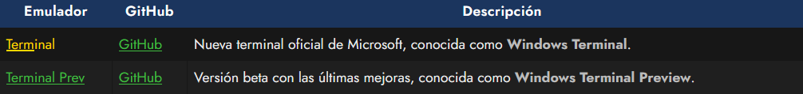
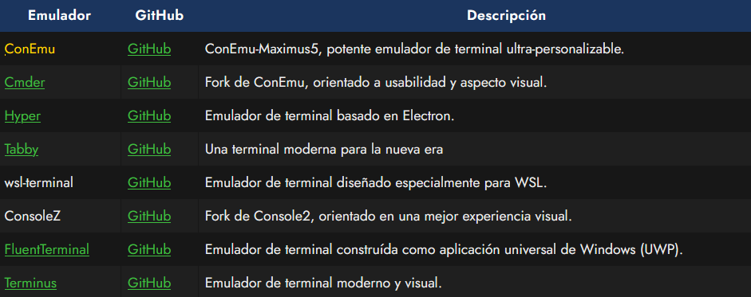
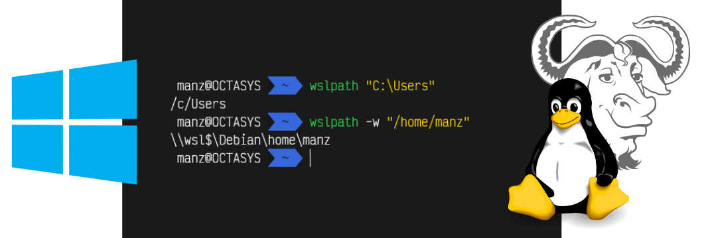
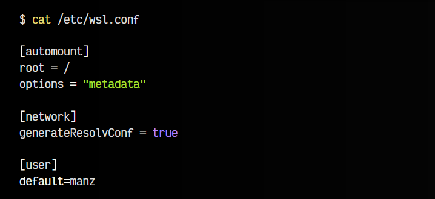

# 
Configuración de WSL2

WSL es el subsistema de GNU/Linux para Windows. Con él puedes utilizar una terminal de GNU/Linux dentro de Windows 10 (o superior). Antes de comenzar a utilizarlo, debes tener instalada una distribución de GNU/Linux, por lo que vamos a comprobar cuál tenemos instalada.

En este artículo revisaremos que tengas perfectamente instalada y configurada la WSL, o resolveremos posibles problemas que puedas tener.

## ¿Qué distribución de WSL tengo?.
Vamos a abrir una terminal de Windows pulsando WIN+R y escribiendo cmd. Una vez hecho esto, en la ventana que nos aparece escribimos wsl --list:

Como se puede ver, en nuestro caso nos aparece una distribución Debian (marcada como predeterminada). Si instalasemos varias distribuciones las veríamos todas en esta lista. Observa que una de ellas debe aparecer con el texto (predet.), que es la distribución WSL por defecto. Si queremos cambiar una y establecerla como predeterminada, solo tenemos que escribir wsl --set-default Debian o wsl -s Debian.

Si no te aparece ninguna distribución al escribir wsl --list o te menciona que el comando wsl no existe, ve al apartado [Instalación de WSL](https://terminaldelinux.com/terminal/wsl/instalacion-wsl/), ya que te falta completar su instalación.

## ¿Estoy utilizando WSL1 o WSL2?.
Si deseas conocer si la distribución de Linux que tienes instalada está utilizando WSL1 o WSL2, es tan fácil como escribir el comando anterior con los siguientes parámetros:

De esta forma podrás saber las distribuciones que tienes instaladas, si están en funcionamiento actualmente y en que versión de WSL.

Es conveniente migrar a WSL2, ya que ofrece mayor rendimiento y características que WSL1. Si acabas de instalar WSL, comprueba siempre en que versión de WSL tienes tus distros.

## Convertir distro de WSL1 a WSL2.
Es posible que nuestra distribución se instalara como una distribución WSL1. Sin embargo, WSL2 está disponible y proporciona múltiples mejoras, ya que incorpora un kernel de Linux real utilizando Hyper-V, ofreciendo así un rendimiento más alto, a la vez que mejor soporte y compatibilidad.

Para aprovechar las últimas ventajas de WSL, es necesario convertir las distribuciones a WSL2, cosa que podemos hacer simplemente escribiendo wsl --set-version Debian 2, lo que convertirá nuestra distribución «Debian» a WSL2:

En el caso de que nos aparezca el error Habilita la característica Plataforma de máquina virtual de Windows y asegúrate de que la virtualización esté habilitada en el BIOS. revisa los puntos mencionados en [activación de características](https://terminaldelinux.com/terminal/wsl/instalacion-wsl/#activaci%C3%B3n-de-caracter%C3%ADsticas).

Si todo ha ido bien, nos debería aparecer una pantalla similar a esta:

En el caso de que nos aparezca el mensaje La distribución ya es la versión solicitada. significa que no se requiere conversión, ya que la distribución actual ya es WSL2.

Si estamos completamente seguros de querer que todas las distribuciones que utilicemos a partir de ahora sean WSL2, no tenemos más que escribir el comando wsl --set-default-version 2, que indicará a WSL que todas las distribuciones que utilicemos funcionen bajo WSL2 por defecto. De esta forma, el paso anterior no será necesario a partir de ahora.

## Actualización componente kernel.
En algunos casos, es posible que nos aparezca un error similar al siguiente:

Este problema ocurre porque necesitamos actualizar el kernel de Linux para Windows. Podemos hacerlo simplemente descargando la actualización oficial desde su página: wsl_update_x64.msi. Esto nos mostrará una actualización con el siguiente aspecto:

Hacemos click en Siguiente, y en breve lo tendremos actualizado.

## Windows Terminal para WSL.
Hay que tener bien claro que bajo Windows, la terminal que utilizamos tradicionalmente es cmd.exe o Símbolo de sistema, lo que nos arranca una interfaz de línea de comandos de Windows. Para arrancar una distribución de Linux de las que hemos instalado, tendremos que acceder escribiendo wsl (para entrar en la distribución predeterminada) o escribiendo wsl -d Debian para indicar la distribución a la que queremos entrar, en el caso de tener varias.

Sin embargo, ya te habrás dado cuenta que la terminal de Windows (CMD) es bastante pobre y limitada, sobre todo en cuanto a características de personalización. La mejor opción, ahora que tenemos WSL, es instalar un buen y moderno emulador de terminal, que nos de una buena experiencia, como es el caso de Windows Terminal:

Para que Windows Terminal se vea correctamente utilizando WSL, recomiendo seguir los siguientes pasos:

   - Instalar Windows Terminal Preview (versión con últimas novedades)
   - Instalar una tipografía compatible con carácteres especiales. Mi preferida: Victor Mono. Más en NerdFonts.
   - Configurar la carpeta de inicio donde arranca el usuario. En Windows Terminal, podemos acceder a la configuración con 

CTRL+, buscar en la lista nuestra distribución WSL (Debian) y en el apartado Directorio de inicio escribimos ~.

IMPORTANTE: Ten en cuenta que los tres pasos anteriores son indispensables para que se vea correctamente la terminal. Especial hincapié en el último punto. Bajo WSL debemos trabajar siempre en nuestra partición de Linux, ya que el acceso directo a discos NTFS de Windows desde WSL es aún bastante lento.

Si lo deseas, por aquí tienes más información sobre la [Configuración de Windows Terminal](https://terminaldelinux.com/terminal/wsl/configurar-windows-terminal/).

## Otras alternativas para terminal.
Por otro lado, si Windows Terminal no te convence como emulador de terminal, puedes buscar en la siguiente lista otros emuladores de terminal alternativos:

Uno de mis preferidos era ConEmu, el cuál tiene multitud de opciones de personalización y permite configurar prácticamente cualquier aspecto del mismo, como por ejemplo, crear una tarea llamada {Shells::WSL} que ejecute wsl.exe al abrir la terminal, y así utilice directamente la distribución de Linux por defecto de WSL.

Sin embargo, como ya comenté anteriormente, pienso que para utilizar bajo WSL está mucho más preparado Windows Terminal, el cuál recomiendo en su versión Preview si estás utilizando WSL.

## Acceder a Linux desde Windows.
Si queremos acceder a una partición de nuestra distro de Linux WSL2 desde el Explorador de archivos de Windows, es posible accediendo a la siguiente ruta:

Donde:

   - \\wsl$\ Es el acceso a WSL2
   - Debian Es el nombre de nuestra distro de Linux WSL
   - \home\manz Es la ruta de linux a acceder (también es posible indicar las slashes no invertidas)

En algunos casos, también es posible acceder desde el apartado de Red de Windows (si tienes activado los archivos y carpetas compartidas). Es posible que, en algún caso, al acceder a estas rutas aparezca vacía. Esto suele ocurrir porque Windows aún no ha iniciado el subsistema WSL, basta con abrir una terminal para forzar a que arranque.

## Convertir rutas Windows a WSL.
Si lo necesitas, WSL incorpora un comando llamado wslpath, que te permite hacer traducciones de rutas Windows a rutas Linux y viceversa desde nuestra terminal de Linux. Para ello, solo tienes que escribir el comando wslpath RUTA_WINDOWS para obtener la misma ruta en formato Linux, o al contrario, escribir el comando wslpath -w RUTA_LINUX para obtener la ruta en formato Windows:

Esto puede ser una forma interesante para intercomunicar ambos sistemas mediante scripts o tareas.

## Establecer usuario por defecto.
Si queremos cambiar el usuario por defecto de nuestra distro WSL, es decir, el usuario con el que se inicia la sesión, podemos hacerlo de la siguiente forma:

   - Editamos el fichero /etc/wsl.conf, el cuál ya contendrá algunas lineas.
   - Si no contiene la sección [user] la añadimos, si ya la tiene, la modificamos.
   - En el valor default= escribimos el nombre de nuestro usuario (¡siempre en minúsculas!)

Quedaría algo así:

Es posible que tengamos que reiniciar o hacer un wsl --shutdown desde un símbolo de sistema para obligar a WSL que apague el núcleo de WSL y vuelva a arrancarlo, y así actualizar la configuración y haga efecto.

## He olvidado la contraseña de root.
¿Has olvidado la contraseña de root de la distribución WSL? No te preocupes. Si tienes acceso a la cuenta de administrador de tu Windows, puedes recuperarla muy facilmente. Para ello, vamos a hacer lo siguiente:

   - Ve a inicio, busca la aplicación Símbolo de sistema y con botón derecho elige «Ejecutar como administrador».
   - Escribe el comando wsl -u root. Esto abrirá una terminal de WSL como usuario root.
   - Escribe el comando passwd. Ahora te pedirá la nueva contraseña de root.

Listo. Si queremos cambiar la contraseña de otro usuario, repetimos escribiendo passwd usuario, donde usuario es el nombre del usuario en cuestión.

## Exportar e importar distros de WSL.
WSL ofrece un sistema muy práctico y sencillo para hacer copias de seguridad o exportar/importar distros con todo su contenido idéntico, algo muy útil si queremos hacer backups o exportar una distro para recuperarla en otro equipo.

Para ello, vamos a un Símbolo de sistema (terminal de Windows) y escribimos lo siguiente:

Esto exportará todo el sistema de archivos de la distribución Debian y lo empaquetará en el archivo backup-wsl.tar. Este proceso puede llevar un buen rato, dependiendo de la velocidad de tu disco duro y del tamaño de la distro, ¡no desesperes!

Luego, la operación inversa para recuperar la distro sería la siguiente:

Con esta linea, importaremos el fichero exportado previamente en backup-wsl.tar como una distro llamada Debian, indicando que debe guardarse en la carpeta c:\wsl\debian y que debe usar WSL2.

