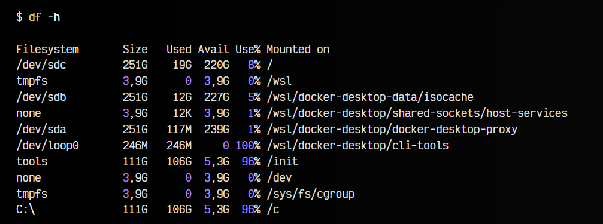
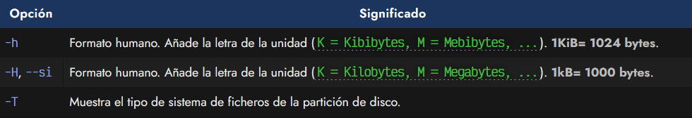
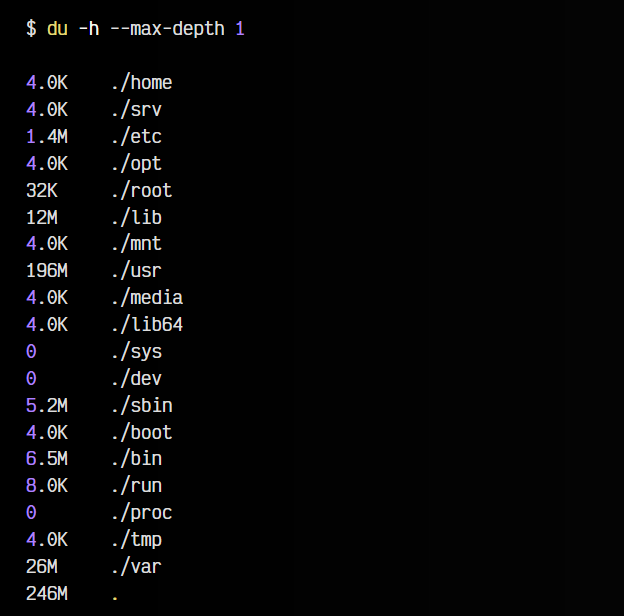
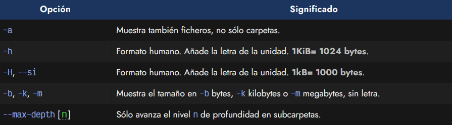
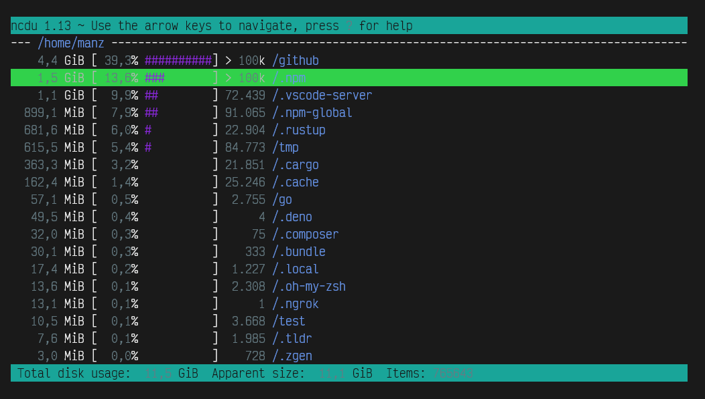
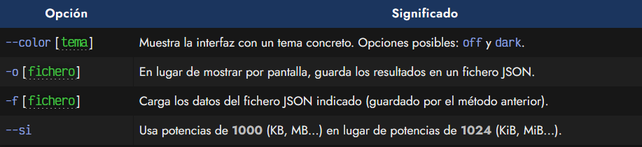
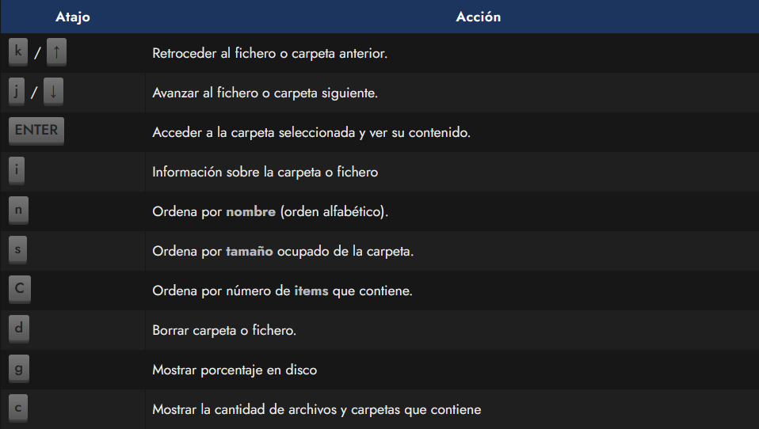
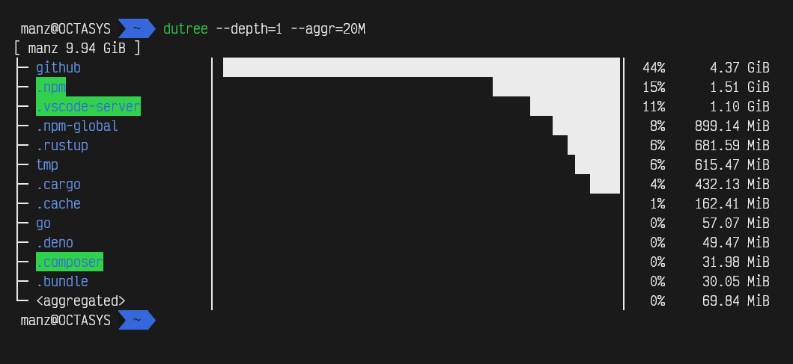

# 
Espacio libre/usado en disco

Al trabajar con cualquier tipo de sistema (sobre todo cuando lo hacemos en máquinas virtuales, contenedores docker o similares) tenemos un espacio de disco limitado, y es muy frecuente que nos quedemos sin espacio libre después de instalar varios paquetes o generar ficheros grandes como contenido multimedia o logs y registros de gran tamaño.

Por lo tanto, sería interesante conocer algunos comandos para conocer cuanto espacio de disco estamos usando, cuanto espacio libre tenemos y que paquetes, carpetas o ficheros son los que más ocupan, facilitándonos la tarea de saber por donde atacar y eliminar datos para hacer espacio libre.

## El comando df.
El comando df (disk free) nos informa del espacio libre en cada partición del disco. Así pues, la salida del comando df en un sistema Linux sobre WSL, mostraría algo similar a lo siguiente (entre otras entradas):

Obsérvese que en la columna Size se nos muestra el tamaño total de cada partición de disco, mientras que en la siguiente se nos muestra el tamaño del espacio ocupado y en la siguiente el tamaño del espacio libre. A modo de resumen, la siguiente columna nos muestra el porcentaje de espacio utilizado. Esto nos da una idea del espacio en disco que nos queda en cada partición.

Nota: Obviamente, debemos conocer un poco el sistema que estamos utilizando para saber que particiones son las que nos interesan. Generalmente, los dispositivos que comienzan por /dev/sd son los discos físicos del sistema, como por ejemplo, en este caso serían sda, sdb y sdc. Un cuarto disco conectado se etiquetaría como sdd.

Los parámetros más interesantes del comando df podrían ser los siguientes:

## El comando du.
Sin embargo, podemos querer rizar el rizo y hacer justo la operación opuesta. En lugar de ver el espacio libre en disco, querer ver el espacio ocupado en disco de una forma un poco más minuciosa. Esta aproximación nos permite que podamos ver el tamaño ocupado por carpetas del sistema y tener una idea más aproximada de donde estamos invirtiendo más espacio en disco.

Para ello, utilizaremos el comando du (disk usage), que recorrerá el disco a partir de la ruta que le indiquemos (o de la carpeta actual si no se indica ruta), mostrándonos el tamaño que ocupa cada carpeta encontrada.

En este ejemplo, nos hemos colocado en la ruta raíz de todo el sistema / y hemos utilizado el parámetro --max-depth establecido a 1, para que sólo mire un nivel de profundidad de carpetas, y no siga mirando subcarpetas, ya que en caso de no establecerlo, lo haría de forma recursiva, entrando en cada subcarpeta sucesivamente.

Al final, nos muestra el tamaño total ocupado, es decir, la suma de todas las carpetas anteriores.

Nota: Esto es una buena forma de analizar el espacio usado en disco por carpetas, y donde es más probable que tengamos más oportunidades para liberar espacio en disco.

Algunos parámetros interesantes del comando du son los siguientes:

## El comando ncdu.
Existe una versión mejorada del comando du llamada ncdu (nCurses du). Se trata de una versión que añade ciertos detalles y muestra la información en paneles de texto de forma un poco más agradable y visuales, permitiendo moverse de forma interactiva por las carpetas y realizando ciertas tareas:

La primera columna nos muestra el tamaño total que ocupa dicha carpeta (y todas sus subcarpetas), la columna que le sigue a continuación refleja el porcentaje sobre el resto de carpetas. Existe otra columna numérica que nos indica el número de ítems (ficheros y carpetas) que incluye dicha carpeta.

Recuerda que puedes manejar la interfaz interactiva de ncdu con los siguientes atajos rápidos, moviéndonos entre las carpetas y accediendo a ellas:

## El comando dutree.
Otra alternativa que nos puede resultar interesantes es dutree. Está desarrollada en Rust, y puede instalarse con cargo install dutree. Tiene un enfoque más básico y menos interactivo que ncdu pero puede resultar más interesante o flexible en algunos casos.

Por ejemplo, en la imagen anterior le pedimos a dutree que nos muestre solo las carpetas del primer nivel de profundidad con --depth=1, mientras que le decimos que descarte y agrupe todas las carpetas que ocupen menos de 20 MiB con --aggr=20M.

Otros parámetros interesantes podrían ser --no-hidden que excluye los ficheros ocultos (los que empiezan por .) o --files-only que excluye las carpetas y se centra en ficheros, por si lo que queremos es analizar el contenido de la carpeta actual y no centrarnos en subcarpetas.

Otro comando muy similar es [du-dust](https://github.com/bootandy/dust) (dust), el cuál también está desarrollado en Rust.