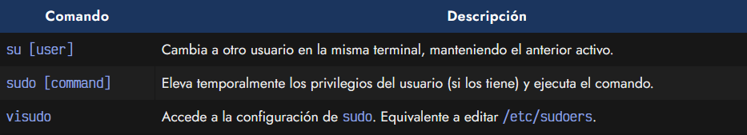
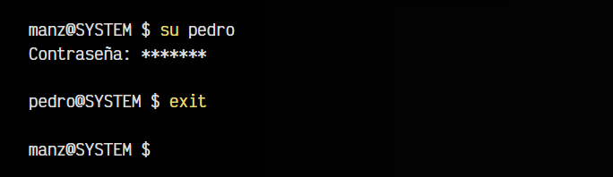
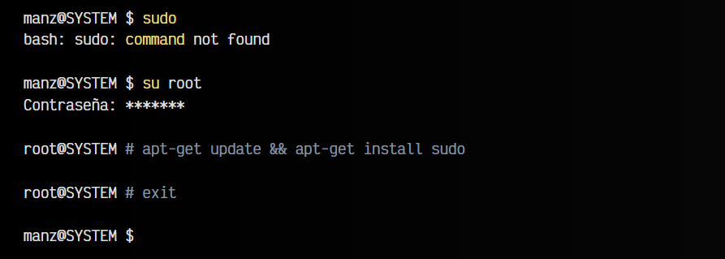
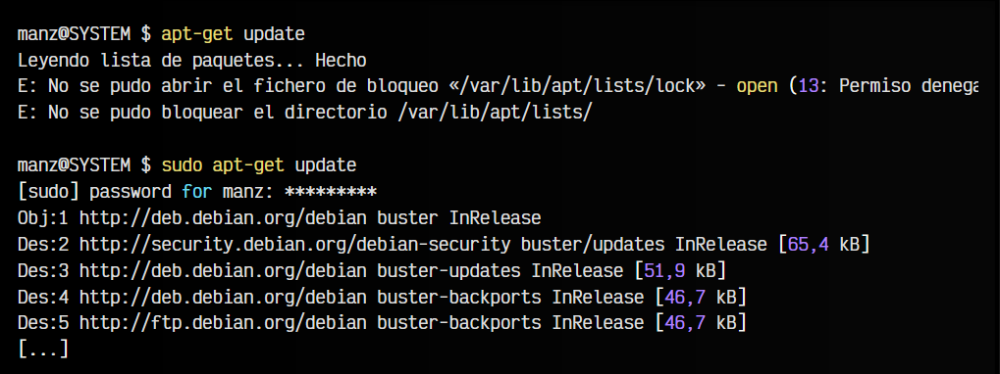
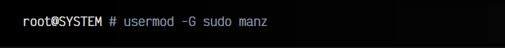
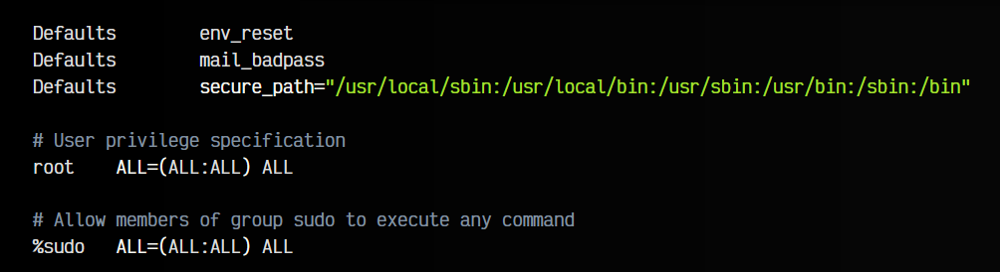

# 
Instalar y configurar sudo

En cualquier sistema operativo moderno, pueden existir múltiples usuarios, ya que el sistema puede ser utilizado por diferentes personas. Y como puede parecer obvio, no todos los usuarios tienen el mismo rol o los mismos privilegios. Hay varios comandos relacionados con estas tareas, que trataremos en este artículo:

Veamos detalladamente cada uno de ellos, pero antes hablemos del usuario root.

## El usuario root.
A parte de los usuarios creados en el sistema, GNU/Linux tiene un usuario especial llamado root. Se trata del usuario administrador, el cuál tiene permisos para hacer cualquier cosa en el sistema (borrar archivos, cambiar configuraciones, instalar programas, etc...).

Se suele decir que algunos usuarios del sistema «tienen privilegios de root», porque se han configurado previamente para que tengan capacidades de administrador. Veremos más adelante como configurarlos para ello.

## El comando su.
El comando su (substitute user) permite cambiar a otro usuario en la misma terminal. La sesión del usuario anterior no se cierra, sino que permanece abierta, albergando al nuevo usuario al que hemos cambiado. De esta forma, si escribimos exit, volvemos a la sesión del usuario anterior:

Obviamente, el usuario debe existir y debemos conocer la contraseña, la cuál se nos preguntará inmediatamente después de escribir el comando.

Ten en cuenta que si al escribir su pedro y cambiar al usuario pedro, volvemos a escribir su manz, lo que obtendríamos es una sesión del usuario manz, que contiene una sesión del usuario pedro, que a su vez contiene otra sesión del usuario manz.

Si al comando su no se le indica un usuario, tomará por defecto cambiar al usuario root.

## El comando sudo.
El comando su es una buena herramienta para cambiar de usuario, pero suele ser una molestia tener que estar cambiando frecuentemente de usuario cada vez que necesitemos privilegios, por lo que si tenemos esta necesidad, el usuario acaba trabajando con root, lo que suele ser una muy mala práctica (y mala idea en general, ya que es más probable que estropeemos algo).

Es por eso que surge el comando sudo, el cuál nos permite elevar los privilegios del usuario temporalmente para poder realizar tareas de root. La idea es muy sencilla, se trata de escribir sudo seguido del comando que queremos ejecutar. Si el usuario tiene los permisos adecuados para elevar sus privilegios al nivel de root, entonces podrá realizar las tareas.

El comando su es una buena herramienta para cambiar de usuario, pero suele ser una molestia tener que estar cambiando frecuentemente de usuario cada vez que necesitemos privilegios, por lo que si tenemos esta necesidad, el usuario acaba trabajando con root, lo que suele ser una muy mala práctica (y mala idea en general, ya que es más probable que estropeemos algo).

Es por eso que surge el comando sudo, el cuál nos permite elevar los privilegios del usuario temporalmente para poder realizar tareas de root. La idea es muy sencilla, se trata de escribir sudo seguido del comando que queremos ejecutar. Si el usuario tiene los permisos adecuados para elevar sus privilegios al nivel de root, entonces podrá realizar las tareas.

Una tira de XKCD muy conocida, representando el uso de sudo.

Si al escribir sudo nos aparece el mensaje command not found es que no tenemos el comando instalado. Aunque las últimas distribuciones de Debian ya lo traen incorporado, si tienes alguna versión antigua es posible que no venga de serie. Es muy sencillo instalarlo:

Una tarea común, por ejemplo, donde necesitas privilegios de administrador, podría ser la de actualizar los paquetes disponibles en los repositorios de apt-get. Así se haría sin utilizar sudo y utilizando sudo:

Además, el comando sudo tiene un parámetro -u que puedes utilizar para ejecutar un comando como un usuario diferente de forma temporal. Observa el siguiente ejemplo donde utilizamos whoami, un comando que te dice cual es el usuario actual:

Recuerda siempre, que sólo podrás elevar los privilegios con sudo si el usuario ha sido previamente permitido para poder realizar esta elevación de privilegios. Dicho permiso debe darse por root o por un usuarios que tenga privilegios.

## El comando doas.
Existe un comando alternativo a sudo denominado doas. Es muy interesante, ya que tiene una filosofía más simple y práctica. Generalmente, no viene instalado en nuestro sistema, por lo que antes de utilizarlo, necesitaremos instalarlo y crear un fichero de configuración:

Una vez instalado, editamos con nano (o con nuestro editor preferido) el fichero /etc/doas.conf, que es la configuración de doas. En este fichero de configuración, tendremos que colocar una serie de reglas que va a seguir doas. Por ejemplo:

En este caso, permit permite el uso de privilegios de administrador al usuario manz, y la palabra clave nopass indica que no necesitarás escribir la contraseña. En lugar de permit se puede utilizar deny para hacer justo lo contrario.

## Cómo dar permisos de root.
Hemos mencionado varias veces que un usuario normal (regular) sólo podrá utilizar el comando sudo si previamente el usuario root le ha concedido «privilegios de root», por lo que es necesario realizar este paso previamente. Se puede hacer de dos formas:

## Mediante usermod.
Personalmente, la forma más sencilla es la de añadir o eliminar usuarios al grupo sudo, para así darles permiso de sudo, lo que lo hace bastante más rápido, práctico y amigable. Podemos hacerlo con el siguiente comando (recuerda que debes hacerlo como root o algún usuario con privilegios):

De esta forma, añadimos al usuario manz al grupo sudo.

## Mediante visudo.
Otra forma de hacerlo es mediante el comando visudo (vi + sudo), que no es más que un atajo para editar el fichero /etc/sudoers, donde se guarda la información de los usuarios que tienen privilegios de root.

En dicho fichero, normalmente encontraremos algo parecido a lo siguiente:

Lo que nos interesa son las 2 lineas de la parte inferior. La primera de ellas, la que comienza por root, indica los usuarios que tendrán privilegios (en este caso, sólo root), la siguiente linea, que comienza por %sudo, indica que todos los usuarios de dicho grupo podrán elevar privilegios.

Podríamos añadir una linea, justo debajo de la de root, tal que:

Una vez hecho esto, ya tendremos al usuario (manz en este caso), añadido al grupo sudo y con la posibilidad de usar este comando para elevar los privilegios de root.