# 
Instalar paquetes con apt-get

Las distribuciones de GNU/Linux tienen un sistema denominado gestor o administrador de paquetes que permite instalar aplicaciones (llamados paquetes en linux) directamente desde la línea de comandos, sin tener que acceder a una página concreta, descargar archivos o ejecutarlos. Todo ello se hace de forma transparente y automática mediante el mencionado gestor, que en distribuciones basadas en Debian se llama apt (Advanced Packaging Tool).

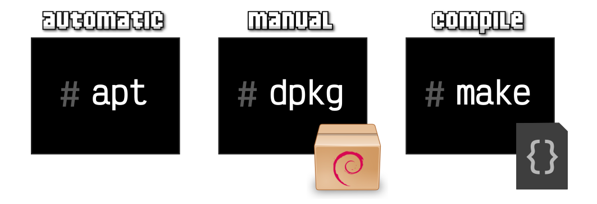

Esta es la forma más cómoda y automática de instalar paquetes desde una línea de comandos. También tenemos el comando dpkg, que sirve para instalar de forma manual los paquetes (es lo que usa por debajo apt) y, por último, tenemos la forma más manual que existe: compilar el programa de su código fuente a un archivo ejecutable. Pero de eso hablaremos en otro momento.

Volviendo a la instalación automática de paquetes, existen varios comandos relacionados:

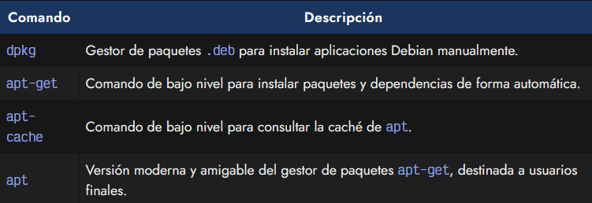

Existen algunos otros comando de gestión de instalación de paquetes como aptitude, synaptic (entorno gráfico) o wajig, pero no son el objeto de este artículo, ya que son menos populares o alternativas para otros contextos.

# 
Instalación manual

## El comando dpkg.
En Linux, más concretamente en Debian (o distribuciones de Linux basadas en él), el formato de paquetería que se utiliza para instalar aplicaciones es .deb (Debian Packages). Si quisieramos instalar un paquete de forma manual, tendríamos que descargar este archivo .deb y desde una línea de comandos escribir:

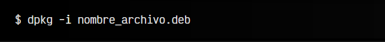

Al igual que instalamos un paquete con el parámetro -i (install), podemos desinstalarlo con el parámetro -r (remove) o ver su contenido con -l (list). En la instalación, el comando dpkg (Debian Package) se encargaría de desempaquetar e instalar el paquete, después de comprobar si tenemos todas las dependencias (otros paquetes) necesarias instaladas.

Como todo este trabajo puede llegar a ser muy laborioso si hay muchas dependencias, se ideó apt, un gestor de paquetes que haría todo esto de forma automática por nosotros, búsqueda e instalación de dependencias incluida.

## Instalación automática con apt.
El gestor de paquetes apt nos permite instalar de forma muy sencilla aplicaciones y programas a través del comando apt (o apt-get si queremos usar el comando de bajo nivel). Una vez dicho esto, veamos cuales son los parámetros más frecuentes de apt:

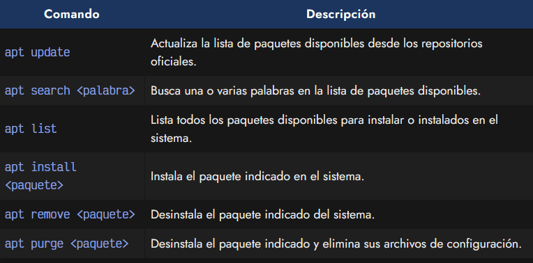

En primer lugar, debemos diferenciar bien un paquete (aplicación o programa), de la lista de paquetes disponibles, que es un índice donde se encuentran todos los paquetes instalables desde apt. Esta lista se suele actualizar (para tener la última disponible) mediante apt update, como veremos a continuación.

## Actualizar lista de paquetes.
Lo primero que se debe hacer es ejecutar la línea de comandos apt update. Este comando lo que hará es actualizar la lista de paquetes disponibles para instalar, que puede estar obsoleta si han pasado varios días desde la última vez que lo hicimos, o incluso puede estar vacía si no lo hemos hecho nunca.

Consejo: Por defecto (sobre todo si usas Docker), las distribuciones suelen venir con esta lista (índice de paquetes) vacía, por lo que si hacemos un apt install o apt search es probable que no nos encuentre nada. Hay que hacer un apt update antes.

Si nos aparece un mensaje como el siguiente, es que no tenemos permisos para actualizar listas o instalar paquetes. Lo correcto sería hacerlo con privilegios de root, utilizando sudo antes del comando apt update:

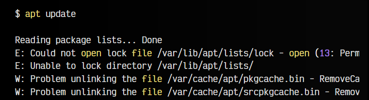

Más adelante veremos como podemos gestionar estas listas de paquetes para incluir más repositorios o mantenerlos bien actualizados.

## Buscar paquetes con apt.
Para buscar paquetes con apt, solo tenemos que usar el parámetro apt search seguido de la palabra (o palabras) que queramos buscar:

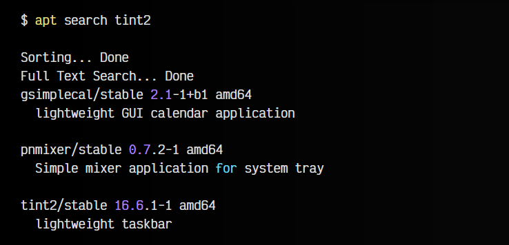

Esto nos muestra una lista de paquetes que coinciden con los términos que hemos buscado, ya sea porque es el paquete concreto, porque contiene la palabra en su nombre, o porque se cita en la descripción o en alguna palabra clave relacionada.

Nota: Si lo que queremos es más información sobre un paquete en particular, podemos utilizar el comando apt show < paquete > donde se nos mostrarán detalles como la versión, el usuario que mantiene el paquete, tamaño de instalación, dependencias, etc...

## Ver paquetes instalados.
Un poco más amplio es el objetivo de apt list, el cuál nos muestra la lista de paquetes disponibles para instalar, en un formato más compacto, donde cada línea es un paquete y no muestra descripción. Esto es útil si queremos filtrar haciendo un apt list | grep tint2 por ejemplo. En este caso, solo filtraremos por nombre del paquete.

Si lo que queremos es ver un listado de los paquetes instalados en nuestro sistema, simplemente hay que escribir: apt list --installed. Por otro lado, apt list --upgradable nos muestra un listado de los paquetes que tienen actualización disponible.

## Instalar paquetes con apt.
Probablemente, lo que más nos interese es saber como instalar un paquete con apt. Es algo tan sencillo como escribir apt install seguido del nombre del paquete.

En muchas ocasiones, apt nos preguntará si estamos seguros de querer continuar, teniendo que pulsar
Yes o No . Es posible omitir esta pregunta utilizando el flag -y:

## Desinstalar paquetes con apt.
En el caso de que queramos desinstalar un paquete de nuestro sistema, podremos utilizar apt remove seguido del nombre del paquete. Esto eliminará dicho paquete de nuestro sistema, exceptuando los ficheros de configuración que pudieramos haber modificado. En el caso de que desinstalemos un programa sin querer, con volverlo a instalar recuperaremos su configuración habitual.

En el caso de que estemos seguros completamente y/o queramos eliminar por completo la aplicación, incluyendo también los archivos de configuración, podemos utilizar el comando apt purge seguido del nombre del paquete, en lugar de utilizar apt remove.

## Operaciones de mantenimiento.
Otra de las ventajas de apt, es que también permite realizar tareas de mantenimiento o actualizar nuestro sistema mediante algunos de sus comandos. Los más populares son los siguientes:

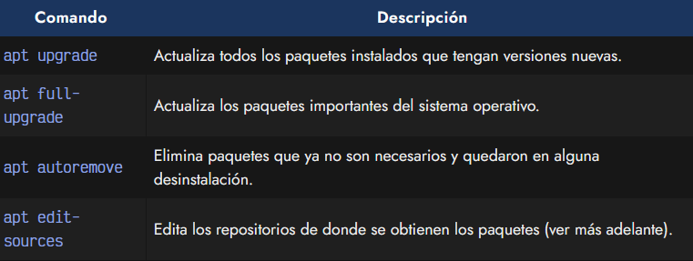

sources	Edita los repositorios de donde se obtienen los paquetes (ver más adelante).

Por ejemplo, apt upgrade (no confundir con apt update) permite actualizar todos los paquetes instalados que no se encuentren en su última versión. Es una excelente forma de mantener el software de tu sistema actualizado sin demasiadas complicaciones.

El comando apt full-upgrade nos permite realizar una actualización completa del sistema. En el caso de apt upgrade, sólo nos actualizará paquetes que pasan a una nueva versión, pero en el caso de apt full-upgrade también eliminará paquetes instalados en el caso de que sea necesario, como suele serlo en las actualizaciones importantes del sistema.

Por último, apt autoremove es un comando que permite eliminar paquetes que, tras una actualización, han pasado a ser paquetes huérfanos (que ya no son utilizados) y pueden eliminarse de forma segura para hacer espacio en el disco.

Del nuevo comando apt edit-sources hablaremos un poco más adelante, en el apartado de Editar los repositorios.

## Equivalencias de apt y apt-get.
Si quieres saber la equivalencia de los comandos entre apt vs apt-get, puedes echar un vistazo a la siguiente tabla:

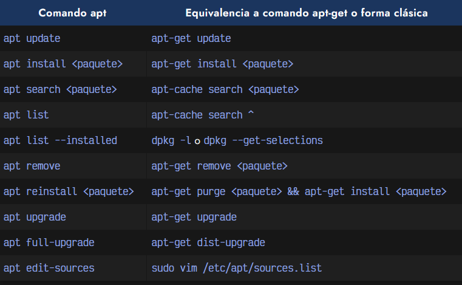

Recuerda que las instalaciones se pueden realizar tanto desde apt como desde el comando de bajo nivel apt-get. Ambos sirven para lo mismo, pero apt está destinado a ser una opción más sencilla y atractiva (usa colores, barras de progreso, simplifica tareas, etc...) que apt-get, el cuál es un comando más a bajo nivel, que puede ser más interesante para crear scripts o realizar tareas automatizadas.

## Editar repositorios de aptt.
Las listas de paquetes de Debian se actualizan desde los repositorios definidos en el fichero /etc/apt/sources.list. En él, se suelen encontrar los repositorios que estamos utilizando, uno por línea. Algo similar a lo siguiente:

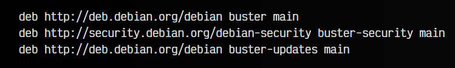

Observa que donde aparece la palabra clave buster está indicando la versión del sistema operativo. En el caso de Debian, cada versión del sistema operativo es definida por una palabra clave que es un personaje de Toy Story:

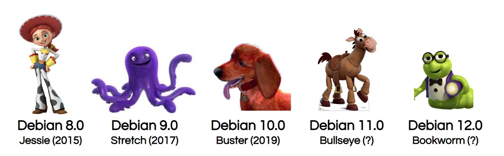

   - Debian 7: wheezy (2013)
   - Debian 8: jessie (2015)
   - Debian 9: stretch (2017)
   - Debian 10: buster (2019)
   - Debian 11: bullseye (2021)
   - Debian 12: bookworm (2023)

## Actualización de Debian.
Sabiendo esto, es muy sencillo configurar los repositorios para actualizar nuestro sistema a las futuras versiones. Imaginemos que tenemos un sistema con Debian 10 (buster) como el del ejemplo anterior. Para actualizarlo a Debian 11 (bullseye), podemos hacer lo siguiente:

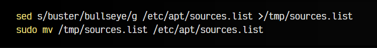

Con sed y una expresión regular, hemos reemplazado buster por bullseye, por lo que nuestro fichero /etc/apt/sources.list debería ser ahora el siguiente:

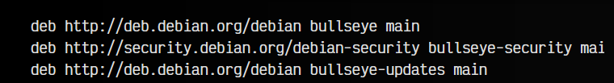

Con un sudo apt update && sudo apt upgrade deberíamos tener la distribución y todos sus paquetes actualizados.

## Ampliación de repositorios.
Comentar también que, por defecto, debian incorpora su repositorio principal (debian), su repositorio de actualizaciones de seguridad (debian-security) y su repositorio de actualizaciones por versión (updates en este caso). Podemos ampliar estos repositorios para tener más paquetes a nuestra disposición.

Veamos un fichero /etc/apt/sources.list ampliado:

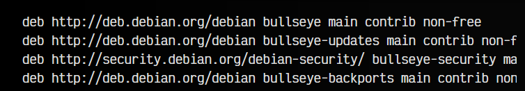

Si nos fijamos, cada repositorio (cada línea) tiene las palabras clave contrib y non-free. Esto hace que dichos repositorios no sólo muestren los paquetes generales, sino también los que son contribuciones de la comunidad (contrib) o los paquetes privativos (non-free).

La última línea tiene un repositorio adicional bullseye-backports. Este es el llamado repositorio de retroimportaciones. Se trata de paquetes considerados inestables, pero mucho más actualizados que otros, por si se quisiera tener versiones más modernas, que las versiones estables consideradas por Debian.

En muchos casos, encontrarás una carpeta adicional /etc/apt/sources.list.d/ que contiene algunos archivos. Son repositorios adicionales particulares, divididos en archivos separados para ser más fácil de gestionar por herramientas automáticas. Muchas aplicaciones como node, docker u otros, utilizan este sistema para añadir sus propios repositorios de actualizaciones.

## Poderes de super vaca.
Si nos fijamos bien, al ejecutar apt nos aparece al final el mensaje This APT has Super Cow Powers (Este APT tiene poderes de super vaca). Se trata de un huevo de pascua donde podemos ver a una vaquita escribiendo apt moo, apt moo moo o apt moo moo moo:

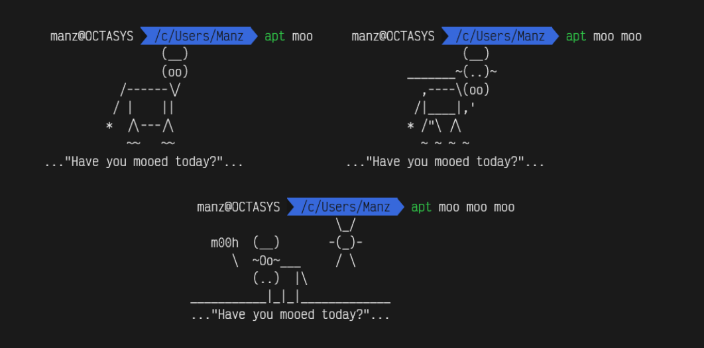

El mensaje Have you mooed today? es una referencia al eslogan de las campañas de Microsoft de los años 90, ¿A dónde quieres ir hoy? [Where do you want to go today?](https://es.wikipedia.org/wiki/Where_do_you_want_to_go_today%3F).