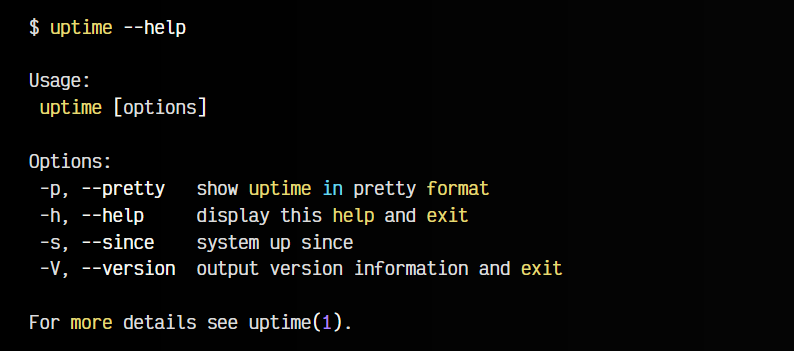
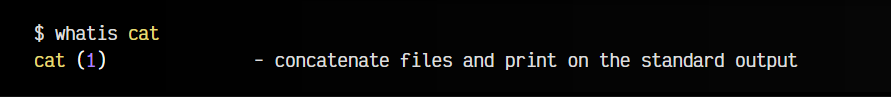
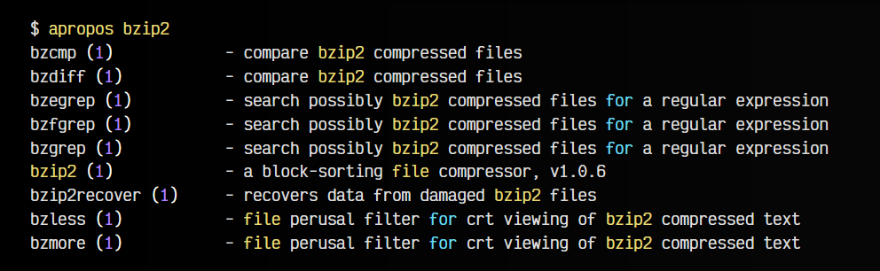
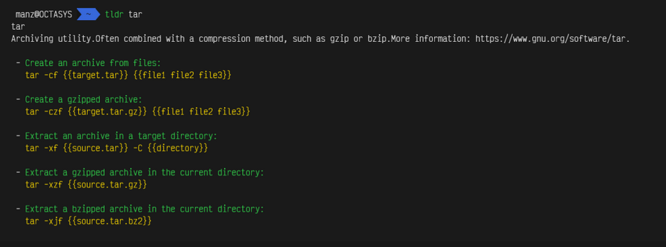
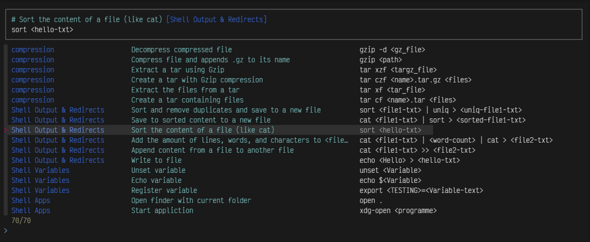

# 
Ayuda en la terminal

Quizás uno de los primeros consejos que nos pueden dar en la terminal de GNU/Linux es el de aprender a consultar la ayuda. Continuamente, nos estaremos enfrentando a nuevos comandos, parámetros adicionales o intentando buscar detalles sobre un comando que desconocemos o que, quizás, no recordamos.

Para lidiar con ello, Linux tiene varias formas de consultar ayuda breve o amplios manuales de ayuda, por lo que es conveniente conocer cada una de las formas más interesantes de obtener más información sobre algún detalle.

## Parámetro --help (ayuda rápida).
Quizás, la forma más rápida de consultar la ayuda, es utilizar el parámetro --help después del comando que desconocemos y queremos más ayuda. Esto nos mostrará una, generalmente, breve pantalla de ayuda, con los parámetros u opciones más comunes. Útil para consultar rápidamente detalles frecuentes o, aparentemente, muy populares.

Por ejemplo, si queremos consultar la ayuda del comando uptime, simplemente escribimos:

Nota: No todos los comandos tienen ayuda rápida, pero si la mayoría, por lo que es una primera opción bastante interesante.

## ¿Para qué sirve este comando?.
En el caso de que simplemente queramos saber para que sirve un comando específico, podemos utilizar el comando whatis (qué es) seguido del nombre del comando:

Otro comando muy similar es apropos (a propósito de...), el cuál nos muestra comandos relacionados al que escribimos a continuación, algo muy útil para aprender nuevos comandos:

Ten en cuenta que el número que aparece a continuación (entre paréntesis), denota en que página del manual se encuentra (ver siguiente apartado). Si lo que buscamos son comandos, el número debe ser 1. También podemos escribir apropos 1 seguido del comando, para obligar a apropos a sólo mostrarnos resultados de esa página.

## Páginas de manual (man pages).
Si existe un comando de ayuda por excelencia en Linux, son las «páginas man», o lo que es lo mismo, las páginas de manual. En ellas puedes encontrar extensa información sobre comandos, parámetros, opciones y otros detalles sobre comandos, programación, ficheros del sistema u otros detalles.

La forma de consultar estas páginas de manual es muy sencilla: escribimos man seguido del nombre del comando (o la palabra a investigar), por ejemplo: man ls. Esto nos mostrará una página de ayuda sobre el mismo, donde podemos aprender a utilizarlo, ver que opciones o parámetros tiene, el autor del mismo, etc. Ten en cuenta que muchas veces no vienen instaladas en el sistema, y hay que instalarlas con un sudo apt install man.

Esta es la opción preferida cuando queremos buscar información detallada sobre alguna funcionalidad específica de algún comando.

Si estamos utilizando la shell zsh, una forma de mejorar las páginas man es incluyendo el plugin colored-man-pages en la línea de plugins del fichero ~/.zshrc. Esto añadirá un resaltado de color a las páginas man, que harán la experiencia de leer estas páginas un poco más agradable.

Nota: Si quieres poner las páginas man en español, lo recomendable sería instalar los paquetes en español en el sistema con sudo apt install manpages-es manpages-es-extra y establecer el idioma del sistema en español.

## Páginas man simplificadas (tldr).
La abreviatura TL;DR (Too long, didn't read) es un acrónimo utilizado para referirse a que algo no se ha leído porque es demasiado largo. Las páginas man, aunque muy útiles, tienen esa característica: muchas veces no se consultan porque debes leer gran cantidad de información, tardando así bastante en encontrar lo que buscas.

Si esta es tu opinión, probablemente te interese el proyecto tldr pages, un sustituto de las páginas man, ideadas para simplificar la ayuda y mostrar directamente ejemplos prácticos de referencia que suelen resolver la mayoría de las dudas, sobre todo cuando sólo consultas para recordar algo olvidado.

Su forma de utilizarlo, es simplemente escribir tldr seguido del comando en cuestión:

## Navi, el hada del terminal.
Otro recurso bastante interesante de cara a mostrar ayuda al usuario, el uso de navi, un asistente interactivo desarrollado en Rust y que toma su nombre del hada del videojuego «The Legend of Zelda», que tiene como finalidad mostrar unas cheatsheets interactivas con los comandos y parámetros más utilizados, al estilo de tldr.

Para instalar navi, necesitaremos tener instalado Rust. Si lo tenemos instalado, podemos escribir cargo install navi. Con ello tendremos el asistente navi, pero tendremos que instalar las cheatsheets que queramos tener descargadas.

Con navi repo browse se nos muestran varios repositorios con las cheatsheets más conocidas, de ahí podemos ir instalando las que más nos interese consultar para tenerlas instaladas en nuestro sistema. Si por otro lado, lo que queremos es instalar una cheatsheet concreta de un repositorio de GitHub, podemos hacerlo con el comando navi repo add < URL >.

Una vez descargadas en nuestro sistema, podemos consultar rápidamente con el comando navi query seguido de la palabra clave a consultar. Otros proyectos similares podrían ser [cheat](https://github.com/cheat/cheat) o [manly](https://github.com/carlbordum/manly).

Nota: Recuerda que si lo que quieres es una cheatsheet física en formato PDF lista para imprimir, tienes nuestra [cheatsheet de la terminal de Linux](https://terminaldelinux.com/cheatsheets) en esta misma página.

