# 
Carpetas (directorios) en Linux

GNU/Linux tiene su propia distribución de ficheros y carpetas que, para usuarios que provengan de Windows, puede ser confusa, ya que es bastante diferente. En Linux hay una máxima que se sigue como filosofía: todo son ficheros: los «accesos directos», los dispositivos físicos como el ratón o el teclado, los discos duros, las carpetas, e incluso y obviamente, los ficheros.

Mientras que en Windows, una ruta normal de carpetas podría ser C:\Users\Manz, una ruta equivalente en un sistema operativo Linux sería /home/manz:

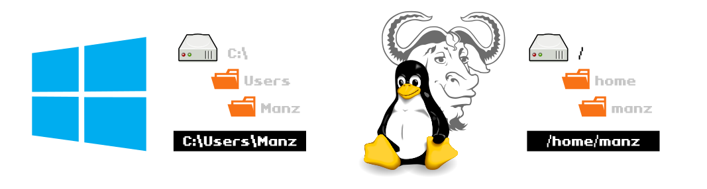

En Linux, los nombres de ficheros son sensibles a mayúsculas y minúsculas, es decir, puede coexistir un fichero llamado gato y otro Gato en la misma carpeta, puesto que son ficheros diferentes. Sin embargo, en un sistema Windows, serían el mismo fichero.

## El comando pwd.
En una terminal de Linux, normalmente a la izquierda se nos muestra la carpeta donde nos encontramos (o parte de ella). Sin embargo, dependiendo de la configuración de nuestra shell, es posible que no aparezca. Si queremos saber en que carpeta nos encontramos, podemos utilizar el comando pwd (print work directory).

## El comando tree.
Si no tenemos muy clara la estructura de carpetas donde estamos, podemos utilizar el comando tree, el cuál nos muestra un árbol de carpetas, esquematizado. Por ejemplo, escribiendo tree /var/log nos mostrará algo parecido a esto:

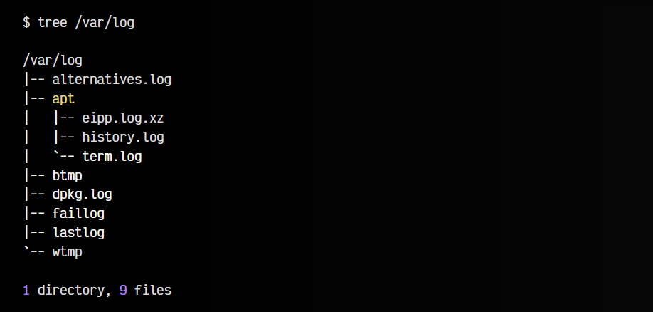

De esta forma podemos ver «pseudo-gráficamente» la estructura de carpetas. Ten en cuenta que el comando tree no viene instalado en el sistema, y hay que instalarlo previamente con un sudo apt install tree.

## El comando et.
Existe una mejora que es una especie de mezcla entre tree y du, llamada et (erdtree). Este comando permite mostrar en forma de árbol la estructura de carpeta, pudiendo personalizar como queremos mostrarlo:

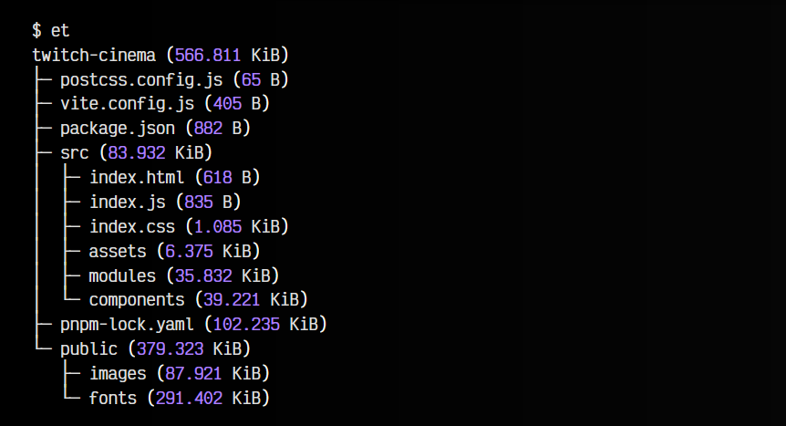

Por aquí tienes el [github de erdtree](https://github.com/solidiquis/erdtree), donde puedes encontrar la instalación y el formato de configuración para personalizarlo. Por ejemplo, creando un fichero en ~/.erdtreerc con el siguiente contenido:

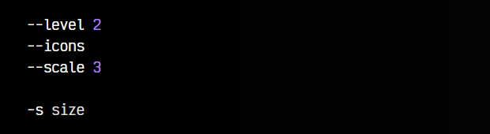

## El comando ls.
Para ver los ficheros y carpetas del directorio actual, basta con utilizar el comando ls (LiSt files). Esto mostrará una lista en horizontal con todos los ficheros y carpetas encontradas. También podemos especificar la ruta que queremos listar por parámetro, por ejemplo: ls /home. Por ejemplo:

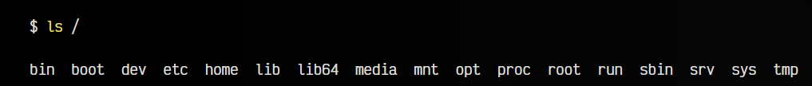

En algunos casos, puede que el ls devuelva los ficheros sin resaltado de sintaxis de color. Puedes probar con ls --color para ver si muestra los ficheros con colores. Las distribuciones de Linux, suelen crear un alias en el fichero ~/.bashrc o ~/.zshrc para que cuando se escriba ls, realmente se haga un ls --color.

Existen algunos parámetros interesantes para mostrar más información al listar ficheros y carpetas, como por ejemplo ls -lh, donde la l usa el formato ancho (más información) y la h muestra «en humano» el tamaño de los ficheros (usando unidades para que sea más fácil).

Aquí vemos algunos de los más interesantes:

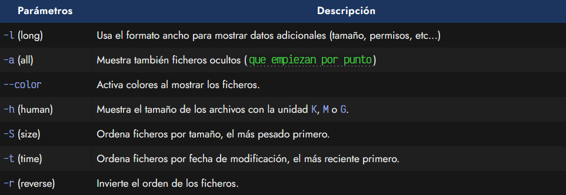

Observa que para indicar varios parámetros, en lugar de escribir, por ejemplo, ls -l -h -S puedes contraer los parámetros y escribir ls -lhS.

## El comando exa.
Existe una mejora del ls, bastante interesante, que utiliza resaltado de sintaxis para que sea más sencillo identificar los permisos rápidamente. Se llama exa y está desarrollada en Rust. Podemos instalar esta herramienta fácilmente si disponemos de Rust en nuestro sistema, utilizando su gestor de paquetes. Simplemente escribimos cargo install exa y lo instalaremos.

La salida del formato largo de exa es el siguiente:

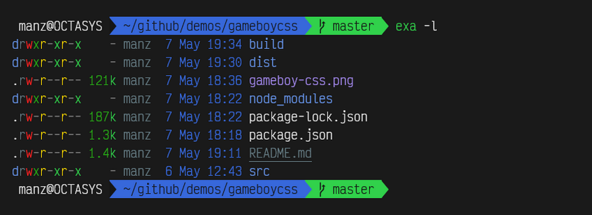

Aunque no es un reemplazo 100% idéntico en parámetros, puedes crear un alias de ls para que ejecute exa en su lugar. Como curiosidad y para una mejor identificación de ficheros, con el parámetro exa --icons puede mostrar iconos de los tipos de ficheros a la izquierda.

## El comando lsd.
Existe otra alternativa a ls llamada lsd y muy parecida a exa. Puedes descargarla e instalarla haciendo lo siguiente:

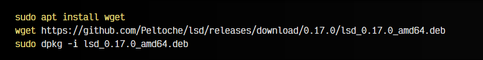

También tiene resaltado de sintaxis con colores, soporte de iconos, junto a otras características, por lo que también es una buena opción.

## El comando cd.
Para movernos entre carpetas, utilizaremos el comando cd (change directory) seguido del nombre de la carpeta (movimiento relativo) o ruta completa (movimiento absoluto) a la que queremos acceder. Ten en cuenta que al escribir el nombre de la carpeta o ruta, puedes pulsar

y el sistema te sugiere las opciones que encajen con lo que has escrito (o autocompleta si solo hay una opción), de modo que no tendrás que escribirlo por completo.

Existen algunas palabras clave para referirnos a rutas específicas:

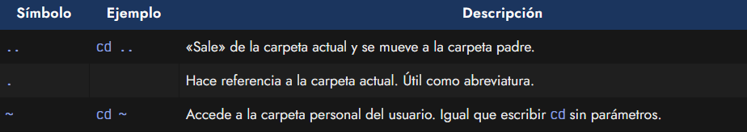

De la misma forma, se pueden hacer combinaciones como ls ~/.oh-my-fish/, que es lo mismo que ls /home/manz/.oh-my-fish/ (si soy el usuario manz) o ls ../etc sería equivalente a ls /etc si estoy en la carpeta /home.

## El comando pushd y popd.
Otra forma de trabajar entre carpetas, es utilizando los comandos pushd (push directory) y popd (pop directory). Ambos funcionan trabajando con una estructura de pila donde podemos hacer push (para meter una carpeta) o pop (para sacar una carpeta). De esta forma, si sabemos que más adelante necesitaremos volver a acceder a una ruta compleja, podemos hacer lo siguiente:

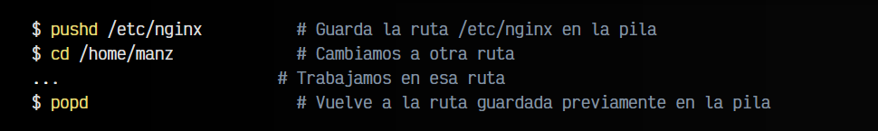

Podemos ejecutar varias veces el comando pushd e ir apilando varias rutas o carpetas diferentes. También tener en cuenta que se puede utilizar . como parámetro de pushd para guardar la ruta actual en la que nos encontramos de forma rápida.

## El comando j (autojump).
Si acostumbras a trabajar en una terminal, es muy común perder bastante tiempo escribiendo los nombres de las carpetas o pensando cuál era la ruta, en la que estabas, si no estás muy familiarizado con ella.

El comando autojump es una mejora interesante del cd, ya que se basa en saltar a la carpeta «frecuente» que más se aproxime al parámetro escrito; esto es, la ruta o carpeta más frecuente y más reciente. Veamoslo con un ejemplo:

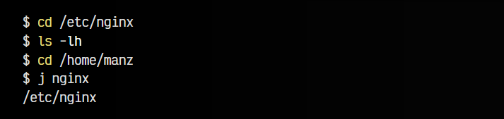

En el ejemplo anterior, al escribir j nginx, el comando autojump accede a la ruta /etc/nginx, porque es la carpeta más reciente a la que hemos accedido frecuentemente que encaja con el texto escrito por parámetro: nginx. El comando nos muestra por pantalla la carpeta coincidente, y cambia a ella automáticamente.

Nota: El comando j es un alias de autojump y no viene instalado por defecto en el sistema. Para instalarlo en Debian, basta con hacer un sudo apt install autojump y añadir la línea source /usr/share/autojump/autojump.bash (la extensión depende de la shell que usemos). Existen otras mejoras similares como [z](https://github.com/rupa/z), [v](https://github.com/rupa/v) o [fasd](https://github.com/clvv/fasd).

## Carpetas del sistema.
Linux tiene una estructura de carpetas bien definida, donde cada carpeta tiene una finalidad muy concreta, y en ella se guardan los archivos correspondientes. Por otra parte, mientras que en Windows la ruta raíz (la primera carpeta del sistema) es C:\, en Linux es /, puesto que todo parte de esa ruta raíz.

Desde esa ruta / nos podemos encontrar varias carpetas, cada una con una finalidad concreta:

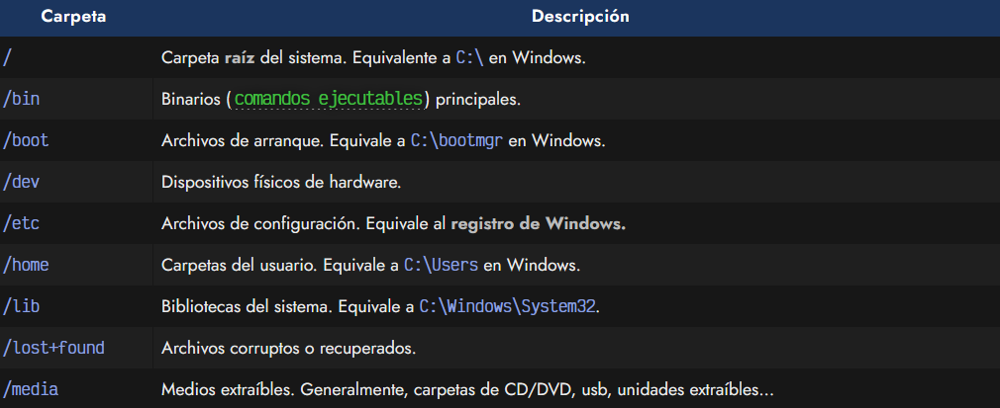

Más adelante, en otro artículo, veremos como realizar otras operaciones de manipulación como copiar, borrar, mover y crear carpetas o ficheros.

