# 
Configuración para VSCode

A continuación encontrarás una lista de configuraciones de VSCode que te permitirán configurarlo completamente a tu gusto. Puedes copiarlas para configurarlas exactamente igual, o modificarlas a tu criterio. Características como configurar el orden de los paneles, los linters, el minimapa de VSCode, features al escribir código, etc...

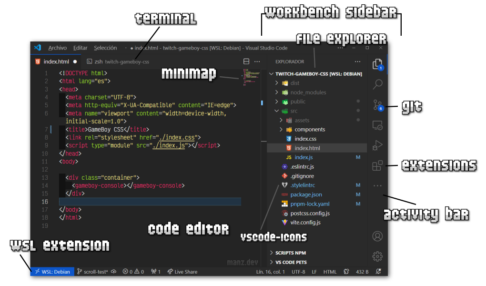

Para acceder al fichero de configuración, sólo tienes que pulsar F1

y escribir Open User Settings (JSON), esa opción te llevará a un fichero .json que ya contendrá tu configuración (o estará vacío en una instalación nueva).

En su interior, comenzaremos a escribir las siguientes opciones que nos interesen. Recuerda que se trata de un fichero .json que permite comentarios /* ... */, por lo que hay que respetar el formato y cerrar correctamente las comillas. Recuerda que podemos pulsar CTRL+SPACE  para forzar al autocompletado a darnos las posibles opciones.

## Ubicación y colocación.
Por defecto, la estructura del VSCode, de izquierda a derecha es la siguiente:

   - Workbench Sidebar (Activity bar + file explorer) (Izquierda)
   - Editor de código (Derecha)
   - Terminal integrada (Abajo)

Podemos cambiar ligeramente esta estructura simplemente añadiendo las siguientes opciones. La barra de actividad se puede colocar arriba (top), en un lateral (side) o ocultarse (hidden), mientras que la sidebar se puede colocar a la izquierda (por defecto) o a la derecha:

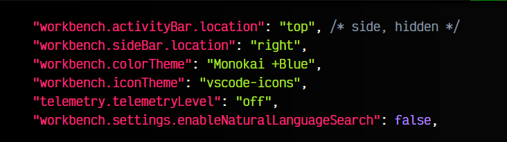

Por su parte, como vimos en el post anterior, con colorTheme e iconTheme podemos indicar el tema que estamos utilizando y el tema de iconos. Los dos últimos sirven para desactivar temas de telemetría y envío de información a Microsoft. Recuerda que también puedes usar [VSCodium](https://vscodium.com/).

## Explorador de archivos (Workbench).
Con las siguientes opciones podemos cambiar la indentación de las carpetas y ficheros en el explorador, así como ocultar por completo las guías verticales de las carpetas. Con expandMode y openMode indicamos si queremos que expanda o abra ficheros/carpetas con un solo click o doble click. Con smoothScrolling conseguimos que podamos hacer scroll de forma suave:

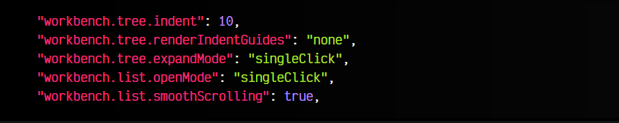

## Zona del editor.
La zona principal del VSCode es la zona del editor de código, podemos establecer cosas como la tipografía a utilizar, el espacio entre letras o si utilizamos ligaduras (carácteres especiales unificados). También podemos indicar si queremos que se inserten espacios al pulsar TAB o si queremos mostrar los espacios con un puntito · para que se vean mejor, o ocultarlos por completo para que esté más limpia la interfaz:

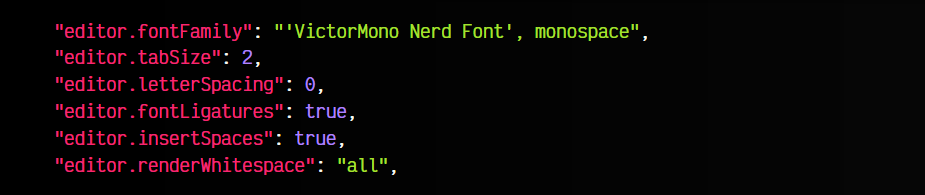

Por otro lado, podemos activar algunas acciones, como que inserte siempre una nueva línea al final del archivo o si queremos que elimine los espacios en blanco al final de una línea.

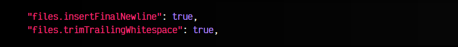

## Trabajando con HTML.
Si trabajamos con ficheros HTML, probablemente te interesen las siguientes opciones. Con autoClosingTags podemos indicar que queremos que al abrir una etiqueta HTML también añada la etiqueta de cierre:

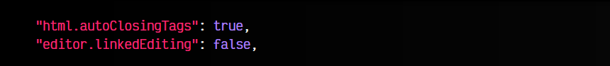

Por otro lado, la segunda, linkedEditing, permite que al actualizar una etiqueta, también se actualice la etiqueta de cierre o viceversa. De este modo no tendrás que hacerlo dos veces.

## Sticky Scroll.
El Sticky scroll (scroll pegajoso) es una modalidad que al hacer scroll, se mantiene en la zona superior la categoría en la que te encuentras.

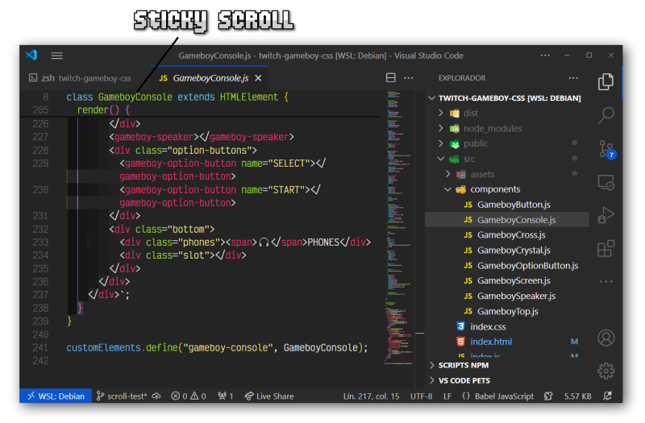

Esto puede activarse tanto en el editor de código, como en el árbol de ficheros, como en la terminal integrada:

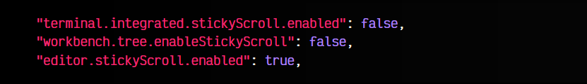

## Animación del cursor.
La animación del curso es modificable desde VSCode, para hacerla mucho más agradable. Por ejemplo, puedes activar la opción cursorSmoothCaretAnimation y smoothScrolling haciendo que tanto la animación de parpadeo del cursor como el movimiento del mismo sea mucho más suave.

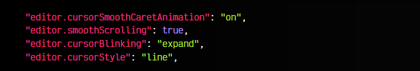

Por otro lado, con cursorBlinking puedes personalizar el tipo de parpadeo (solid, phase, expand, blink, smooth) y con cursorStyle la forma del cursor (block, line, underline).

Recuerda que también tienes la extensión [PowerMode](https://marketplace.visualstudio.com/items?itemName=hoovercj.vscode-power-mode) para echar chispas y partículas mientras escribes.

## Bracket Pair.
Antiguamente, se utilizaba una extensión llamada Bracket Pair Colorizer en VSCode para colorear los corchetes, llaves o paréntesis y saber donde termina cada uno rápidamente. Hoy en día no se debe utilizar, ya que VSCode tiene integrada esta funcionalidad sin necesidad de extensiones externas, simplemente con la opción bracketPairColorization.enabled.

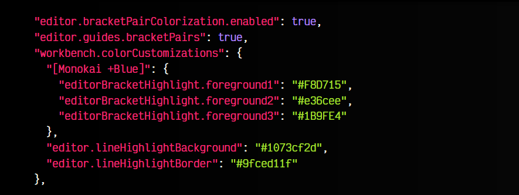

Además, tiene capacidades de personalización como guides.bracketPairs, que nos permite activar unas guías para ver hasta donde alcanzan los ámbitos. Por otro lado, si añades el nombre del tema de VSCode que utilices entre paréntesis (yo he puesto [Monokai +Blue]), puedes configurar los colores de las parentizaciones.

## Reglas de TextMate.
Otra característica interesante es que VSCode permite heredar personalizaciones de TextMate, por lo que podemos usar cosas como esta, que coloca los comentarios de código con un estilo en cursiva:

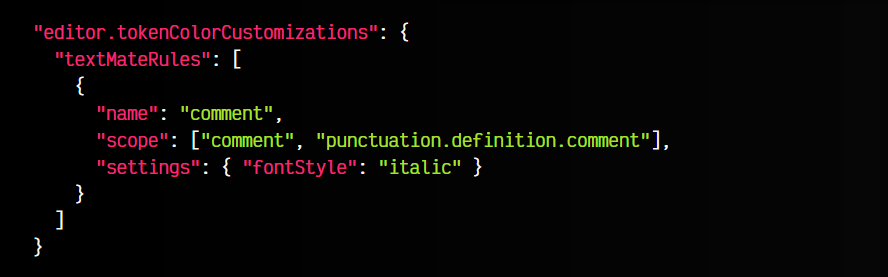

## Minimapa del archivo.
El minimapa de VSCode es altamente configurable también. Por ejemplo, yo prefiero desactivar la renderización de carácteres con renderCharacters y ajustar features como su tamaño máximo, la escala, donde se muestra o si se debe ocultar, entre otras:

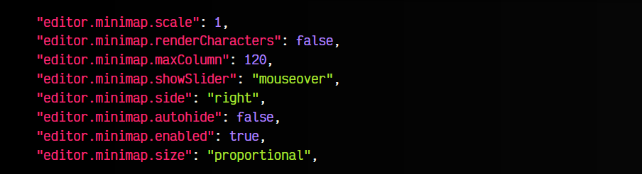

## Inlay Hints.
Los Inlay Hints son sugerencias incrustadas que VSCode muestra para ayudarnos a entender que se espera por parámetro o que devuelva una función. Con la opción inlayHints.enabled a offUnlessPressed, nos muestra dicha información al pulsar la combinación CTRL+ALT.

Las demás opciones te ayudan a seleccionar que características quieres activar:

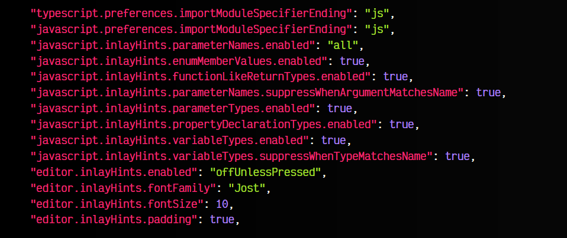

## Terminal integrada.
Nuestra terminal integrada de VSCode, se abre siempre en la zona inferior del editor. Para los [streams](https://manz.dev/) me gusta más abrirlas en una pestaña del editor, para aprovechar mejor el espacio.

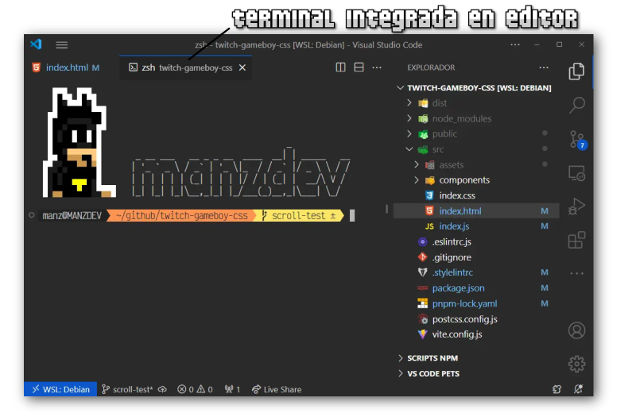

Además, puedes personalizar la tipografía de la terminal aquí:

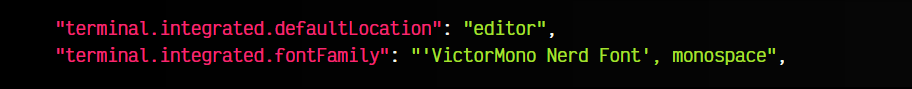

Utilizo Victor Mono en su versión de [Nerd Fonts](https://www.nerdfonts.com/font-downloads).

## Autoguardado.
VSCode incorpora unas opciones para hacer guardados automáticos, sin necesidad de que el desarrollador tenga que pulsar CTRL+S:

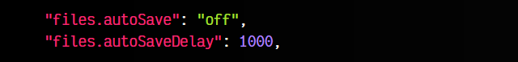

Con la opción autoSave puedes indicar:

   - off desactivar el autoguardado
   - afterDelay guarda tras los ms indicados en autoSaveDelay
   - onFocusChange guarda cuando el editor pierde el foco y vas a otra zona del editor
   - onWindowChange guarda cuando el VSCode pierde el foco y vas a otro programa

Mucho cuidado al utilizar esta característica. Recomiendo acostumbrarse a utilizar CTRL+S para guardar, ya que el autoguardado puede ocasionar problemas, sobre todo si utilizas linters o herramientas automatizadas.

## Linters.
Una de las características más importantes de VSCode es la activación y configuración de Linters, que no son más que herramientas que vigilan tu código y te avisan de posibles problemas, fragmentos mal escritos o errores.

Sin embargo, para configurarlos correctamente, debes dedicar un rato en configurarlo todo correctamente. Personalmente, me gusta utilizar ESLint y StyleLint, dos linters avanzados y personalizables de Javascript y CSS.

Primero, lo conveniente es desactivar los que vienen integrados en VSCode, que son mucho más básicos:

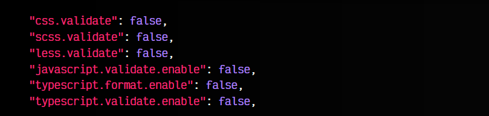

Una vez hecho, ahora vamos a activar nuestros linters personalizados. Ten en cuenta que estos linters avanzados son herramientas externas que deben ser instaladas, lo que estamos haciendo es conectar VSCode con dichas herramientas externas:

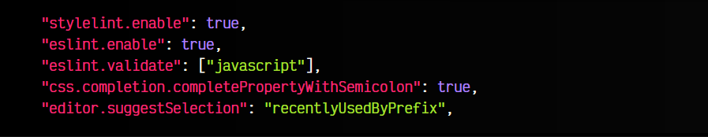

Por último, vamos a indicar a VSCode con formatOnSave que queremos darle formato a los archivos cada vez que guardemos con nuestro VSCode. Existen otros como formatOnType (al escribir) o formatOnPaste (al pegar código) que son algo más agresivas.

Las características de codeActionsOnSave definen exactamente si además intentarán corregir automáticamente los errores con el linter:

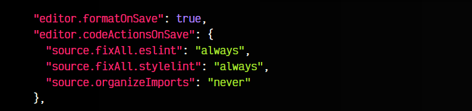

Si quieres más personalización, puedes utilizar el siguiente fragmento de código, donde puedes utilizar CTRL+SPACE para elegir el formateador o linter que quieres utilizar para dar formato al tipo de archivo que indiquemos entre []:

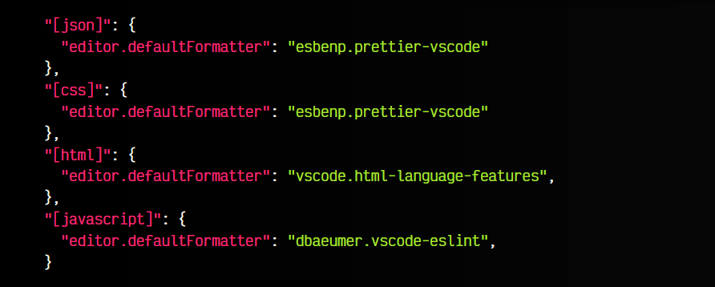

Recuerda leer los artículos [Configurar ESLint](https://lenguajejs.com/javascript/calidad-de-codigo/eslint/) y [Configurar StyleLint](https://lenguajecss.com/css/calidad-de-codigo/stylelint/) para más información.

