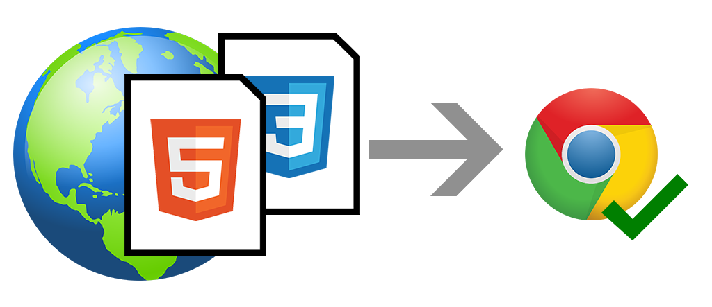

# 
¿Qué es CSS?

Si te gusta el mundo del diseño web o tienes curiosidad por empezar en este sector, probablemente ya habrás escuchado el término CSS. Se trata de una tecnología utilizada para dotar de cualidades visuales y estéticas a una página web. Si nunca has tocado esta materia, comprobarás que se trata de una forma analítica, lógica y prácticamente matemática de crear páginas web, pero gracias a ella podemos simplificar la creación de páginas y conseguir exactamente lo que buscamos.

La curva de aprendizaje de CSS suele ser sencilla (es fácil aprender cosas básicas, pero complicado dominarlas), aunque también es cierto que puede resultar complejo adaptarse si nunca has programado (o eres totalmente ajeno a escribir código), pero a medida que cometes errores y vas practicando, tu capacidad para escribir código CSS mejorará progresivamente, permitiéndonos avanzar a un ritmo cada vez más veloz.

Antes de comenzar, debes tener claro un concepto clave: una página web es realmente un documento de texto. En dicho documento se escribe código HTML, con el que se que crea el contenido de una web. Por otro lado, existe el código CSS, que unido al código HTML permite darle forma, color, posición (y otras características visuales) a un documento web.

En resumen, se trata de un «idioma» o lenguaje, como podría ser el inglés o el alemán, que los navegadores web como Chrome o Firefox conocen y pueden entender. Nuestro objetivo como diseñadores y programadores web es precisamente ese: aprender el idioma e indicarle al navegador lo que debe hacer.

Los navegadores entienden los idiomas HTML y CSS

## ¿Qué significa CSS?.
Las siglas CSS (Cascading Style Sheets) significan «Hojas de estilo en cascada» y parten de un concepto simple pero muy potente: aplicar estilos (colores, formas, márgenes, etc...) a uno o varios documentos (generalmente documentos HTML, páginas webs) de forma automática y masiva.

Se le denomina estilos en cascada porque se lee, procesa y aplica el código desde arriba hacia abajo (siguiendo patrones como herencia o cascada que trataremos más adelante) y en el caso de existir ambigüedad (código que se contradice), se siguen una serie de normas para resolver dicha ambigüedad.

Al empezar, siempre generalizamos mencionando que tenemos varios documentos HTML, pero sólo un documento CSS. En cada documento HTML enlazamos ese único documento CSS, de modo que si hacemos cambios en él, afecta a todos los documentos HTML relacionados. Esto es mucho más práctico que tener el CSS en cada uno de esos documentos, y tener que cambiarlos en cada uno de ellos.

## ¿Por qué se usa CSS?.
La idea de CSS es la de utilizar el concepto de separación de presentación y contenido. Este concepto se basa en que, como programadores, lo ideal es separar claramente el código que escribimos. ¿Por qué? Porque con el tiempo, esto hará que el código sea más fácil de modificar y mantener.

La idea es la siguiente:

   - Los documentos HTML (contenido) incluirán sólo información y datos, todo lo relativo a la información a transmitir.
    Los documentos CSS (presentación) inclurán sólo los aspectos relacionados con el estilo (diseño, colores, formas, etc...).

De esta forma, se puede unificar todo lo relativo al diseño, a lo visual en un solo documento CSS, y con ello, varias ventajas:

   - Si necesitamos hacer modificaciones visuales, lo haremos en un sólo lugar y se aplica a todo el sitio.
   - Se reduce la duplicación de estilos en diferentes lugares. Es más fácil de organizar y hacer cambios.
   - La información a transmitir es considerablemente menor (las páginas se descargan más rápido).
   - Es más fácil crear versiones diferentes para otros dispositivos: tablets, smartphones, etc...

