# 
Elementos flexibles en CSS

Como su propio nombre indica, una de las características más interesantes de flex es la flexibilidad de sus elementos. Existen una serie de propiedades muy interesantes para dotar de interacción y flexibilidad a los elementos que forman parte de un contenedor flex.

A excepción de la propiedad align-self vista en temas anteriores, todas las propiedades que hemos visto hasta ahora se aplican sobre el elemento contenedor. Las siguientes propiedades, sin embargo, se aplican sobre los elementos hijos.

## Propiedades de flexibilidad
Las siguientes propiedades nos permiten dotar de flexibilidad a los elementos hijos de un contenedor flex:

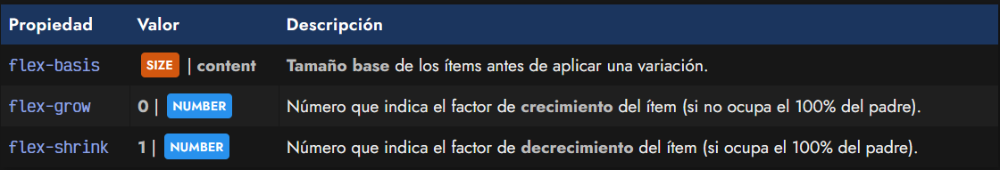

Vamos a ver detalladamente cada una de estas propiedades para entenderlas mejor.

## La propiedad flex-basis
En primer lugar, tenemos la propiedad flex-basis, que define el tamaño base por defecto que tendrán los ítems antes de aplicarle una cierta distribución de espacio. Se suele aplicar un tamaño específico (unidades, porcentajes, etc...), pero también se puede aplicar la palabra clave content que ajusta automáticamente el tamaño al contenido del elemento. Este es el valor por defecto de la propiedad.

css:
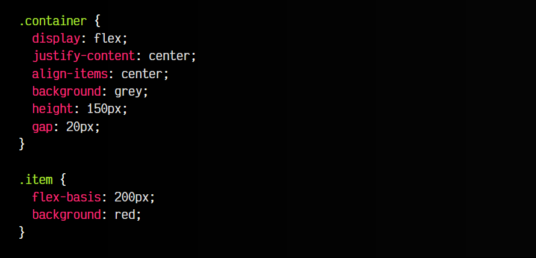

html:
![alt text]./imagenes-elementos-flexibles-css/mage-2.png)

vista:

Un detalle interesante sobre esta propiedad, es que si le aplicamos un flex-direction: column y aumentamos el height, invertiremos los ejes primario y secundario, y flex-basis actuará como height en lugar de como width. Observa también que al estar usando la propiedad de atajo gap, el hueco se aplica a ambos ejes, por lo que también actua.

## La propiedad flex-grow
La propiedad flex-grow actúa en situaciones donde:

   - Hay un flex-basis definido.
   - Los ítems cubren el tamaño total del contenedor flex padre.

En esas situaciones, la propiedad flex-grow indica el factor de crecimiento de los ítems en el caso de que no tengan un ancho o alto específico. Modifiquemos el ejemplo anterior y añadamos el siguiente fragmento de código:

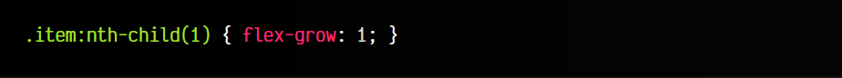

Por omisión, todos los elementos tienen un flew-grow: 0 definido, de modo que no hay factor de crecimiento en el elemento, y tendrá el tamaño definido por la propiedad flex-basis que explicamos anteriormente. Sin embargo, si colocamos un flex-grow: 1 al primer hijo (ejemplo anterior), este crecerá hasta que la suma de los hijos ocupen el 100% del contenedor, mientras que el resto de hijos tendrá el tamaño base definido por flex-basis.

Volvamos a modificarlo. Ahora añadiremos las dos últimas líneas de CSS:

css:
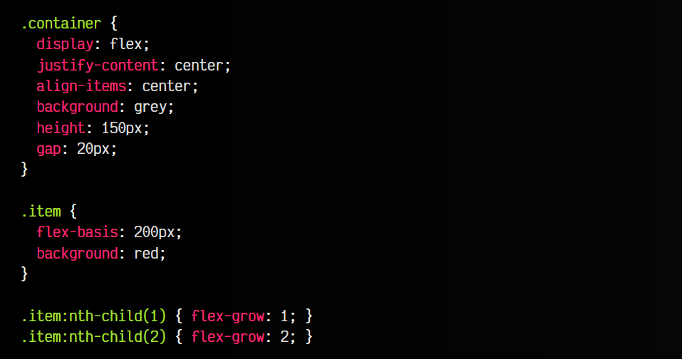

html:
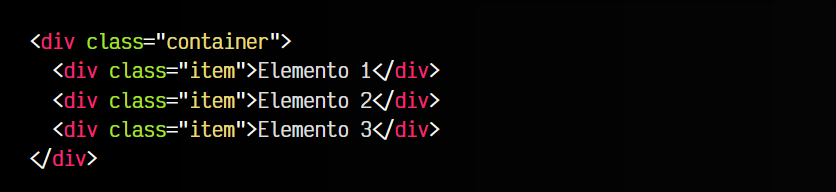

vista:
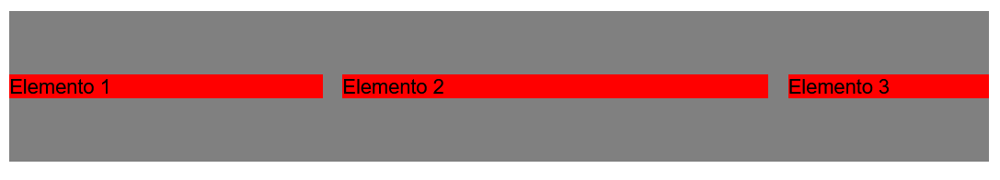

En este caso, el primer elemento tiene un factor de crecimiento de 1, mientras el segundo elemento tiene un factor de crecimiento de 2, el resto de elementos tendrán un factor de crecimiento de 0, o sea, no crecen. Así pues, tendremos que el elemento número 3 tiene un tamaño igual al flex-basis, mientras que el elemento número 1 crece un poco más y el elemento número 2 crece un poco más que el número 1.

En resumen, flex-grow establece un factor de crecimiento observando en conjunto el resto de elementos, y veremos que actua siempre y cuando la suma del espacio de los elementos hijos no superen el 100% del contenedor padre.

## La propiedad flex-shrink
Por otro lado, tenemos la propiedad flex-shrink que es la opuesta a la propiedad flex-grow. Mientras que la anterior indica un factor de crecimiento, flex-shrink hace justo lo contrario: aplica un factor de decrecimiento.

La propiedad flex-shrink actúa en situaciones donde:

   - Hay un flex-basis definido.
   - Los ítems no cubren el tamaño total del contenedor flex padre.

Volvamos al ejemplo inicial de flex-basis y vamos a añadir las dos últimas líneas y a cambiar el flex-basis de .item:

css:
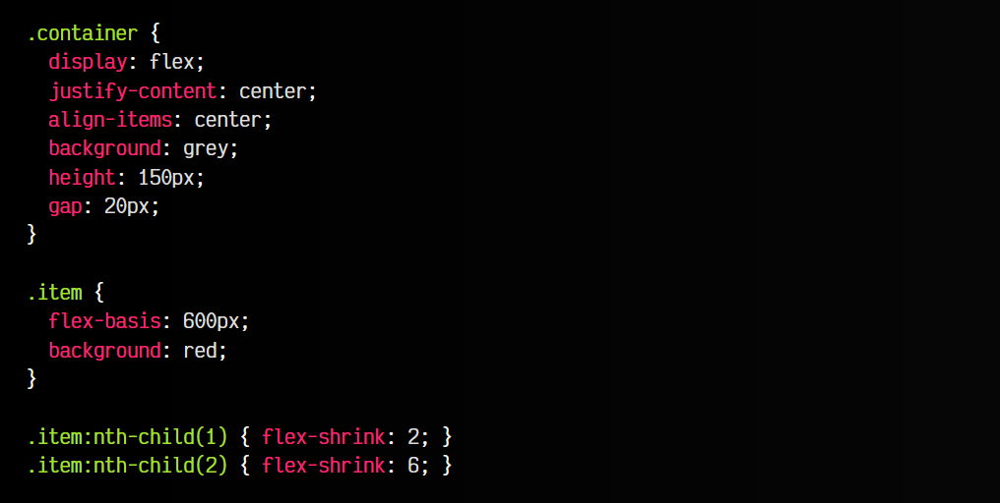

html:
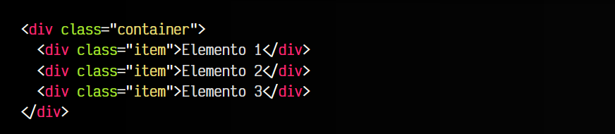

vista:
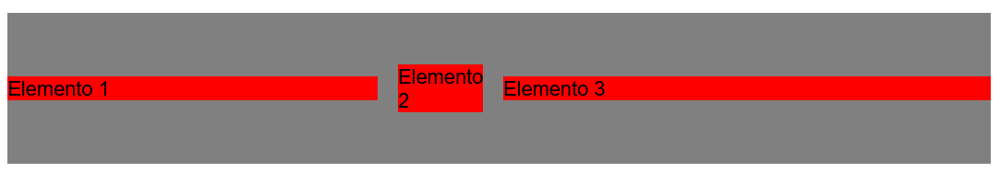

Observa que ahora, hemos definido un flex-basis más grande, para obligar que ocupe más del 100% del contenedor flex padre. Si al primer elemento le aplicamos un flex-shrink: 2 y al segundo elemento un flex-shrink: 6, veremos que el primer elemento va a ser ligeramente más pequeño que el tercero (que no cambia respecto al tamaño base), mientras que el segundo elemento va a ser considerablemente más pequeño.

## Atajo: La propiedad flex
Existe una propiedad denominada flex que sirve de atajo para estas tres propiedades indicadas en los ítems hijos. Veamos como funciona, ya que se trata de una propiedad muy versátil que soporta varios formatos:

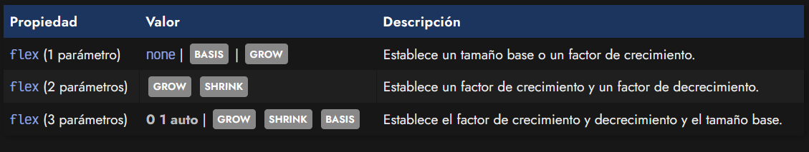

Dependiendo de la cantidad de parámetros:

   - Si en la propiedad flex indicamos un sólo parámetro podemos indicar la palabra clave none, que es equivalente a 0 0 auto, podemos establecer un flex-grow si lo que escribimos es un NUMBER o en otro caso, podemos escribir un SIZE y definir un flex-basis.

   - Si en la propiedad flex indicamos dos parámetros estaremos estableciendo un factor de crecimiento y luego, el factor de decrecimiento.

   - Si en la propiedad flex indicamos tres parámetros estaremos estableciendo los dos factores de crecimiento, y además un tamaño base.

Por defecto, el valor por omisión de esta propiedad es 0 1 auto.

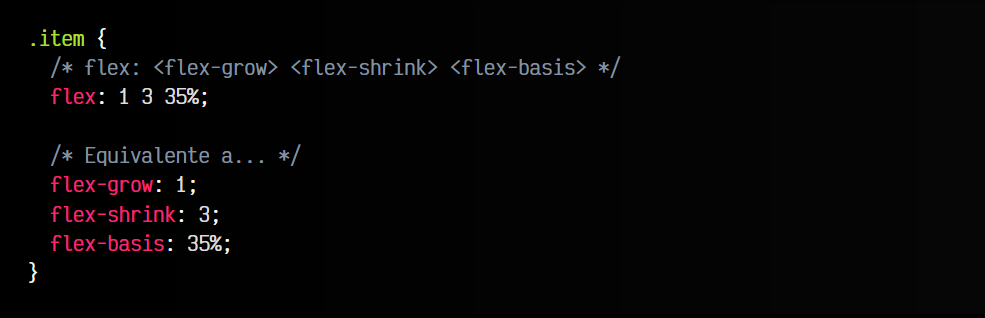

## Elementos flex animados
Ten en cuenta que las propiedades flex-grow, flex-shrink o incluso su atajo flex son animables, por lo que podemos conseguir hermosos efectos de animación con fragmentos de código con muy poco código como el siguiente:

css:
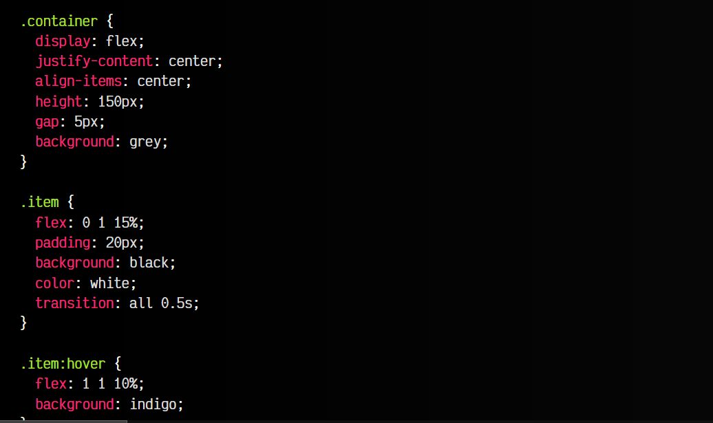

html:
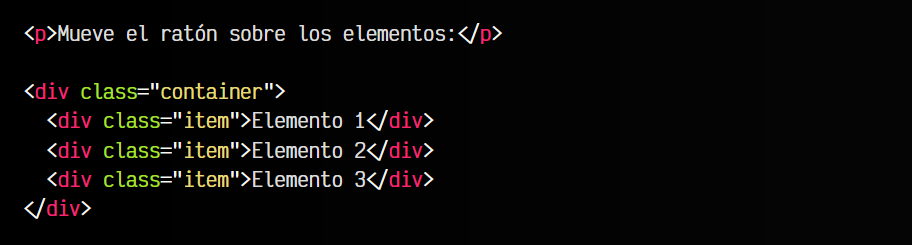

vista:
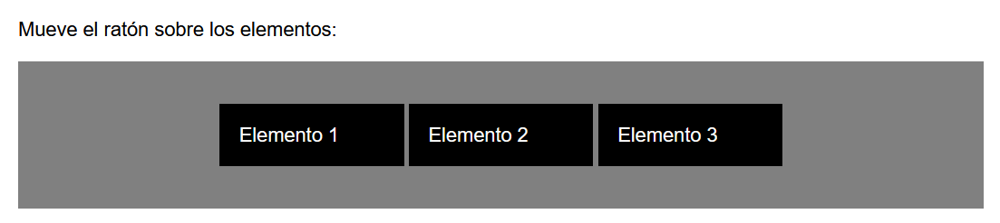

Observa que el truco está en utilizar la propiedad transition, que veremos en el apartado de Transiciones, en todos los elementos hijos para preparar una animación cada vez que hagamos el :hover y movamos el ratón sobre un elemento que cambia sus valores de flexibilidad mediante flex y su color de fondo mediante background.

