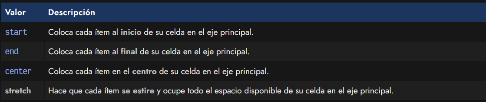
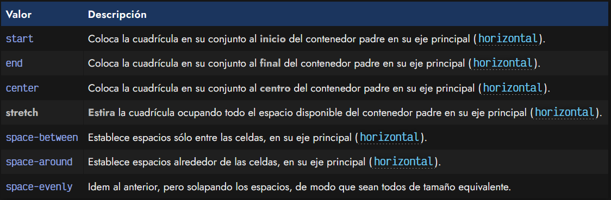
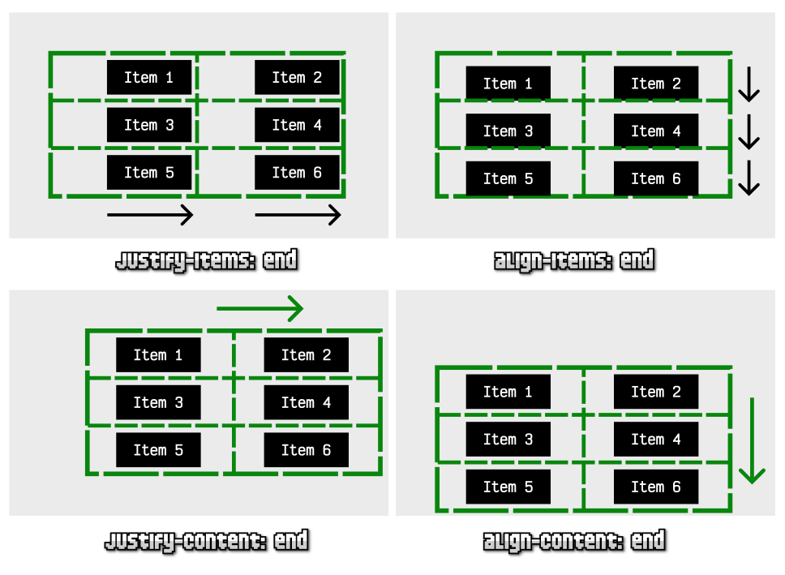

# 
Alinear y centrar con Grid CSS

l igual que con la maquetación Flex CSS, Grid incorpora un sistema para alinear elementos que se basa en Flex y es incluso más potente, ya que permite la alineación de elementos en dos dimensiones, así como centrar o colocar elementos hijos del contenedor Grid.

## Propiedades de alineación
Existen una serie de propiedades que se pueden utilizar para colocar y ajustar nuestra cuadrícula grid o ajustar los ítems a lo largo de ella, de forma sencilla y cómoda. Algunas de estas propiedades probablemente ya las conocerás del módulo CSS flex, sin embargo, en grid pueden tener un comportamiento diferente.

Dichas propiedades pueden afectar al 1️⃣ eje principal o al 2️⃣ eje secundario del grid y son las siguientes:

Estas propiedades se aplican sobre el elemento contenedor padre, sin embargo, afectan tanto al contenedor como al comportamiento de los elementos hijos.

Antes de continuar, un pequeño resumen:

   - justify-items: Alinea los elementos (hijos) en horizontal (eje principal) dentro de cada celda.
   - align-items: Alinea los elementos (hijos) en vertical (eje principal) dentro de cada celda.
   - justify-content: Alinea el contenido (la cuadricula) en horizontal (eje secundario) en el contenedor padre.
   - align-content: Alinea el contenido (la cuadricula) en vertical (eje secundario) en el contenedor padre.

Es importante tener en cuenta que el grid se define mediante las propiedades vistas en el tema anterior. Con estas cuatro propiedades veremos como colocar los ítems hijos dentro de cada celda de la cuadrícula, o la colocación de la cuadrícula en el elemento padre contenedor.

De esta forma, podemos controlar prácticamente todos los aspectos de posicionamiento de grid. Mantén el valor stretch en todas las propiedades y ve variando una por una a diferentes valores, para ver las diferencias:
 
justify-items: start

justify-items: end

justify-items: center

justify-items: stretch

align-items: start

align-items: end

align-items:  center

align-items: stretch

justify-content: start

justify-content: end

justify-content: center

justify-content: space-between

justify-content: around

justify-content: space-evenly

align-content: start

align-content: end

align-content: center

align-content: stretch

align-content: space-between

align-content: space-around

align-content: space-evenly

# 
Alineación de elementos

## La propiedad justify-items
La primera propiedad, justify-items sirve para colocar los ítems de un contenedor grid a lo largo de sus celdas correspondientes, siempre en el eje principal (por defecto, en horizontal). Los valores que puede tomar esta propiedad son los siguientes:

## La propiedad align-items
De forma análoga, la propiedad align-items sirve para colocar los ítems de un contenedor grid a lo largo de sus celdas correspondientes, pero en lugar de el eje principal, las coloca en el eje secundario (por defecto, en vertical). Los valores que puede tomar son los mismos que la propiedad anterior.

# 
Alineación de contenido

## La propiedad justify-content
La propiedad justify-content permite modificar la distribución del contenido de la cuadrícula en su contenedor padre, a lo largo de su eje principal (por defecto, el horizontal). Los valores que puede tomar son los siguientes:

## La propiedad align-content
De forma análoga, la propiedad align-content sirve para colocar el contenido de la cuadrícula en su contenedor padre, pero a lo largo de su contenedor secundario (por defecto, el vertical). Los valores que puede tomar son exactamente los mismos que la propiedad anterior.

Vamos a partir de un escenario con el siguiente código HTML y CSS, donde planteamos unas bases y profundizaremos en las propiedades anteriormente mencionadas:

css:

html:

vista:

Observa que tenemos 6 elementos hijos, dentro de un contenedor donde hemos creado un grid de 2 columnas x 3 filas (en rojo, realmente es invisible). Observa hemos aplicado las cuatro propiedades indicadas en la tabla de arriba con el valor center. A continuación, vamos a variar sólo una de ellas cada vez, colocando el valor end para observar su repercusión.

Este sería el resultado al aplicar cada una de las propiedades individuales anteriores:

## Alineaciones específicas
En el caso de que queramos que uno de los ítems hijos tenga una distribución diferente al resto, podemos aplicar en el elemento hijo la propiedad justify-self (eje principal) o align-self (eje secundario) sobreescribiendo su distribución su general, y aplicando una específica.

Recuerda que estas propiedades funcionan exactamente igual que sus análogas justify-items o align-items y tienen los mismos valores, sólo que en lugar de indicarse en el elemento padre contenedor, se hace sobre un elemento hijo y repercute en dicho elemento hijo específicamente.

Con ellas conseguiremos que nuestro código sea más simple, menos texto y más directo:

## Orden de los elementos
Por último, tenemos la propiedad order. Funciona exactamente igual que como funciona en flex. Es una propiedad mediante la cual podemos modificar y establecer un orden de los elementos mediante números que actuarán como «peso» del elemento:

Por defecto, todos los elementos hijos de un contenedor flex tienen establecido un order por defecto al valor 0. Si indicamos una propiedad order con un valor numérico diferente, recolocará los ítems según dicho número, colocando antes los elementos con un número order más pequeño (incluso números negativos) y los elementos con números más altos después.