# 
Propiedades lógicas CSS

Tras mucho tiempo utilizando un modelo de cajas tradicional en CSS, se ha creado una nueva familia de propiedades lógicas que permiten definir zonas concretas de un elemento de forma que se adecuan mucho mejor a diferentes idiomas donde la escritura o lectura no es de izquierda a derecha, y por lo tanto, palabras como left y right o top y bottom pueden ser confusas o ambiguas.

Es por ello, que entramos en una era de transición donde hay que adaptarse a estas nuevas propiedades y entender como funcionan, para así conseguir crear código mucho más práctico, independientemente del idioma en el que estemos trabajando.

## El modelo de cajas de CSS.
Antes de empezar, hay que tener claro el modelo de cajas en CSS, ya que nos basaremos en él para entender la nueva familia de propiedades. Lo hemos explicado en capítulos anteriores como en [modelo de cajas de CSS](https://lenguajecss.com/css/modelo-de-cajas/que-es/), por lo que si no lo conoces, es conveniente que le eches un vistazo antes de continuar.

Modelo de cajas CSS

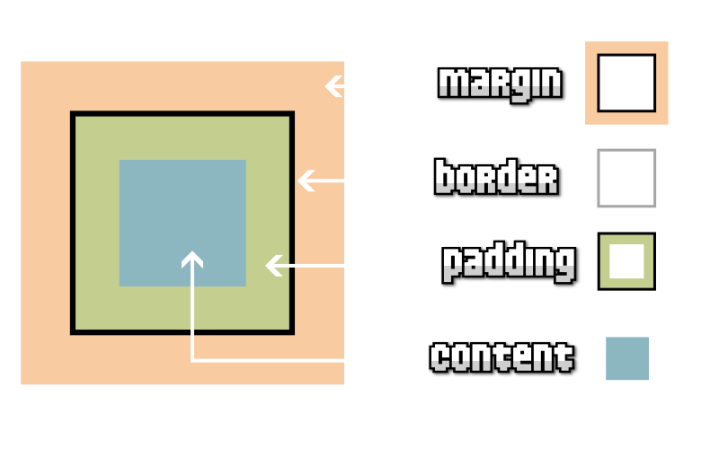

Básicamente, las propiedades lógicas de CSS son un renombrado de propiedades y valores de CSS que hacen referencia a un concepto que puede ser erróneo en determinadas situaciones. Esta nueva familia de propiedades viene a reemplazar muchas de las propiedades que encontraremos en las siguientes categorías:

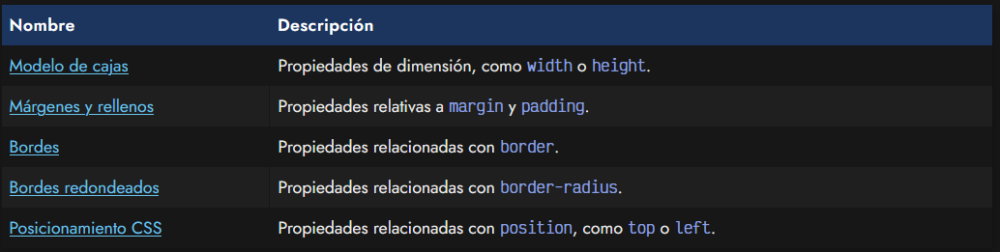

La idea de todos estos cambios, desde un punto de vista físico a un punto de vista lógico, es que sea mucho más sencillo alterar el orden de flujo de los elementos en bloque y en línea y que podamos alterarlo, de modo que las nuevas disposiciones sean coherentes, por ejemplo, cambiando este flujo con la propiedad writing-mode:

css:
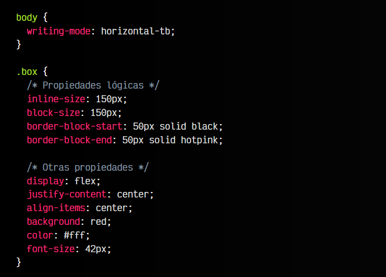

html:
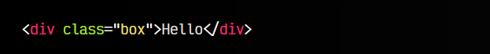

👓vista:
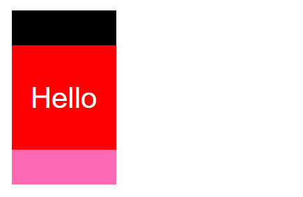

En el ejemplo anterior, prueba a cambiar el valor de la propiedad writing-mode entre horizontal-tb, vertical-rl o vertical-lr. Tras leer este artículo, este ejemplo cobrará sentido.

## Propiedades de dimensión.
El primer cambio que hay que tener claro, es que en el futuro no hablaremos de ancho (width) y alto (height) de los elementos, sino de un concepto algo más abstracto. Ahora debemos tener en cuenta que los conceptos «en linea** (inline) y en bloque (block), van a reemplazar los anteriores.

Cuando antes hablabamos de ancho, ahora estaremos hablando de espacio en dirección «en línea», mientras que lo que antes denominábamos alto, ahora es espacio en dirección «en bloque». A priori, puede parecer lioso, pero la idea es simplificarlo globalmente, incluyendo todos los idiomas y su forma de escritura o dirección.

Propiedades lógicas CSS

Pero veamos antes como quedarían las propiedades relacionadas con dimensiones:

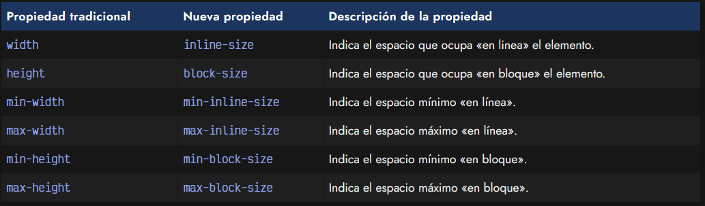

## Márgenes y rellenos.
En el caso de la familia de propiedades margin-* y padding-*, muchas de sus propiedades individuales sufren cambios debido a que contienen palabras como top, left, right o bottom en su nombre.

Así pues, las propiedades de la familia margin-* cambian a las siguientes:

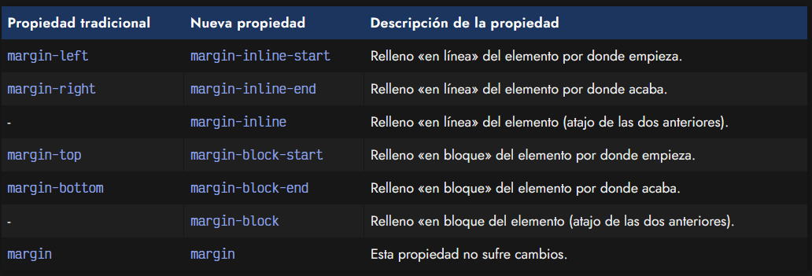

De forma análoga, la familia de propiedades padding-* sufre los cambios correspondientes:

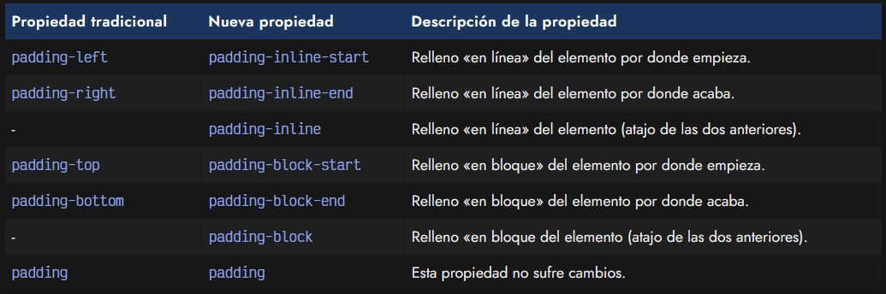

## Propiedades de bordes.
Ya en el modelo de cajas tradicional teníamos una amplia variedad de propiedades referentes a bordes, para hacer referencia a las diferentes partes del borde un elemento, y además sus respectivas características como el grosor, el estilo o el color.

Ahora, con las nuevas propiedades lógicas de bordes, tenemos a nuestra disposición una primera serie de propiedades que se separan en dos: propiedades lógicas en línea y propiedades lógicas en bloque:

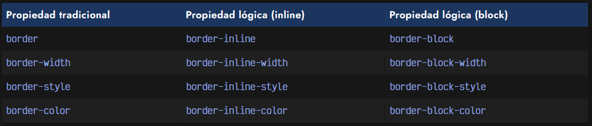

Y como no, una ampia gama de propiedades individuales o específicas, que ahora se dividen en sus versiones en línea y sus versiones en bloque:

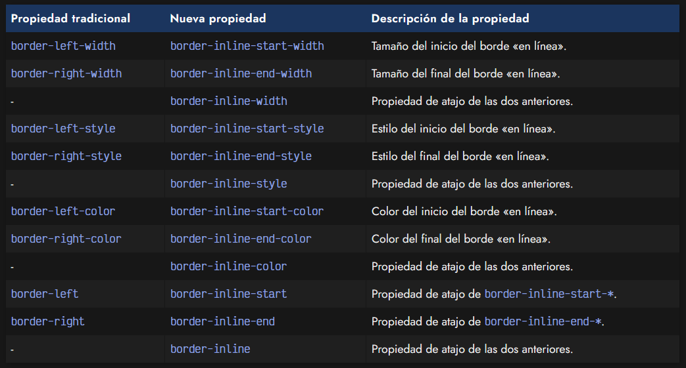

De la misma forma que tenemos todas las anteriores, relativas a las antiguas propiedades border-left-* y border-right-*, tenemos las siguientes propiedades «de bloque», que hacen referencia a las antiguas propiedades border-top-* y border-bottom-*:

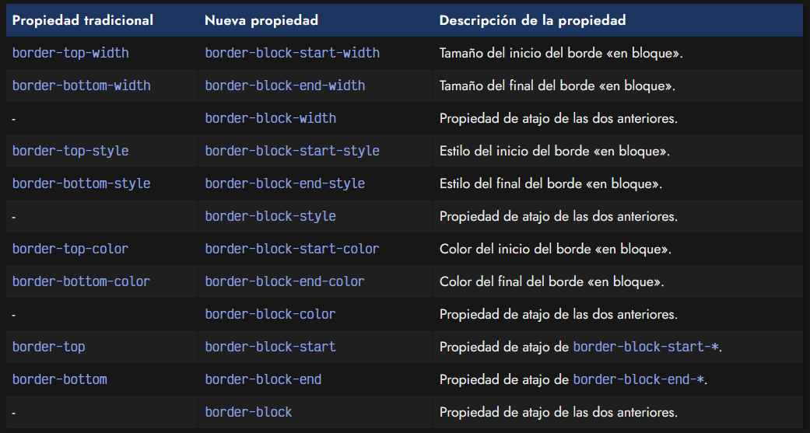

Como se habrá podido ver en las tablas anteriores, el modelo clásico pasa a un nuevo modelo similar al que se puede ver en la siguiente imagen:

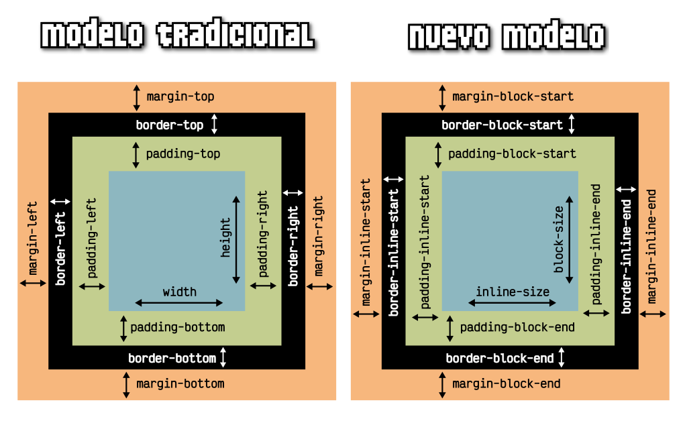

## Redondeo de esquinas.
La familia de propiedades border-radius también sufre cambios, ya que muchas de sus propiedades incluían las palabras top, left, right y bottom. Quedan como se ve en la tabla a continuación:

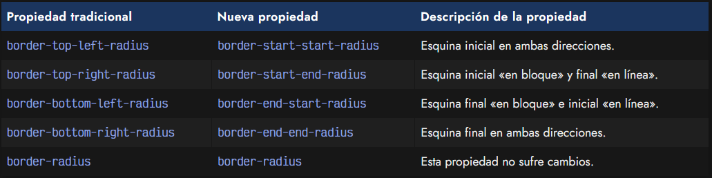

## La propiedad inset.
Por último, otras de la propiedades que sufren cambios, son las que suelen acompañar a la propiedad position, ya que existen varias propiedades denominadas top, left, right y bottom. Tras la adición de las propiedades lógicas, se añaden las siguientes:

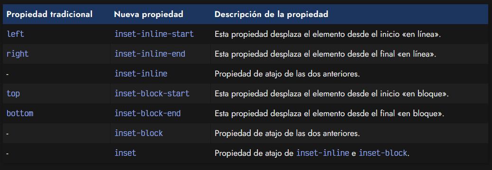

La propiedad inset funciona de forma similar a margin o padding, puesto que puede tomar tanto de 1 a 4 parámetros, para indicar lo que antiguamente se hacía con las propiedades individuales top, left, right y bottom:

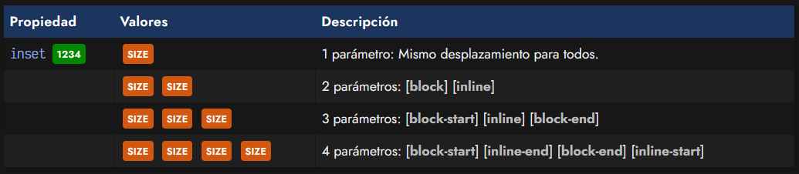

## Propiedades lógicas.
A continuación, puedes ver un gráfico de como quedarían las diferentes propiedades lógicas visualmente, junto a sus propiedades de atajo:

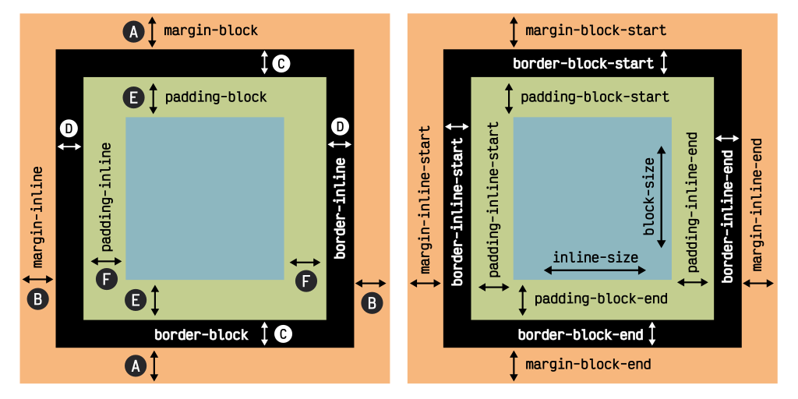

La compatibilidad en navegadores de las propiedades lógicas de CSS es interesante, puesto que hay muy buen soporte.

## Otros cambios menores.
De la misma forma, las propiedades CSS que antes aceptaban valores como left, right, top o bottom, ahora son reemplazados por inline-start, inline-end, block-start y block-end respectivamente:

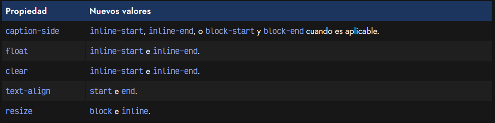

Además, propiedades de [paginación](https://lenguajecss.com/css/responsive-web-design/medios-paginados/) como page-break-after o page-break-before reemplazan los valores left y right por verso y recto respectivamente. Por su parte, las pseudoclases :left y :right se reemplazan por :verso y :recto:

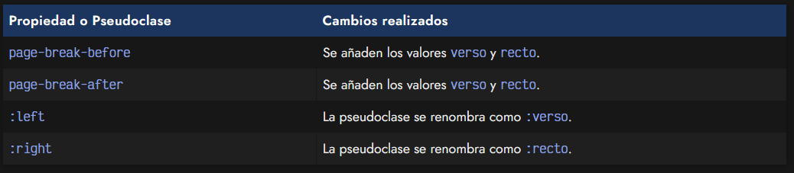
