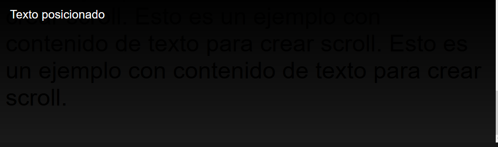

# 
Posicionamiento fijo

El posicionamiento fijo es hermano del posicionamiento absoluto con algunas ligeras diferencias. Funciona exactamente igual, utilizando marcos de referencia, con la diferencia que el elemento se muestra en una posición fija (respecto a la región visible del navegador) a medida que haces scroll o te mueves en la página.

Dicho de otra forma: aunque el usuario haga scroll y se desplace en la página, el elemento con position: fixed seguirá en el mismo sitio posicionado. Esto es muy frecuente en banners de publicidad o menus que requieren ser visibles en todo momento en la página.

## La propiedad position: fixed
¿Qué mejor forma de entender este ejemplo que echando un vistazo a un ejemplo práctico? En el siguiente fragmento de código hemos establecido un recuadro .element de color negro que se encuentra posicionado de forma fija en la parte superior derecha de la página.

Puedes hacer scroll por la página, y observarás el comportamiento característico del elemento con el texto blanco con fondo negro:

css:

html:

vista:

Observa que lo único que hemos hecho ha sido establecer un position: fixed y un top: 0 y right: 0 para indicar la esquina donde queremos que se fije el elemento. Además, también hemos definido un tamaño de ancho al elemento, junto a otras propiedades visuales de estilo.

## Extender un elemento
Por otro lado, aprovechemos este ejemplo para utilizar las propiedades de coordenadas y observar como se puede extender elementos de forma sencilla utilizando position: fixed, position: absolute o similares.

Utilizaremos el mismo ejemplo anterior, pero observa que utilizamos la propiedad inset: 0:

css:

html:

vista:

En este caso, observa que hemos colocado .element como una capa superior que cubre toda la página, sin necesidad de utilizar width u otros elementos. Esto puede ser particularmente útil cuando tienes diseños muy complejos que quieres que se adapten automáticamente a la parte que cubren.

Recuerda que la propiedad inset: 0 es equivalente a utilizar las propiedades top, left, right y bottom a 0.

Este ejemplo puede recordar mucho a una ventana modal o diálogo similar. Sin embargo, aconsejo encarecidamente echar un vistazo a la etiqueta "dialog" de HTML para esto.

