# 
Barras de desplazamiento

Una necesidad bastante común en un sitio web, es la de estilar o dar estilo a las barras de desplazamiento del navegador (o de una de las secciones o partes de la página) para que estén más acorde con el diseño del sitio, ya que las barras de progreso por defecto del sistema muchas veces no encajan con el «look and feel» del sitio web.

Para ello, tenemos una serie de propiedades interesantes que veremos a continuación, y que son las que deberían utilizarse en primer lugar.

## Dar estilo a las barras de progreso
Para dar estilo a las barras de progreso tenemos las siguientes propiedades en el estándar:

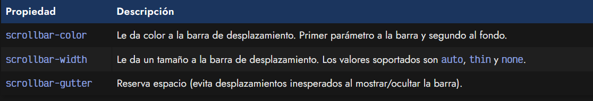

Veamos un ejemplo de estas propiedades aplicadas a una sección de texto:

css:
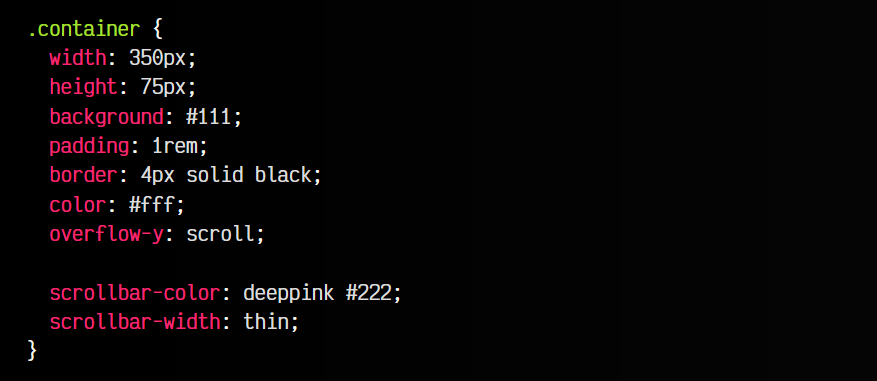

html:
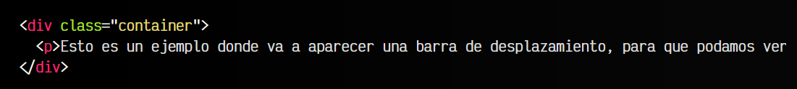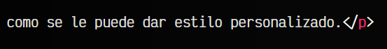
vista:
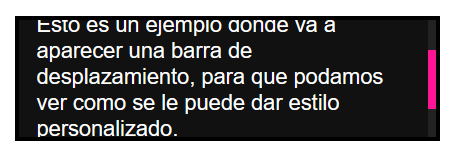

## La propiedad scrollbar-gutter
La palabra gutter hace referencia a un «canal», espacio o hueco que se puede configurar a la hora de crear barras de desplazamiento.

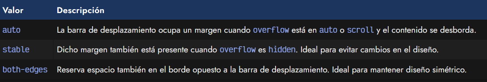

La última opción, both-edges, realmente es un valor que se puede añadir a las anteriores para indicar esa característica.

Veamos algunos ejemplos:

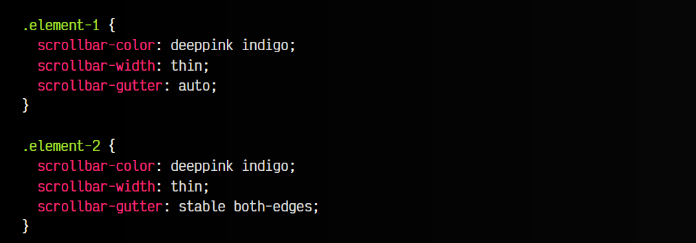

## Estilar barras de progreso (legacy)
Lo que hemos visto anteriormente es la forma oficial para estilar una barra de desplazamiento. Sin embargo, en muchas situaciones nos puede parecer insuficiente, ya que necesitamos mayor personalización.

Existen mecanismos de personalización más avanzados que explicaremos a continuación, sin embargo, el gran problema de estos mecanismos es que están desarrollados por y para el motor webkit (Safari), y por extensión blink (Chrome y Edge), pero al no ser estandares, no funcionan ni planean funcionar en servo (Firefox).

El punto bueno, es que son mucho más personalizables (y complejos) que las propiedades anteriores. Si aún así te interesa utilizarlos, veamos una explicación.

Para utilizar estos mecanismos de personalización debemos utilizar unos pseudoelementos propios de los navegadores basados en webkit o blink. Estos pseudoelementos se escriben prefijados de ::-webkit- y funcionan de una forma particular.

Cuidado al utilizar los pseudoelementos ::-webkit-, no puedes usarlos con Nesting ni unirlos a otros fragmentos de código. Deben ser individuales ya que el navegador los procesa de forma aislada.

## Scrollbar con ::-webkit-scrollbar)
Comencemos con el pseudoelemento ::-webkit-scrollbar, que nos permite dar estilo a la barra de desplazamiento en conjunto. Antes de comenzar, examina el código de .container y observa que estamos cambiando el tamaño del elemento e indicando un overflow-y: scroll para forzar a que haya barra de desplazamiento en el eje Y (vertical).

Una vez hecho esto, podemos utilizar nuestra pseudoclase con el elemento que queramos, o con body si queremos aplicarlo a la barra de desplazamiento global del navegador:

css:
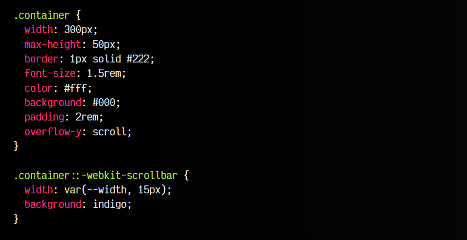

html:
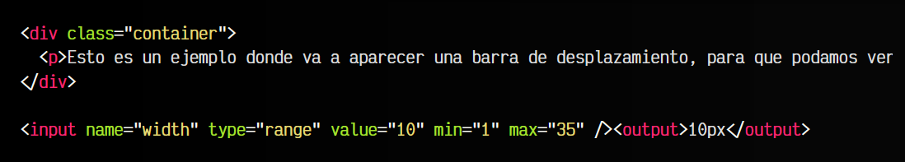

js:
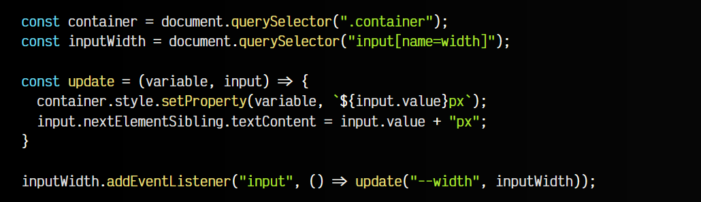

vista:
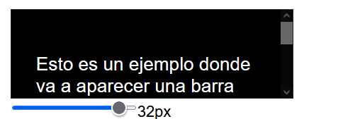

Observa que aquí lo único que hacemos es cambiar el color de fondo de la barra de desplazamiento y el tamaño de ancho de la misma. Sin embargo, no contiene nada porque aún no falta estilar las demás partes, que veremos a continuación.

## El fondo con ::-webkit-scrollbar-track
Con el pseudoelemento ::-webkit-scrollbar-track podemos cambiar el fondo por donde se desplaza la barra de desplazamiento. Ten en cuenta que existe tanto un track como un track-piece, donde este último es una región más interna por donde se puede mover la barra de desplazamiento:

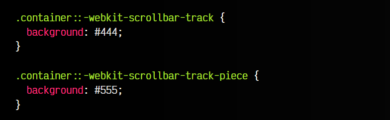

Normalmente, con utilizar track nos basta, pero si quieres ver bien la diferencia añade un margin: 10px a cada elemento y verás rápidamente la porción que ocupa cada uno.

## La barra con ::-webkit-scrollbar-thumb
Además, también tenemos el pseudoelemento ::-webkit-scrollbar-thumb que aplica estilos a la barra de desplazamiento propiamente dicha. Probablemente, es el elemento más importante de los que hemos visto:

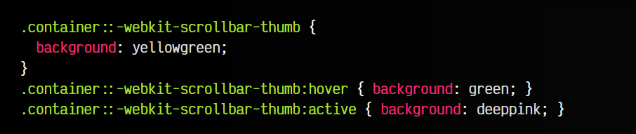

Observa que podemos usar :hover para cambiar estilo cuando mueves el ratón por encima (o :active para cuando pulsas). Vamos a añadir el código que hemos visto hasta ahora al ejemplo inicial anterior:

css:
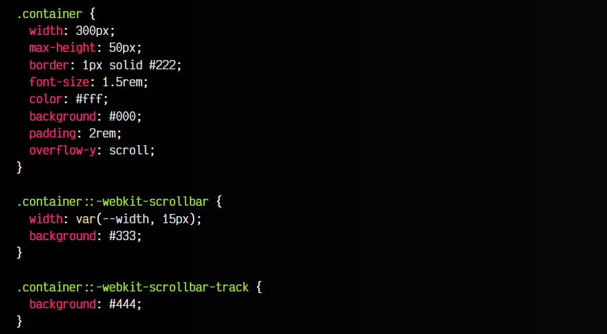
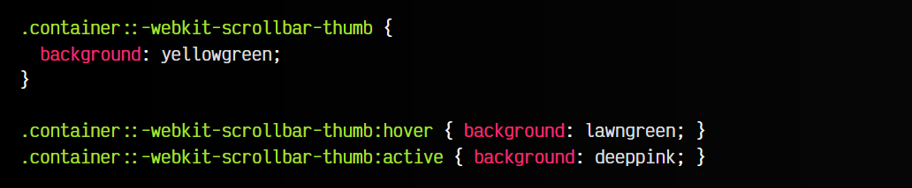

Si lo quisieras podrías añadir otras propiedades interesantes. Por ejemplo, un border-radius: 10px al thumb para hacer que la barra de desplazamiento esté redondeada. Recuerda que no todas las propiedades CSS funcionan en este pseudoelemento.

## Los botones con ::-webkit-scrollbar-button
Observa que hasta ahora puedes mover la barra de desplazamiento tanto arrastrando el thumb como pulsando en las zonas vacías del track. Sin embargo, es posible que quieras añadir los clásico botones de desplazamiento, si te parece más intuitivo.

Esto se hace con el pseudoelemento ::-webkit-scrollbar-button, que se puede configurar bastante:

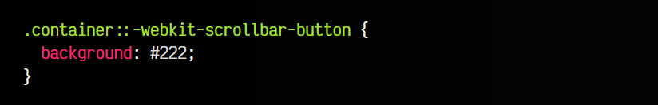

Si añades este fragmento de código, verás que aparecen a los extremos unos cuadraditos que son los botones de las barras de desplazamiento. Sin embargo, por defecto aparecen sin icono, ni nada en su interior. Vamos a ponerle solución.

## Modificadores para los botones
Existen varios modificadores para nuestros botones, que podemos utilizar en ::-webkit-scrollbar-button:

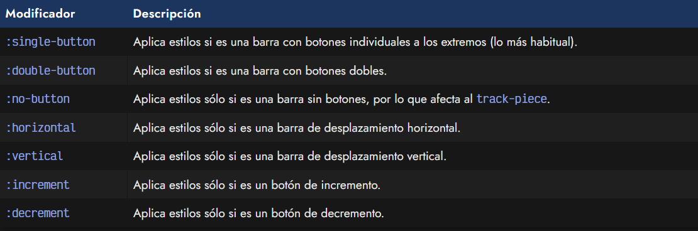

Ten en cuenta que estos modificadores se añaden al final y son acumulables, por lo que puedes usar varios. Veamos un ejemplo donde además, utilizamos background para añadir un icono SVG para las flechas. En este caso lo hacemos con svg inline, pero se puede perfectamente hacer con un fichero externo .svg:

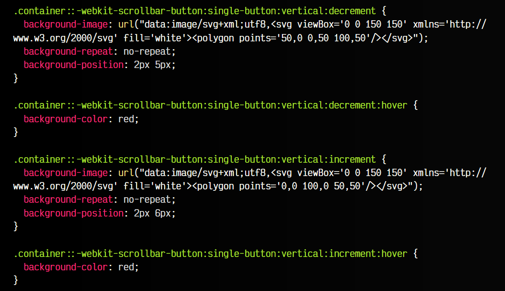

En lugar de :increment o :decrement también podemos utilizar :start o :end, que puede ser más intuitivo en el caso de necesitarlo.

## El redimensionador con ::-webkit-resizer
En algún caso podríamos necesitar tener un redimensionador. Para ello, en el CSS del elemento se suele indicar la propiedad resize``con los valores both, horizontalovertical`. Si lo hacemos, veremos que en una esquina nos aparece un redimensionador.

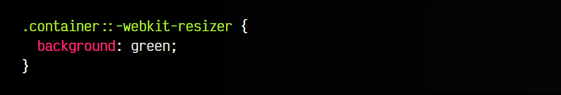

Este redimensionador se puede estilar utilizando el pseudoelemento ::-webkit-resizer. Veámoslo en funcionamiento con todo lo anterior que hemos aprendido en este artículo:

css:
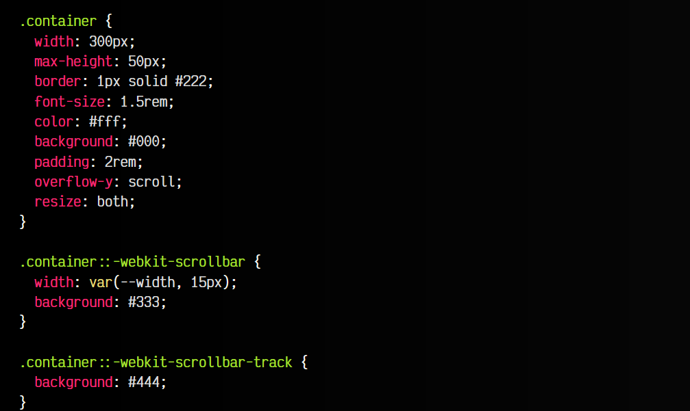
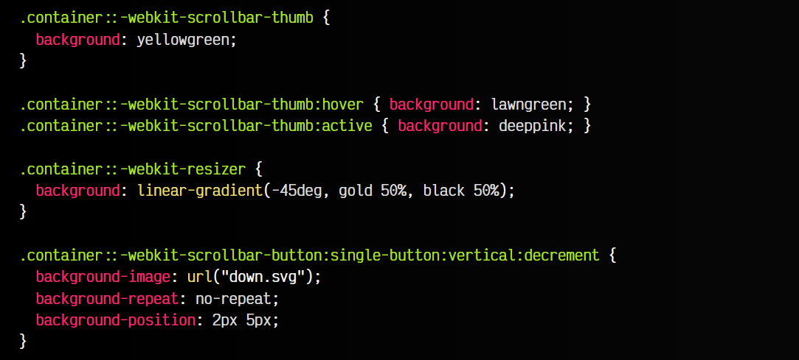
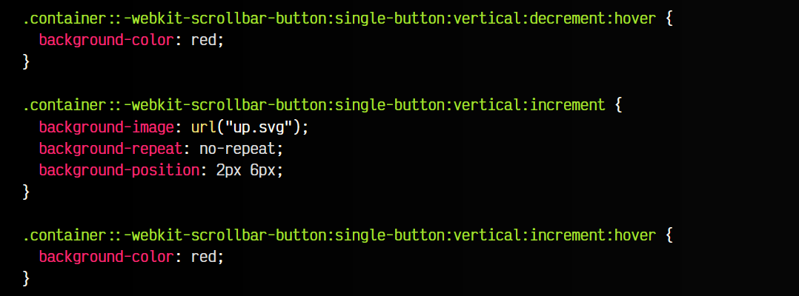

html:
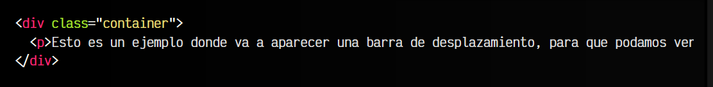

vista:
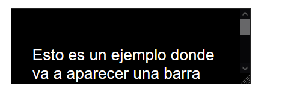

## Mejora progresiva
Recuerda que las propiedades iniciales que vimos son las propiedades estándar y las que deberíamos utilizar en primer lugar. Luego, si queremos mayor personalización para los navegadores que lo soporten, podríamos añadir este mecanismo orientado a webkit o blink.

La mejor forma de realizar esto, es utilizar la regla @supports, donde podemos definir como queremos utilizarlo:

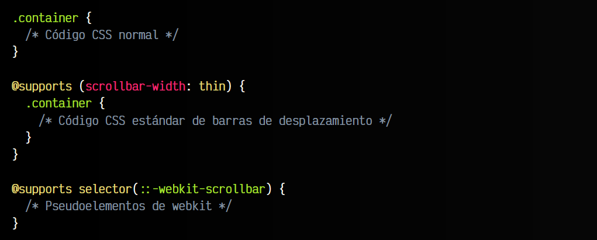

