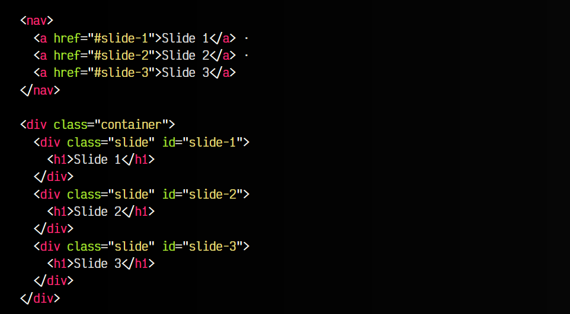
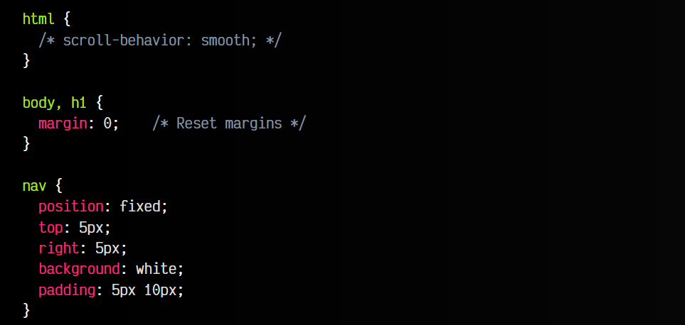
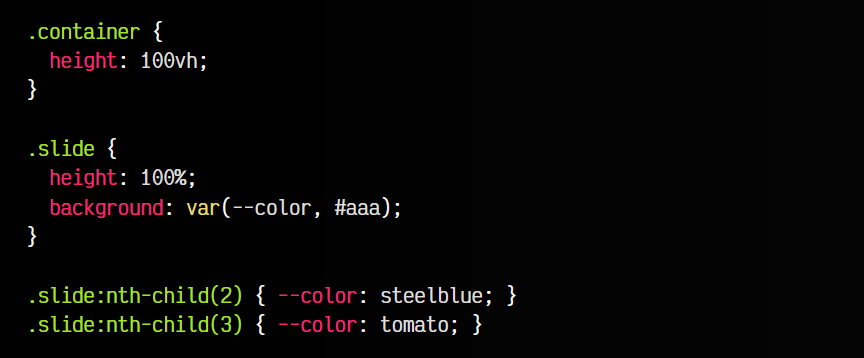

# 
Scroll suave (Smooth Scroll)

En ciertas situaciones, al pulsar enlaces que llevan a un ancla (anchor) de una zona del documento, deseamos que el scroll se realice suavemente, en lugar de moverse directa e instantáneamente, que es el comportamiento por defecto del navegador.

## Propiedad scroll-behavior
La propiedad scroll-behavior nos permite activar un desplazamiento suave (smooth scroll) al pulsar en un enlace de anclas "a". Como hemos dicho, por defecto, al pulsar sobre estas anclas, nos desplazamos directa e instantáneamente a nuestro objetivo.

Por defecto, la propiedad indicada es auto. Sin embargo, estableciendo el valor smooth a esta propiedad en el elemento <html>, podemos suavizar este comportamiento, de modo que se realiza de forma progresiva, muy suave:

Hagamos el siguiente ejemplo. Consideremos una página que tiene 3 secciones (slide). Cada una ocupa la parte visible del navegador. El usuario puede desplazarse entre ellas simplemente haciendo scroll de ratón, o pulsando en los enlaces ancla, que se encuentran dentro del elemento <nav> (ubicados en la parte superior derecha). Estos enlaces llevan a los id definidos posteriormente.

En este ejemplo, sin CSS, la propiedad scroll-behavior está definida a auto, por lo que el comportamiento del navegador suele ser acceder directamente a la sección, de forma instantánea:

html:

css:

Si descomentamos la parte comentada de CSS, del elemento <html>, aplicaremos el suavizado en desplazamiento, por lo que al pulsar sobre los enlaces ancla, observaremos que el desplazamiento entre secciones se hace de forma suave.