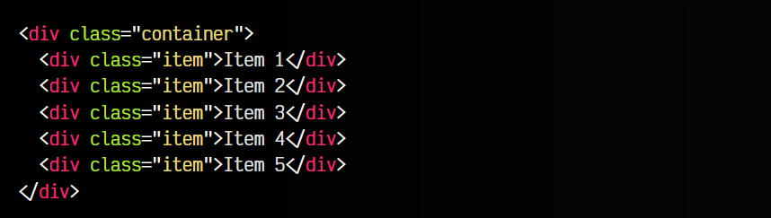

# 
CSS Snap Scroll

El estándar de CSS nos da la posibilidad de utilizar ciertas propiedades de ajuste tras un desplazamiento suave de ratón o con el dedo en dispositivos móviles. Con ello, podemos conseguir que un elemento se ajuste exactamente en el lugar correspondiente que nos interesa, justo al acabar el scroll.

Estas propiedades pertenecen a la familia de propiedades scroll-snap, entre las cuales se encuentran scroll-snap-type o scroll-padding, entre otras, que veremos a continuación. En principio, se dividen entre propiedades que utilizaremos en el contenedor padre, y propiedades que utilizaremos en los elementos hijos.

Para ello, utilizaremos el esquema del ejemplo base del artículo anterior, donde el elemento con clase .container es el elemento padre contenedor y los elementos con clase .slide son los elementos hijos:

Vamos a explicarlo por partes, donde diferenciaremos las propiedades aplicadas al contenedor padre y las propiedades aplicadas a los elementos hijos.

## Propiedades para el contenedor
Así pues, dentro del estándar de CSS Scroll Snap, tenemos unas propiedades que afectan a nuestro elemento padre contenedor. Son las siguientes propiedades:

## La propiedad scroll-snap-typer
La propiedad scroll-snap-type es la propiedad de control que establece el mecanismo de ajuste de scroll en el desplazamiento por parte del usuario. Para ello, tenemos que indicar dos valores:

En el primer caso, x e y indican si se trata de un desplazamiento en horizontal o vertical. Los valores block e inline son sus equivalentes en propiedades lógicas. Por último, both es ideal si se quiere que se apliquen ambas.

Por último, hay que establecer el tipo de ajuste de desplazamiento. En el caso de mandatory, establecemos que es un ajuste obligatorio y cuando el usuario deje de hacer scroll, el navegador ajustará el scroll para que encaje exactamente con el hijo en esa dirección. En caso de indicar proximity, el navegador ajustará el scroll para que encaje exactamente con el hijo más próximo.

Recuerda que las barras de scroll deben estar visibles para que funcione correctamente. Podrías utilizar overflow-y (por ejemplo) a visible si lo necesitas.

## La propiedad scroll-padding
También tenemos disponible la propiedad scroll-padding, que permite indicar una separación de relleno entre el ajuste que encaja exactamente al terminar el desplazamiento y el límite de esa zona. Como la propiedad padding de CSS, scroll-padding también tiene sus propiedades individuales:

También tenemos otras propiedades como scroll-padding-block o scroll-padding-inline, y sus derivadas como scroll-padding-*-start o scroll-padding-*-end, que son sus equivalentes en [propiedades lógicas](https://lenguajecss.com/css/modelo-de-cajas/propiedades-logicas-css/).

Retomaremos el ejemplo del capítulo anterior. Sin embargo, observa el CSS de la clase .container. Le hemos añadido una pequeña parte donde activamos las propiedades scroll-snap-type y scroll-padding, previamente indicando que necesitamos scroll en el eje vertical con overflow-y:

html:

css:

Con scroll-snap-type: y mandatory indicamos que el scroll se va a aplicar en vertical y que va a ser obligatorio, además de no dejar ningún padding de scroll. Prueba a cambiar mandatory por proximity y comprueba que el ajuste se realiza por proximidad, en lugar de forma obligatoria (por dirección).

Sin embargo, todo esto no funcionaría si no establecemos las propiedades de la clase .slide, que afectan a los elementos hijos, y que explicaremos a continuación, en la siguiente parte de este artículo.

## Propiedades para los hijos
En las propiedades hijas de nuestro contenedor con CSS Scroll Snap (en nuestro caso .slide), tenemos las siguientes propiedades que nos permitirán configurar el ajuste de scroll:

## Propiedad scroll-snap-align
La propiedad scroll-snap-align es una propiedad que permite indicar la posición de ajuste. Puede tomar los valores start, end y center y en el caso de indicarse dos parámetros, se aplica al eje horizontal (inline) y al eje vertical (block). Si sólo se indica un parámetro, se aplica el mismo valor a ambos.

Para entender esto con nuestro ejemplo, lo mejor es cambiar el height de .slide a un valor como 75% (por ejemplo). Ahora cada slide, ocupará el 75% de la pantalla, y por lo tanto si modificamos scroll-snap-align con el valor...

   - ...start, el .slide ajustará su parte inicial en la parte superior del navegador.
   - ...end, el .slide ajustará su parte final en la parte inferior del navegador.
   - ...center, el .slide se ajustará de modo que esté centrado en el navegador.

## Propiedad scroll-snap-stop
La propiedad scroll-snap-stop permite indicar los valores normal o always para permitir que el navegador «atrape» el desplazamiento y lo detenga si pasa por una zona sensible a ajustarse en ella. La diferencia es que el valor por defecto normal permite pasar por una de estas zonas, mientras que el valor always define que si pasa por una zona, se detenga en ella.

Esta propiedad no tiene efecto en situaciones en las que solo tenemos una posición de ajuste.

## La propiedad scroll-margin
De forma análoga a scroll-padding, también tenemos una propiedad scroll-margin que podemos aplicar en nuestros elementos hijos. Esta propiedad permite indicar un margen externo al hijo, que permitirá que se vea el elemento anterior (o posterior, dependiendo donde ajustemos), ya que aplica un margen al scroll.

De la misma forma que el anterior, podemos utilizar sus propiedades individuales:

En nuestro ejemplo anterior indicamos este CSS adicional:

Con la propiedad scroll-snap-align indicamos donde debe detenerse el scroll. Recuerda modificar el tamaño de alto del slide si quieres verlo sobre este ejemplo.

Aumentando la propiedad scroll-margin comprobarás que se establece un márgen que se aplica al scroll con ajuste que estamos realizando en este artículo. También puedes usar las mencionadas propiedades individuales, o indicar 4 parámetros con diferentes valores a modo de atajo.

Recuerda que aunque este ejemplo se haga sobre toda la pantalla y en vertical, podemos utilizar CSS Snap Scroll para crear sliders más pequeños, que no sean a pantalla completa, sliders de imágenes verticales, etc.

El siguiente ejemplo es un pequeño slider horizontal de elementos de texto:

html:

css:

