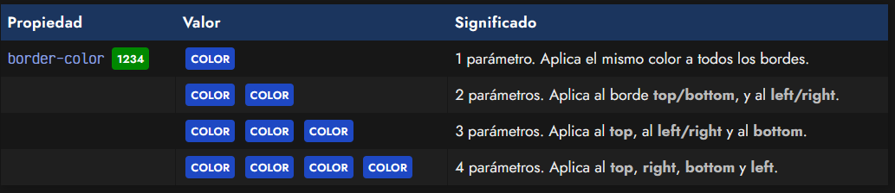

# 
Bordes CSS

En CSS es posible especificar el aspecto que tendrán los bordes de cualquier elemento HTML, pudiendo incluso, dar diferentes características a zonas particulares del borde, como por ejemplo, el borde superior, el borde izquierdo, el borde derecho o el borde inferior.

## Propiedades de bordes.
Las propiedades básicas y específicas de los bordes en CSS son las siguientes:

En primer lugar, border-color establece el color del borde, de la misma forma que lo hicimos en apartados anteriores de colores. En segundo lugar, con border-width podemos establecer la anchura o grosor del borde utilizando tanto palabras clave predefinidas como un tamaño concreto con cualquier tipo de las unidades ya vistas.

## La propiedad border-style.
Por último, con la propiedad border-style podemos aplicar un estilo determinado al borde de un elemento. En estilo de borde podemos elegir cualquiera de las siguientes opciones:

Veamos un ejemplo sencillo aplicando alguna de estas características:

css:

html:

vista:

Sin embargo, el borde más frecuente suele ser solid, que no es más que un borde liso y continuo. Pueden utilizarse cualquiera de los estilos indicados en la tabla anterior e incluso combinar con otras propiedades. Recuerda que si no aplica una de ellas, se aplica el valor por defecto.

Veamos como se verían los diferentes estilos de borde utilizando 10 píxels de grosor y color gris:

## Bordes múltiples (diferentes).
Hasta ahora, sólo hemos utilizado un parámetro en cada propiedad, lo que significa que se aplica el mismo valor para cada borde de un elemento (borde superior, borde derecho, borde inferior y borde izquierdo). Sin embargo, podemos especificar uno, dos, tres o cuatro parámetros, dependiendo de lo que queramos hacer:

De la misma forma, podemos hacer exactamente lo mismo con las propiedades border-width (respecto al ancho del borde) y border-style (respecto al estilo del borde). Teniendo en cuenta esto, disponemos de mucha flexibilidad a la hora de especificar esquemas de bordes más complejos:

css:

html:

vista:

En el ejemplo anterior hemos utilizado 3 parámetros, indicando un elemento con borde superior rojo sólido de 2 píxeles de grosor, con borde izquierdo y derecho punteado azul de 10 píxeles de grosor y con un borde inferior verde sólido de 5 píxeles de grosor.

## Atajo: Bordes.
Ya habremos visto que con tantas propiedades, para hacer algo relativamente sencillo, nos pueden quedar varias lineas de código complejas y difíciles de leer. Al igual que con otras propiedades CSS, podemos utilizar la propiedad de atajo border, con la que podemos hacer un resumen y no necesitar indicar múltiples propiedades individuales por separado, realizando el proceso de forma más corta:

Por ejemplo:

Así pues, estamos aplicando un borde de 1 píxel de grosor, estilo sólido y color negro a todos los bordes del elemento, ahorrando mucho espacio y escribiéndolo todo en una sola propiedad.

Consejo: Intenta organizarte y aplicar siempre los atajos si es posible. Ahorrarás mucho espacio en el documento y simplificarás la creación de diseños. El orden, aunque no es obligatorio, si es recomendable para mantener una cierta coherencia con el estilo de código.

## Bordes específicos.
Otra forma, quizás más intuitiva, es la de utilizar las propiedades de bordes específicos (por zonas) y aplicar estilos combinándolos junto a la herencia de CSS. Para utilizarlas bastaría con indicarle la zona justo después de border-:

css:

html:

vista:

Esto dibujaría sólo un borde inferior negro de 2 píxeles de grosor y con estilo punteado. Ahora imaginemos que queremos un elemento con todos los bordes en rojo a 5 píxeles de grosor, salvo el borde superior, que lo queremos con un borde de 15 píxeles en color naranja. Podríamos hacer lo siguiente:

css:

html:

vista:

El ejemplo anterior conseguiría nuestro objetivo. La primera propiedad establece todos los bordes del elemento, sin embargo, las siguientes propiedades modifican sólo el borde superior, cambiándolo a las características indicadas.

Recuerda que también existen atajos para estas propiedades de bordes en zonas concretas, lo que nos permite simplificar aún más el ejemplo anterior, haciéndolo más fácil de comprender:

css:

html:

vista:

Dichas propiedades de atajo serían las siguientes:

Es muy importante entender como se está aplicando la herencia en los ejemplos anteriores, puesto que es una de las características más complejas de dominar de CSS junto a la cascada. Por ejemplo, si colocaramos el border-top antes del border, este último sobreescribiría los valores de border-top y no funcionaría de la misma forma.