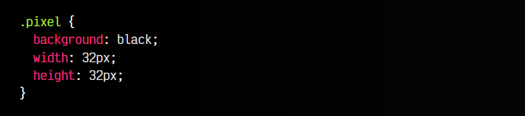

# 
Pixel art con CSS

Existe una técnica muy curiosa con la que se puede hacer pixel art sólo con CSS (o incluso combinar con bucles Javascript y hacerlo más flexible). A grandes rasgos, se trata de crear un elemento de un tamaño muy específico (por ejemplo, 32 pixels) y crear sombras sin desenfoque con el desplazamiento adecuado que simulen los pixels.

## Creación de un píxel base
El primer paso, obviamente, será crear el pixel base en nuestro documento:

css:

html:

vista:

Una vez lo tenemos, todo se basará en utilizar box-shadow para crear nuevos píxels con desplazamiento.

## Creación de siguientes píxels
Aquí puedes ver como creamos una sombra roja (se creará del mismo tamaño que el píxel base) y la desplazamos exactamente 32px a la derecha, por lo que aparecerá justo al lado del píxel base. Lo mismo con el siguiente píxel (color dorado):

css:

html:

vista:

Para hacer el código más flexible y fácil de mantener, podemos hacer uso de variables CSS y organizar/reescribir un poco el código. Quizás puede ser más difícil de leer si no tienes cierta soltura con CSS, pero es mucho más flexible si necesitamos cambiar tamaños o similar:

css:

html:

vista:

Ahora podríamos cambiar el valor de la CSS custom property --size y el resto del código se adaptaría automáticamente, gracias a que hemos utilizado cálculos con la función calc() y variables css con la función var().

## Usando Javascript para reutilizar
A continuación puedes ver un ejemplo más elaborado, donde utilizamos Javascript para simplificar nuestro código HTML y CSS, y generar los fragmentos repetibles. Observa que el HTML/CSS sólo tiene los detalles genéricos, y el resto lo creamos desde Javascript:

css:

html:

js:

vista:

A grandes rasgos, hemos hecho lo siguiente:

   - 1️⃣ La constante COLORS es la paleta de colores (cada color es un número).
   - 2️⃣ La constante PIXEL_ART es el lienzo y los colores que se usan.
   - 3️⃣ En las siguientes líneas, recorremos el array PIXEL_ART para crear los valores de la propiedad box-shadow de CSS, de forma automática.

