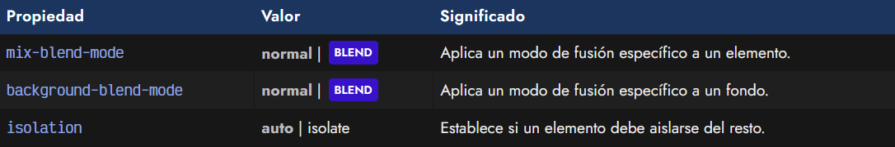
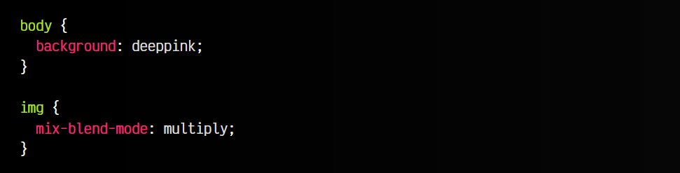
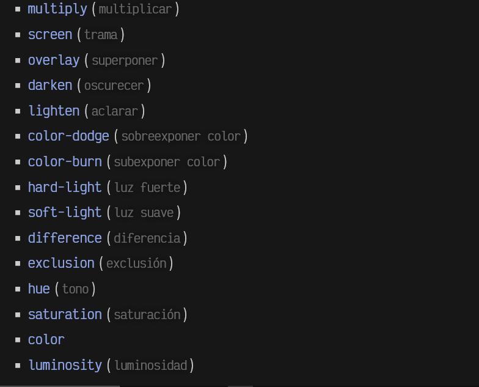
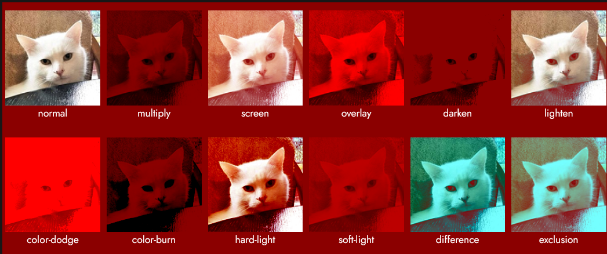
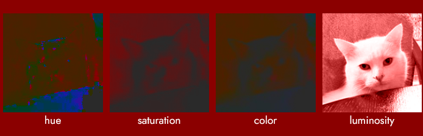

# 
Modos de fusión CSS

Los filtros CSS están muy bien en multitud de situaciones, pero hay casos en los que se nos pueden quedar cortos. Los modos de fusión son un interesante añadido que aparece en CSS para dotar de otra característica muy común en los programas de diseño y edición de imagen: la fusión de dos elementos sumando la información de color de los píxeles de cada uno de ellos.

## Propiedades de fusión
Mediante las propiedades mix-blend-mode y background-blend-mode podemos utilizar modos de fusión en los diferentes elementos que seleccionemos en una página web, aplicando composición para mezclar los colores, superponiendo dos elementos, consiguiendo una variación como resultado final.

Dichas propiedades son las siguientes:

La diferencia entre ambas propiedades es que la primera de ellas, mix-blend-mode, se utiliza para elementos, mientras que la segunda, background-blend-mode, se utiliza para aplicar modos de fusión en fondos. Por ejemplo, usándola con una imagen:

css:

html:

vista:

Entre los diferentes modos de fusión que podemos utilizar en dichas propiedades, se encuentran las siguientes:

## Ejemplos de modos de fusión
Si no tenemos ningún modo de fusión aplicado, el valor por defecto de la propiedad es normal. Como ejemplo, a continuación tenemos una imagen de Smudge aplicado con un modo de fusión sobre un fondo rojo. Puedes mover el ratón por encima de él para comparar la fotografía sin modo de fusión:

Podemos hacer uso de la propiedad isolation con valor auto o isolate, para que, en el último caso, se proteja un elemento de la mezcla de fusión y aislarlo sin que se aplique.

Nota: Lo mismo que hemos hecho en el ejemplo anterior con una imagen y un color de fondo, se podría hacer con 2 o varias imágenes.

