# 
Formas básicas

En nuestro código CSS, es posible utilizar ciertas funciones para determinar formas geométricas básicas, como pueden ser círculos, rectángulos o polígonos, entre otros. Estas formas se pueden utilizar para diversos objetivos, como recortes mediante la propiedad clip-path, o colocaciones mediante la propiedad outside-shape, entre otros.

## Tipos de formas CSS
Por lo tanto, siempre que hagamos referencia a una forma SHAPE nos referimos a alguna de las funciones siguientes:

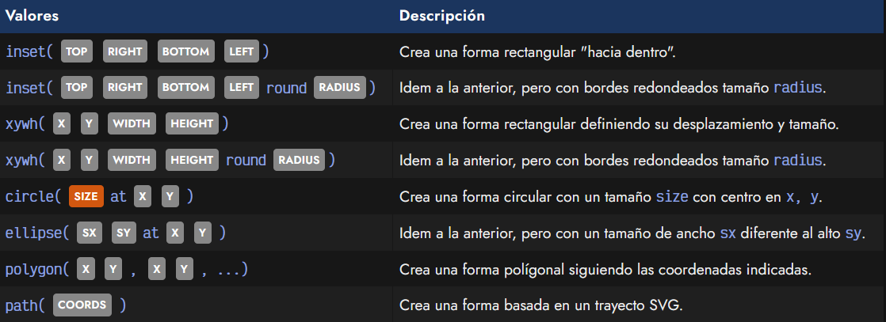

Ten en cuenta que aunque es posible utilizar otras unidades para definir las formas, lo más habitual suele ser utilizar porcentajes, ya que resulta muchísimo más sencillo y claro, siendo también mucho más escalable y mantenible si el elemento cambia sus dimensiones.

Veamos como funcionan cada una de estas funciones de formas básicas. Los ejemplos de código los haremos utilizando [la propiedad de recortes](https://lenguajecss.com/css/mascaras-y-recortes/clip-path/) clip-path, que veremos en el siguiente artículo.

## La función rect()
Con la función rect() podemos establecer un rectángulo en cualquier elemento y quedarnos con esa porción de elemento. En la función, los parámetros establecidos son rect(top right bottom left). Veamos un ejemplo:

css:
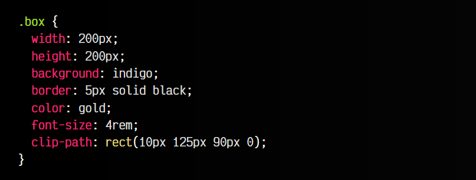

html:
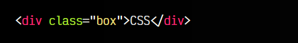
vista:

En este caso, estamos recortando un rectángulo utilizando estos cuatro puntos de referencia:

   - Desde arriba (top), marca donde empieza a recortar: 10px
   - Desde la izquierda (left), marca hasta donde recorta: 125px
   - Desde arriba (top), marca hasta donde recorta: 90px
   - Desde la izquierda (right), marca donde empieza a recortar: 0

Además, después de los 4 parámetros, se puede añadir la palabra clave round, seguida de un SIZE. Con esto puedes establecer un border-radius en el recorte.

## La función inset()
En el caso de la función inset(), estamos estableciendo un cuadrado o rectángulo, donde cada parámetro (top, right, bottom, left) indicará un porcentaje que representa la distancia desde su punto concreto.

css:
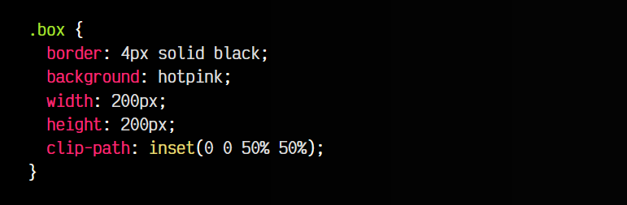

html:
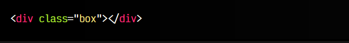
vista:
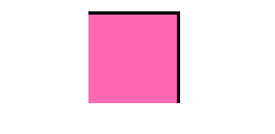

Así pues, inset(0% 0% 50% 50%) parte desde el 0% de la parte superior, desde el 0% de la parte derecha, desde la mitad (50%) de la parte inferior y desde la mitad (50%) de la parte izquierda:

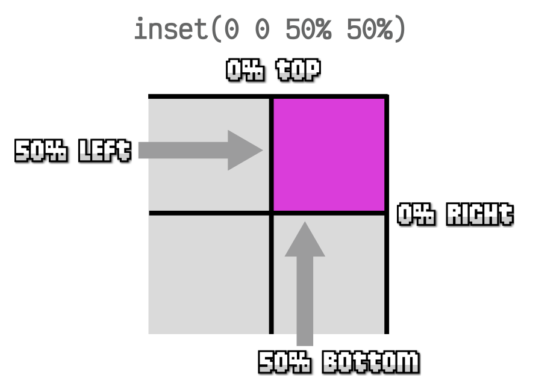

También es posible redondear los bordes del cuadrado o rectángulo, indicando al final la palabra clave round junto al radio de borde que quieres especificar. Por ejemplo:

css:
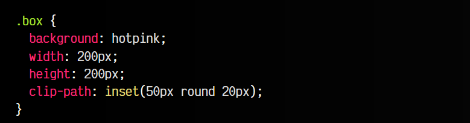

html:
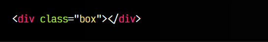

vista:
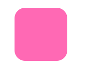

Observa que en este caso, hemos establecido sólo un valor para los parámetros, es decir, equivalente a inset(50px 50px 50px 50px), pero además incluimos round 20px, por lo que va a establecer un border-radius de 20px en cada esquina, es decir, algo similar a border-radius: 20px 20px 20px 20px.

## La función xywh()
Con esta función podemos definir un recorte basado en una posición concreta x,y (los dos primeros parámetros) y un tamaño de ancho y de alto w,h (los dos últimos parámetros). Es muy sencilla de utilizar, como veremos a continuación:

css:
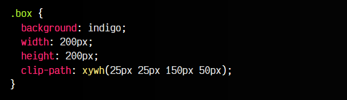

html:
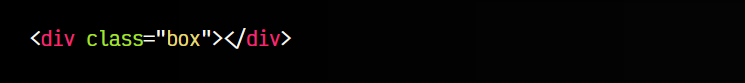
vista:

Observa que del cuadrado de 200x200, hemos recortado y nos hemos quedado con un rectángulo de 150x50 ubicado en la posición 25x25. Nuevamente, al igual que el anterior, opcionalmente se le puede añadir el parámetro round SIZE para indicar el redondeo de las esquinas.

## La función circle()
En el caso de la función circle(), vamos a establecer una forma circular en una porción del elemento, pudiendo recortar formas como círculos, medias lunas, etc. Veamos un ejemplo con un fragmento de código:

css:
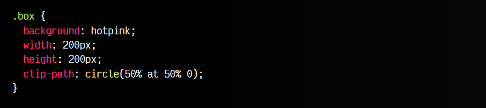

html:
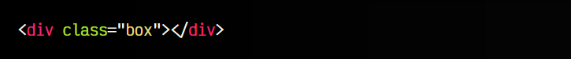

vista:
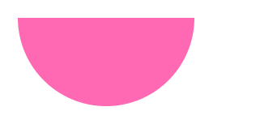

Así pues, en este caso, observa que indicamos circle(50% at 50% 0). El primer parámetro indica el tamaño de la forma geométrica circular (50%), y las coordenadas después de at es el punto central del círculo: 50% en x y 0% en y. Quedaría algo así:

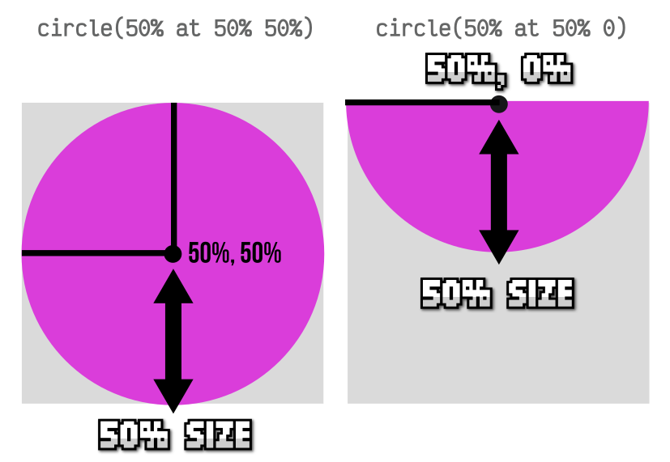

Además de la forma circular básica, podemos crear formas elípticas, como veremos a continuación.

## La función ellipse()
El caso de la función ellipse() es exactamente igual que el de circle() sólo que en las formas elípticas podemos establecer un ancho y alto diferente, mientras que en las formas circulares sólo podemos establecer un tamaño de ancho y alto idéntico:

css:
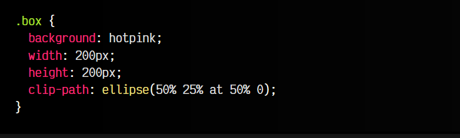

html:
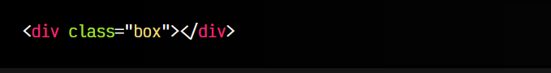

vista:
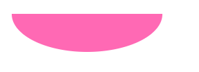

Como ya hemos comentado, la diferencia respecto a ellipse() es que en el tamaño de la elipse le podemos indicar el tamaño de ancho y de alto, mientras que en el círculo este valor es el mismo en ambos y sólo se indica uno.

## La función polygon()
Probablemente, el tipo de forma básica más potente y versátil sea crear una forma poligonal utilizando polygon(). Su funcionamiento es muy sencillo, pero a la vez muy flexible. Simplemente hay que indicar los puntos clave deseados e iremos creando la forma poco a poco:

css:
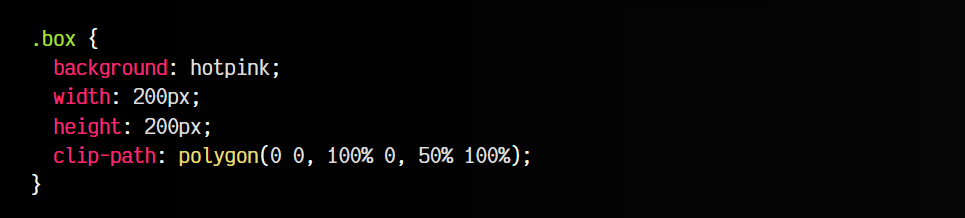

html:
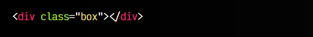

vista:
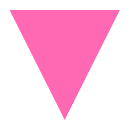

En este ejemplo, polygon() tiene 3 puntos clave separados por comas (cada uno con sus coordenadas en X e Y), formando un triángulo, pero se pueden indicar tantos puntos de corte como se quiera (incluso con valores negativos o superiores a 100%):

Recuerda que es posible crear polígonos mucho más complejos, con más puntos clave (o puntos de corte), consiguiendo polígonos con 3 puntos (triángulos), con 4 puntos (cuadrados o rectángulos), con 5 puntos (pentágonos), etc. La ventaja de las formas poligonales es que son mucho más personalizables.

Un buen consejo podría ser guardar la forma poligonal creada con la función polygon() en una variable CSS para reutilizarla después o añadirle un nombre de variable y hacerla más semántica.

## La función path()
Si buscamos algo un poco más de flexiblilidad y potencia, podemos crear un trayecto personalizado mediante la función path(). Con ella podemos definir un trayecto SVG para crear una forma que puede ser mucho más complejas, imposibles (o muy difíciles) de conseguir utilizando sólo HTML/CSS.

En los parámetros de path() se pasa un STRING que es una serie de coordenadas de un trayecto SVG, o lo que es lo mismo, el atributo d (data) de un elemento path> de SVG:

css:
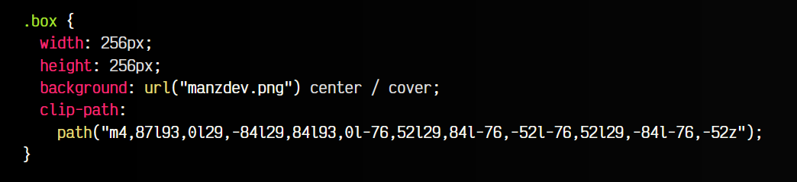

html:
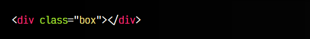

vista:

En este caso, hemos definido una estrella a través de una serie de coordenadas de un trayecto SVG.