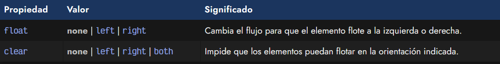
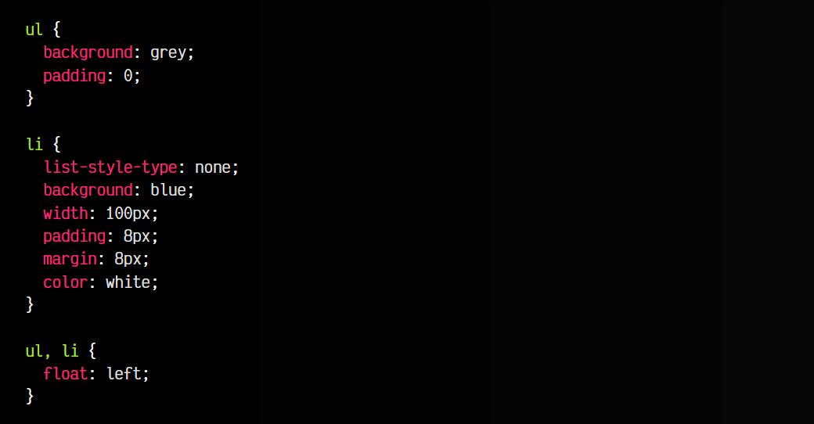
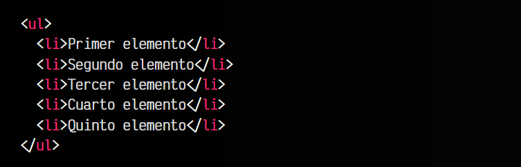
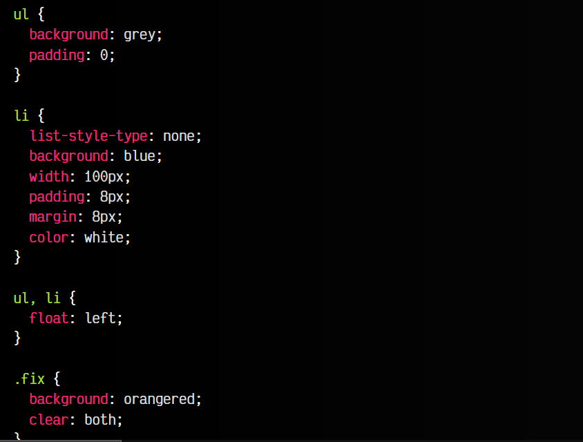
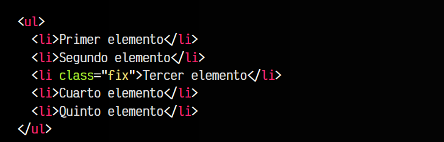
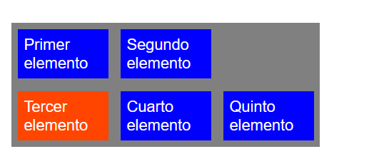

# 
La propiedad float

Es posible que en algún momento necesitemos algo más de control sobre nuestra página y «hacer flotar» determinados elementos al lado de otros. Existe una propiedad denominada float que tiene un funcionamiento peculiar con el que cambiamos el flujo de ordenación de los elementos de una página.

En el pasado, la propiedad float se usaba para maquetación y creación de layouts, cuando no había una necesidad prioritaria de crear layouts responsive u otras características relacionadas. Actualmente, float no debe utilizarse para maquetación, pero sigue siendo buena práctica para usar junto a propiedades como shape-outside.

## La propiedad clip-path
Con la propiedad float podemos conseguir que un elemento «flote» a la izquierda o a la derecha de otro elemento. Para ello podemos utilizar las siguientes propiedades:

De esta forma, utilizando la propiedad float podemos cambiar donde aparecía un elemento, y mediante la propiedad clear podíamos resetearlo. Veamos algunos ejemplos para entenderlo bien.

## Elementos flotantes
Con la propiedad float puedes conseguir que los elementos que quieras, alteren su comportamiento y floten a la izquierda (left) o a la derecha (right). Con el valor none (valor por defecto) eliminas esta característica de desplazamiento.

Imaginemos que tenemos un párrafo de texto, seguido de una lista, seguida de otro párrafo de texto:

css:

html:

vista:

Con esto conseguimos que los ítems de la lista floten uno a continuación de otro. No obstante, hoy en día para conseguir este comportamiento siempre recomiendo utilizar la propiedad display en lugar de float. De esta forma se suele conseguir una solución y código más limpio y organizado.

## Limpiar flujo flotante
Por otro lado, la propiedad clear se encarga de impedir elementos flotantes en la zona indicada, a la izquierda del elemento (left), a la derecha (right) o en ambos lados (both).

En el ejemplo anterior, el segundo párrafo de texto aparecería a continuación de la lista, cuando probablemente, nuestra intención es que apareciera en la parte inferior. Se podría solucionar simplemente añadiendo el siguiente texto:

css:

html:

vista:

Recuerda que la propiedad float es una propiedad que podría ser interesante en determinadas condiciones, sin embargo, utilizarla para creación de layout o colocación de elementos, como se hacía en el pasado, si se puede considerar una mala práctica, ya que el código resultante suele ser más sucio y complejo de lo que sería mediante otros métodos actuales, como [Flex](https://lenguajecss.com/css/maquetacion-y-colocacion/flex/) o [Grid CSS](https://lenguajecss.com/css/maquetacion-y-colocacion/grid-css/).

