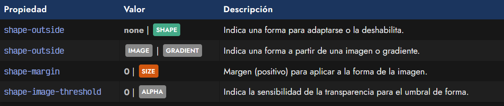
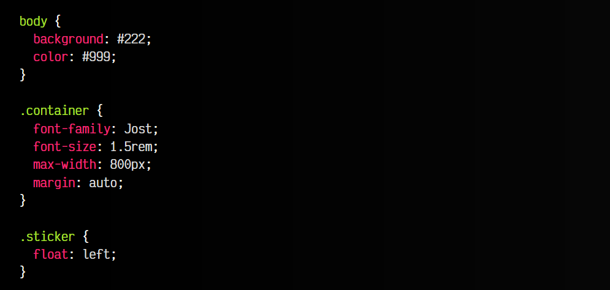
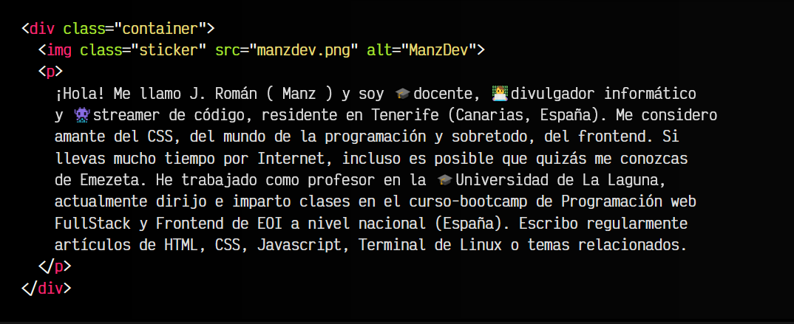
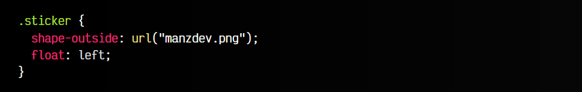
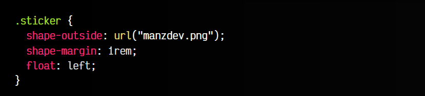
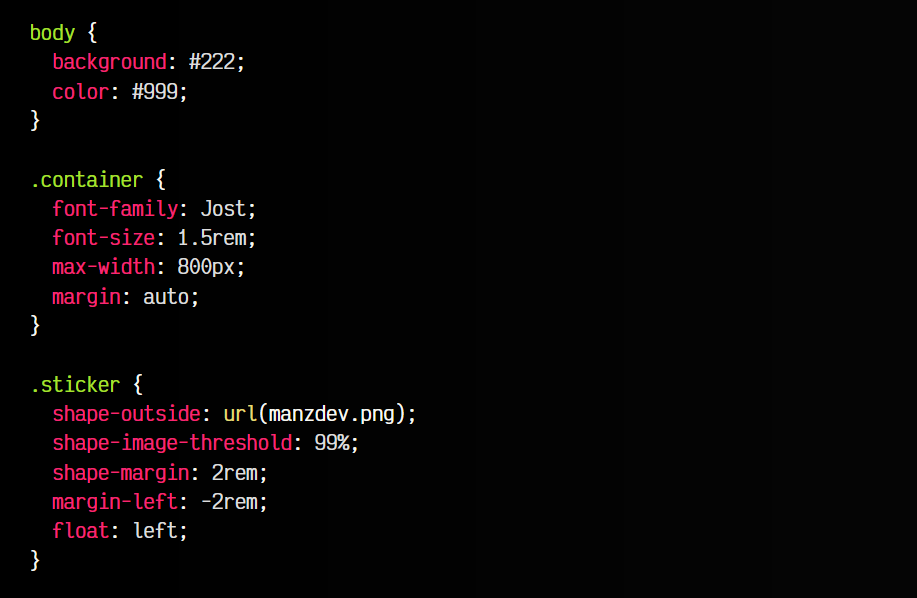
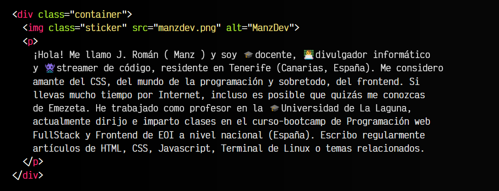

# 
La propiedad shape-outside

En algunos casos puede interesarnos crear formas alrededor de imágenes para que el texto se adapte y se consiga una apariencia más bonita. Sin embargo, es un objetivo que en CSS puede ser bastante complejo de conseguir, salvo que se conozcan las siguientes propiedades:

Antes de comenzar a explicar estas propiedades, partamos del siguiente ejemplo, donde utilizaremos la propiedad enemiga y archienemiga float para hacer flotar un elemento a la izquierda o a la derecha de un texto, en este caso, a la izquierda.

La propiedad float se usó en el pasado para crear layouts, algo que hoy en día ha sido completamente reemplazado por sistemas como Flexbox o Grid, pero que sin embargo, se puede utilizar hoy perfectamente para combinar con la propiedad shape-outside y realizar las formas flotantes que veremos a continuación.

## Creando una imagen flotante
Asumamos el siguiente fragmento de código HTML/CSS. En él, hemos creado un párrafo de texto a continuación de una imagen. A dicha imagen le vamos a establecer un float: left para conseguir que se coloque flotando a la izquierda del párrafo de texto:

css:

html:

vista:

Estableciendo estas directrices, obtendríamos un resultado similar a la siguiente imagen de ejemplo. Ten en cuenta que el recuadro rojo, lo he incluido para que se recalque la forma que está ocupando la imagen, que no pertenece al resultado visual del navegador. Esta forma es completamente recta, formando un rectángulo perfecto que ocupa todo el espacio de la imagen.

Ten en cuenta que la imagen manzdev.png enlazada se trata de una imagen con una forma irregular y con fondo transparente, algo que es importante en el objetivo de este artículo.

De momento sólo hemos establecido la base del ejemplo, pero no hemos utilizado ninguna de las propiedades que explicamos en este artículo. Vamos a modificar el ejemplo base para utilizar la primera de ellas.

## La propiedad shape-outside
Utilizando la propiedad shape-outside e indicando la misma imagen que hemos establecido en nuestro HTML, podemos indicarle al navegador, que debe ignorar la zona transparente de la imagen, de modo que cree una forma adaptada a la imagen, y por consecuencia, permita al texto que se encuentra alrededor acomodarse alrededor de la imagen:

El navegador utilizará la transparencia de la imagen para acomodarse automáticamente, sin necesidad de utilizar ninguna otra propiedad adicional salvo shape-outside y float. El código CSS sería el siguiente:

Aunque en este ejemplo estamos utilizando la función url() para establecer la forma a la imagen que estamos utilizando, debes saber que también se pueden utilizar gradientes o formas básicas, a excepción de path(), que aún no tiene soporte en navegadores.

## La propiedad shape-margin
Mediante la propiedad shape-margin podemos definir la distancia de margen que queremos aplicar a la forma creada con shape-outside. Es posible que esta forma creada no sea lo suficientemente grande como para separar el texto de una forma visualmente aceptable:

Aplicando una distancia o tamaño adecuado, podemos pasar del tamaño 0 inicial (en rojo en la imagen) a tamaños como 1rem o 2rem (por ejemplo, en amarillo en la imagen), y hacer crecer un poco este margen, ya que la propiedad margin aplicada a la imagen no tendrá en cuenta las particularidades de la forma de la imagen, y puede que no nos sirva:

De esta forma podemos ajustarla a nuestra necesidad.

## La propiedad shape-image-threshold
Por último, la propiedad shape-image-threshold es una propiedad interesante que nos permite indicar el umbral de transparencia (canal alfa) que debe tener cada pixel para considerarse transparente y crear la forma. Esto puede ser especialmente útil, si no está detectando la transparencia y ocurre el caso inverso anterior, es decir, no detecta la transparencia y tiene un "margen" demasiado amplio.

Observa en la imagen, que el borde rojo es la forma creada en el ejemplo anterior, mientras que al aplicar un shape-image-threshold de 70% o 0.7 obtenemos la forma de color verde:

La propiedad shape-image-threshold

El fragmento de código de este ejemplo sería el siguiente:

   - El float hace que la imagen flote a la izquierda.
   - El shape-outside indica la imagen para crear la forma a partir de ella.
   - El shape-margin establece un margen concreto (en este, ninguno).
   - El shape-image-threshold establece la cantidad de transparencia necesaria para que se considere el pixel transparente y forme parte de la forma a crear.

Finalmente, el código resultante sería el siguiente:

css:

html:

vista:

La compatibilidad de estas propiedades es aceptable, por lo que no suele haber problema para utilizarla en navegadores actuales.
