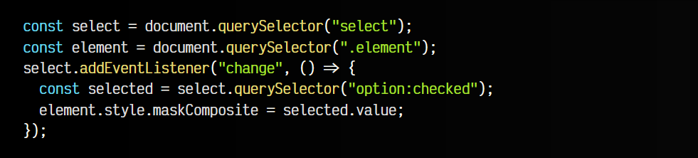

# 
La propiedad mask-image

Existe una familia de propiedades CSS poco conocidas que permiten crear máscaras de composición, mediante las cuales, utilizando imágenes o formas "compatibles", puedes establecer máscaras que recortarán o establecerán formas compuestas aplicadas a elementos de nuestro HTML.

## Máscaras CSS
Para crear estas máscaras utilizaremos las siguientes propiedades. Varias de ellas están basadas en las propiedades individuales de la familia de propiedades background. Por ejemplo, mask-repeat es similar a background-repeat:

Ten en cuenta que las máscaras pueden no estar soportadas por completo en ciertos navegadores, por lo que se recomienda examinar bien la necesidad de utilizar prefijos como -webkit- antes de las propiedades o estrategias similares.

## La propiedad mask-image
La propiedad principal de las máscaras CSS es mask-image, la cuál se puede pensar en ella como un análogo a background-image con las imágenes de fondo. En su caso, mask-image establece una imagen a modo de máscara, y aunque hablamos de imagen, realmente nos referimos a varios tipos de elementos:

Como ves, tenemos varias opciones:

   - 1️⃣ Utilizar none y no aplicar máscara. Valor por defecto.
   - 2️⃣ Usar una imagen externa referenciada (JPEG, PNG, WEBP, etc...)
   - 3️⃣ Usar un gradiente creado con CSS (linear, radial o conic)
   - 4️⃣ Usar una referencia a una parte de un SVG mediante su id

Veamos un ejemplo con código CSS (mueve el ratón por encima para quitar la máscara):

css:

html:

vista:

Puedes probar a hacer cambios en un [CodePen](https://pen.new/) para ver como funciona. Con la propiedad de atajo background establecemos una imagen de fondo con background-image, colocamos con background-position y damos tamaño con background-size, además de dar tamaño de alto y ancho con width y height.

Con la propiedad mask-image creamos una máscara negra basada en un gradiente como la de la imagen. Esta máscara se aplicará al elemento y su imagen de fondo, de modo que la parte en negro oculta y la parte transparente deja ver la imagen:

Esto es una fantástica forma de enmascarar nuestras imágenes y darle formas flexibles y potentes mediante código. Recuerda que puedes utilizar no sólo gradientes radiales, sino otro tipos de gradientes, imágenes con transparencia o formas personalizadas mediante SVG.

Recuerda que al igual que con background-image, es posible indicar múltiples máscaras de imágenes, simplemente separando por coma, que se sumarán y aplicarán a la vez. Si lo haces, recuerda que las propiedades mask-* relacionadas utilizarán el valor para todas las máscaras, o tendrás que separar por comas para hacer referencia a cada máscara.

## La propiedad mask-mode
Mediante la propiedad CSS mask-mode podemos cambiar el modo en el que se crea la máscara. La propiedad tiene los siguientes valores posibles:

En el caso de utilizar un modo alpha, la máscara utilizará los valores alfa de la máscara para utilizarlos como transparencia. Sin embargo, si configuramos el valor luminance utilizará los valores con más brillo para utilizarlos como transparencia. Esto nos podría servir por ejemplo, para invertir la máscara de forma rápida:

css:

html:

vista:

En este caso, hemos modificado la máscara para que sea con colores negro-blanco en lugar de negro-transparente. Al utilizar mask-mode: luminance, se toma el color blanco, en lugar del transparente. Recuerda que el valor match-source es el valor que trae por defecto.

## La propiedad mask-repeat
La propiedad mask-repeat se entiende fácil si hacemos el simil con la propiedad background-repeat de la familia de propiedades de imágenes de fondo, ya que funciona exactamente igual. Los valores disponibles son los siguientes:

Por defecto, la máscara de imagen establecida se repetirá en el eje x y en el eje y, ya que tiene establecido el valor repeat. Utilizaríamos repeat-x si queremos que se repita solo en horizontal, repeat-y para repetir en vertical o no-repeat para que no se repita en ningún eje.

css:

html:

vista:

Por último, los valores space o round se pueden añadir al valor de mask-repeat para indicar como quieres que ajuste el espacio sobrante.

## La propiedad mask-position
La propiedad mask-position permite colocar la máscara de imagen y desplazarla una cierta cantidad de espacio. Por defecto, el valor indicado es 0% 0%, por lo que se colocará lo más a la izquierda y arriba posible. Sin embargo, podemos cambiar los valores a:

   - left, center o right para el eje x
   - top, center o bottom para el eje y
   - Valores de tamaño para ambos ejes

Obviamente, también puedes combinarlos.

css:

html:

vista:

Si tienes más dudas, echa un vistazo a la propiedad background-position, en el tema de imágenes de fondo, ya que funciona de forma muy parecida.

## La propiedad mask-clip
La propiedad mask-clip se puede usar para indicar el área que será afectada por una máscara. Por defecto, el valor establecido es border-box, que incluye contenido, relleno y borde (ver tema de modelo de cajas). Sin embargo, se pueden utilizar otros valores:

Entre esos otros valores se encuentran:

  -  padding-box: El área incluye padding y contenido (excluye borde).
  -  content-box: El área incluye sólo contenido (excluye padding y borde).
  -  no-clip: El contenido no es recortado.
  -  margin-box: El área incluye márgenes.

El resto de valores, se utilizan específicamente en ficheros SVG:

  -  view-box: El área incluye el viewbox (lienzo).
  -  fill-box: El área incluye el contenido del SVG.
  -  stroke-box: El área incluye los trazos (bordes) del SVG.

## La propiedad mask-origin
Con prácticamente los mismos valores que la propiedad anterior, la propiedad mask-origin permite indicar el origen del área de la máscara de imagen. Con los siguientes valores puedes marcar como se comportará el área respecto a su posición de origen:

bserva este ejemplo. En este caso hemos utilizado dos máscaras idénticas, pero hemos añadido un padding y con mask-origin hemos cambiado su origen. Usando también la composición (ver más adelante), hemos conseguido que se quede sólo con el borde de una de las máscaras:

css:

html:

vista:

Si tienes dudas, consulta las propiedades background-clip y background-origin, en el apartado de fondos de imágenes.

## La propiedad mask-size
La propiedad mask-size nos permite indicar el tamaño que tendrá la máscara indicada. Observa que puedes indicar dos valores, que corresponden al tamaño de ancho y al tamaño de alto. Puedes indicar valores como:

El significado de cada valor es el siguiente:

 -   auto establece el valor de forma automática (valor por defecto para ambos ejes)
 -   Valor medido en un tamaño concreto o en porcentajes
 -   Utilizar un único valor cover, para un ajuste automático del alto
 -   Utilizar un único valor contain, para un ajuste automático del ancho

Veamos un ejemplo:

css:

html:

vista:

Como vimos más atrás, podemos establecer un mask-repeat para repetir la máscara. En este caso, en el gradiente, hemos definido que tenga una forma circular con un radio de 50px. Como en el mask-size hemos establecido un tamaño de máscara de 50x50, sólo cabe una cuarta parte del círculo, que es la que se repite continuamente.

## La propiedad mask-composite
La propiedad mask-composite te permite indicarle al navegador como se va a componer la máscara de imagen en el caso de tener múltiples máscaras definidas. Observa que entre los valores disponibles se encuentran los siguientes:

El valor add es el valor por defecto, por lo que por norma general, se suman (superponen) las máscaras. Estos métodos de composición se utilizan aplicándose a la máscara actual y al resto de máscaras inferiores a ella.

Así pues, con add podríamos superponer varias máscaras, con subtract restar el contenido de una máscara al contenido del resto, con intersect quedarse con la intersección (parte común) de la máscara actual y el resto de máscaras inferiores y con exclude quedarse con lo contrario a la intesección (*parte no común).

Observa el siguiente ejemplo. En él, hemos definido dos máscaras:

 -   1️⃣ La primera máscara es un radial-gradient en forma de círculos de radio de 50px que se repiten a lo largo de la imagen con un tamaño 100x100.
 -   2️⃣ La segunda máscara es un radial-gradient en forma de círculo grande de 400px, no se repite y cubre el alto de la imagen.

Mediante la propiedad mask-composite podemos determinar como se mezclan esas dos máscaras:

css:

html:

js:

vista:

## Atajo: La propiedad mask
Finalmente, la propiedad mask es un atajo que nos permitirá abreviar todas las propiedades relacionadas con las máscaras CSS en una sola propiedad. Recuerda que si no necesitas indicar algún valor, puedes omitirlo y se utilizará el valor por defecto:

