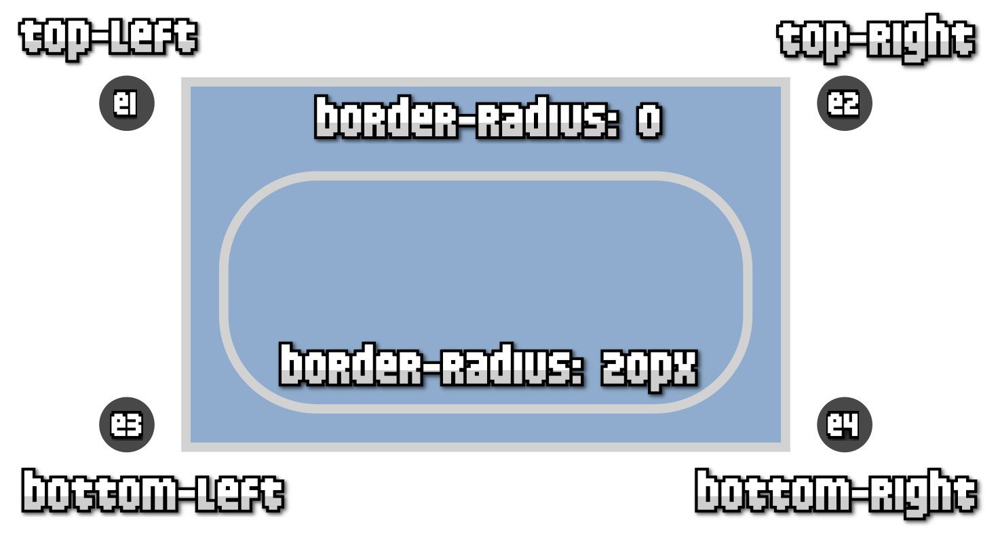
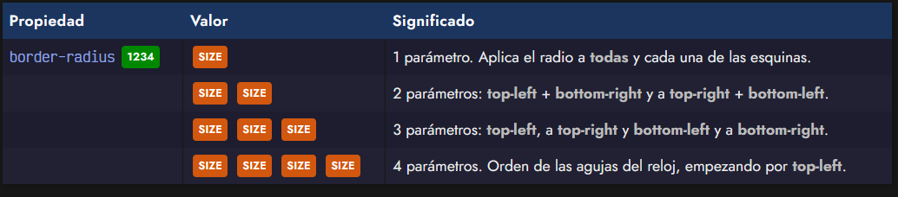
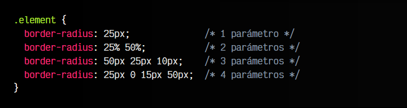
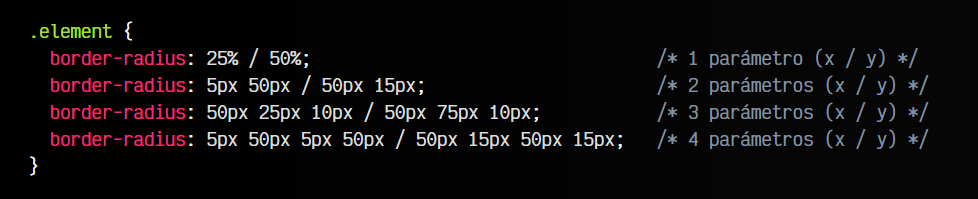
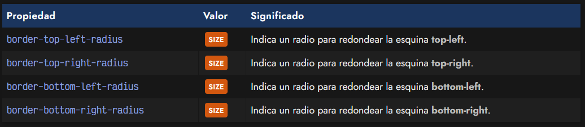

# 
Esquinas redondeadas

CSS3 añade interesantes características en materia de bordes, como la posibilidad de crear bordes con esquinas redondeadas, característica que en versiones anteriores de CSS era muy complicado de lograr, necesitando recurrir al apoyo de imágenes gráficas. Por su parte, en CSS3 es realmente sencillo hacerlo mediante código.

La idea es especificar un radio para el borde de las esquinas de la caja. Por defecto, este borde es de tamaño 0, por lo que no hay borde redondeado. A medida que se aumenta este valor, el borde se redondea más. Una vez llegado a su máximo, no se apreciará ningún cambio.

## La propiedad border-radius.
Para indicar este radio, utilizaremos la propiedad border-radius. Hay varias formas de utilizarla:

Profundicemos un poco en estos cuatro formatos:

   - El primer formato, un único parámetro, aplica ese tamaño a todas las esquinas del borde.

   - El segundo formato, con dos parámetros, aplica el primer valor, e1, a las esquinas superior-izquierda e inferior-derecha, y el segundo valor, e2, a las esquinas superior-derecha e inferior-izquierda.

   - En el tercer formato, se aplica el parámetro e1 a la esquina superior-izquierda, el parámetro e2 a las esquinas superior-derecha e inferior-izquierda y el parámetro e3 a la esquina inferior-derecha.

   - Y por último, en el cuarto formato, se aplica el tamaño de cada valor a cada esquina por separado, en el sentido de las agujas del reloj. O lo que es lo mismo, e1 a la esquina superior-izquierda, e2 a la esquina superior-derecha, e3 a la esquina inferior-derecha y e4 a la esquina inferior-izquierda.

A modo de ejemplo teórico, pueden ver un ejemplo de la aplicación de varios formatos:

## Esquinas irregulares.
Es posible diferenciar el radio horizontal del radio vertical de una esquina determinada, creando una esquina redondeada irregular. Para conseguirlo, no hay más que añadir una barra (/) y repetir nuevamente el número de parámetros escogido. De esta forma, los parámetros a la izquierda de la barra representan el radio horizontal, mientras que los que están a la derecha, representan el radio vertical.

## Esquinas específicas.
De la misma forma que hemos visto con anterioridad en otras propiedades CSS similares, también es posible especificar los valores de cada esquina mediante propiedades por separado:

Estas propiedades son ideales para aplicar junto a la herencia de CSS y sobreescribir valores específicos.