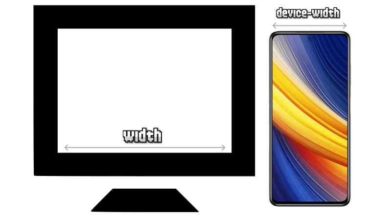

# 
CSS Media Queries

Una vez nos adentramos en el mundo del Responsive Design, nos damos cuenta en que hay situaciones en las que determinados aspectos o componentes visuales deben aparecer con ciertas diferencias dependiendo del dispositivo donde se están visualizando, ya que no todos los dispositivos tienen los mismos tamaños o características.

Por ejemplo, una zona donde se encuentra el buscador de la página puede estar colocada en un sitio concreto en la versión de escritorio, pero en móvil quizás nos interese que ocupe otra zona (o que tenga otro tamaño o forma) para aprovechar mejor el espacio de la versión del dispositivo móvil.

## ¿Qué son las Media Queries?
Existe un concepto denominado media queries, mediante el cuál podemos hacer excepciones para que unos determinados estilos de diseño sólo se apliquen si se cumplen una serie de condiciones, generalmente relacionadas con el dispositivo o navegador mediante el cuál se está viendo la página.

A fin de cuentas, se trata de una especie de condicionales de diseño, en las que si se cumple la condición se aplicarán unos estilos, y en caso contrario, se aplicarán otros.

## La regla @media
Las reglas media queries (abreviadas como MQ) se indican en el código mediante la regla @media, indicando la condición en cuestión entre paréntesis. La sintaxis sería la siguiente:

Observa que, de utilizar la palabra clave not antes de los paréntesis, invertimos la condición. Así pues, veamos un pequeño ejemplo donde escribimos las dos opciones anteriores, pero sin entrar en detalles aún en la condición:

En el ejemplo anterior, si se cumple la condición establecida, se aplicará un color verde. Sin embargo, si no se cumple, se aplicará un color rojo. Recuerda que es similar al funcionamiento de un if / else en programación.

No olvides que al escribir una regla @media podrías estar sobreeescribiendo los estilos CSS en otro fragmento posterior. Una buena forma de empezar a escribir MQ sería escribir las reglas @media siempre al final, como excepciones al código anterior.

El número de bloques de reglas @media a utilizar depende del desarrollador web, ya que no hay una obligación o norma de utilizar un número concreto. Se pueden utilizar desde un sólo media query, hasta múltiples de ellos a lo largo de todo el documento CSS.

Si lo deseas, es posible establecer múltiples condiciones en las reglas @media. De esta forma, se pueden conseguir situaciones mucho más específicas y flexibles. Ten mucho cuidado si aplicas el not en las condiciones, no sea que niegues de forma incorrecta los casos deseados:

Al igual que not, también existe la palabra clave only. Suele usarse a modo de hack. El comportamiento por defecto ya incluye los dispositivos que encajan con la condición, así que con only conseguimos que navegadores antiguos (no la entienden) no procesen la información de esta regla, consiguiendo una forma de dar estilo sólo en navegadores modernos.

## Condiciones de Media Queries
En los ejemplos anteriores hemos indicado *condiciones* en el interior de los paréntesis, pero no hemos visto como definir ninguna. Vamos a profundizar en esto.

## Media Queries (range syntax)
Aunque existen otras formas, hoy en día la forma preferida de escribir Media Queries es utilizando la modalidad de rangos de condiciones (Media Query Range Syntax), mucho más versátiles que las sintaxis anteriores, y mucho menos tediosas.

Para ello, vamos a escribir las condiciones utilizando operadores de comparación como <, <=, > o >=:

css:

html:

vista:

Observa que en el caso de que la ventana del navegador del dispositivo sea igual o más pequeña que 550px, se verá el fondo de color lila, y en el caso de que sea mayor o igual que 750px se verá verde.

Si la ventana tuviera entre 551px y 749px, no se aplicaría ninguna media query (no cumplen las condiciones) y se quedaría de color gris, que es el valor que tiene indicado por defecto.

Ahora, hagamos una pequeña variación del CSS anterior, y aprovechemos el CSS Nesting nativo y la anidación de reglas @media:

css:
![alt text]./imagenes-css-media-queries/(image-6.png)

html:

vista:

Como puedes ver, exactamente equivalente al código anterior, pero más compacto y legible. Ten en cuenta que con la sintaxis de rangos también puedes hacer condiciones múltiples de este estilo, en el que el código CSS se aplica sólo si el navegador tiene un ancho de pantalla entre 400px y 800px:

Esta serie de características de sintaxis junto a poder utilizar los operadores >, >=, <, <= en las condiciones de los media queries, hace mucho más intuitivo el escribir MQ CSS.

## Media Queries (legacy syntax)
Lo que veremos a continuación es un ejemplo clásico de media queries en el que se utiliza una sintaxis antigua. Hoy en día se recomienda utilizar la Media Query Range Syntax que acabamos de explicar, pero es posible que te encuentres con una sintaxis similar a la siguiente:

css:

html:

vista:

El ejemplo anterior muestra un elemento (con clase menu) con un color de fondo concreto, dependiendo del tipo de medio con el que se visualice la página. Los resultados podrían ser los siguientes (los valores son sólo ejemplos, habría que adaptarlos al caso deseado):

   - Azul para resoluciones menores a 400 píxeles de ancho (móviles).
   - Rojo para resoluciones entre 400 píxeles y 800 píxeles de ancho (tablets).
   - Verde para resoluciones mayores a 800 píxeles (desktop).

## Tipos de medios
En algunas ocasiones, queremos indicar que las reglas @media sólo se pongan en funcionamiento en determinados tipos de dispositivos. Son los llamados tipos de medios, que pueden utilizarse en las condiciones de los media queries. Existen los siguientes:

Estos tipos de medios se pueden indicar como una condición más, de modo que podría quedar de la siguiente forma:

Quizás encuentres referencias a medios como braille, embossed, handheld, projection, tty o tv. Aunque aún pueden servir, están marcados como obsoletos a favor de los de la lista anterior.

## Viewport (Región visible)
Cuando hablamos de Responsive Design muchas veces haremos referencia al viewport (región visible del navegador). Recordemos que con el siguiente fragmento de código HTML estamos indicando que hay que preparar el navegador para el Responsive y que el nuevo ancho de la pantalla será el ancho del dispositivo, por lo que el aspecto del viewport se va a adaptar consecuentemente:

Con esto conseguiremos preparar nuestra web para dispositivos móviles y prepararnos para la introducción de reglas media query en el documento CSS. Es importante no olvidar este paso.

## Media Queries desde HTML
Por último, hay que tener en cuenta que los media queries también es posible indicarlos desde HTML, utilizando la etiqueta <link> y el atributo media para establecer la condición:

Observa, sin embargo, que en este caso, el código CSS de las diferentes condiciones queda en un archivo .css diferente, sin embargo, el navegador al cargar la página los descargará todos y los aplicará cuando sea necesario, al igual que lo hace en los ficheros .css.

