# 
CSS Media Features

Hasta ahora, sólo hemos utilizado width como condición para los media queries, sin embargo, existe una amplia gama de características o features que podemos utilizar en nuestras condiciones para aplicar un estilo si se cumplen o se dejan de cumplir.

Para ello, vamos a dividirlas en varios bloques. Veamos cada uno de ellos.

## Tamaño o proporción de aspecto
Al igual que utilizamos width, también podemos utilizar otros valores que determinan capacidades del dispositivo. Por ejemplo, podemos utilizar los siguientes:

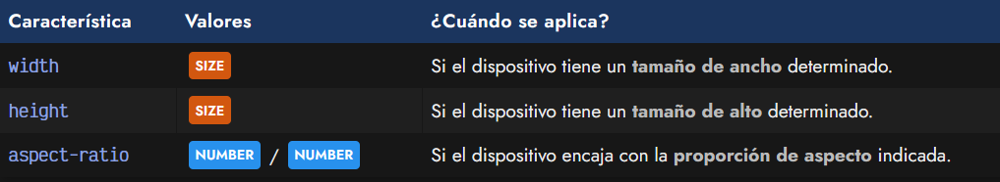

Observa que tanto width, height como aspect-ratio tienen valores numéricos con los que puede utilizarse los operadores <, >, <=, >=. La proporción de aspecto es un valor numérico, pero que también puede indicarse en forma de fracción.

css:
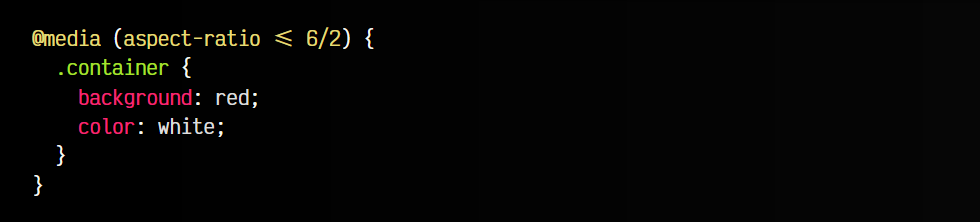

html:
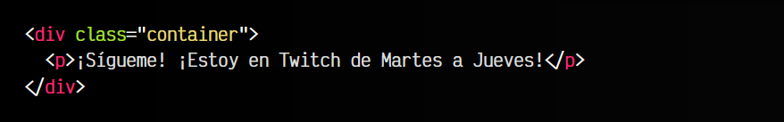

vista:
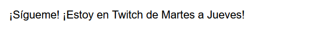

Por ejemplo, 6/2 sería lo mismo que utilizar 3/1, que a su vez, sería lo mismo que 3. En los tres casos, se refiere a que la proporción de ancho debe ser 3 veces la proporción de alto.

## Orientación del viewport
Mediante la feature orientation podemos aplicar estilos dependiendo de la orientación del viewport (región visible) del navegador del usuario. Ten en cuenta que orientación no se refiere a la orientación de la pantalla, sino a la orientación del viewport. En móviles, esto suele coincidir con la situación donde el usuario tiene el móvil en vertical (portrait) o en apaisado (landscape).

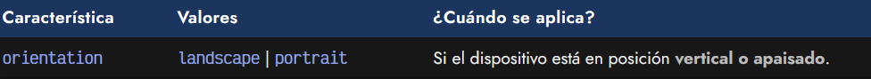

Observa el siguiente ejemplo. En navegadores de escritorio, generalmente nos encontraremos con que el texto tiene estilo y aparece en fondo verde. En dispositivos móviles o tablets, dependerá indirectamente de la orientación del dispositivo.

css:
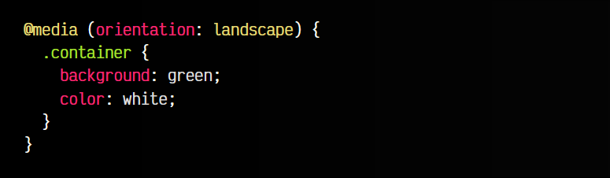

html:
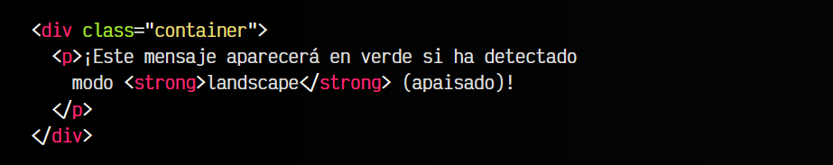

vista:
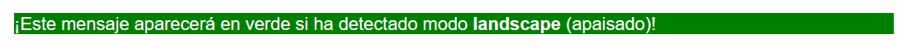

Recuerda que esta media query no identifica la orientación de la pantalla.

## Desbordamiento del contenido
El navegador es capaz de detectar que tipo de medio estás usando a través de la feature overflow-block y overflow-inline:

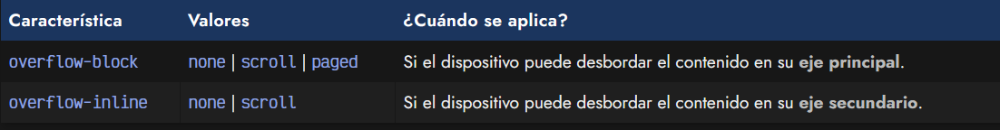

   - 1️⃣ scroll: Medio donde el usuario puede hacer scroll (móvil, tablet, desktop, etc...)
   - 2️⃣ paged: Medio donde el usuario ve contenido paginado (ebook reader, impresión, etc...)
   - 3️⃣ none: Medio que no cumple los criterios anteriores (plataformas publicitarias, etc...)

La feature overflow-block se refiere al eje principal (que en nuestro caso, suele ser eje Y), la feature overflow-inline se refiere al eje secundario (que en nuestro caso, suele ser X).

## Modo de visualización
La feature display-mode nos permite aplicar estilo si el navegador se encuentra en una modalidad específica de las siguientes:

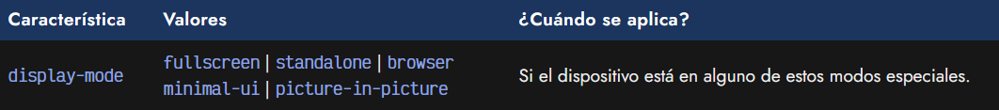

   - 1️⃣ fullscreen: La página está en modo pantalla completa. Generalmente, ocurre al pulsar .
   - 2️⃣ standalone: La página está en modo aplicación independiente nativa.
   - 3️⃣ minimal-ui: Similar a standalone, pero con elementos mínimos de UI de navegación.
   - 4️⃣ browser: La página está en el modo navegador tradicional.
   - 5️⃣ picture-in-picture: La página está mostrando medios en una ventana flotante y siempre visible.

Por ejemplo, si pulsamos F11 en un navegador, pasamos al modo Pantalla completa (fullscreen). Veremos que en ese caso, los estilos se aplican al elemento:

css:
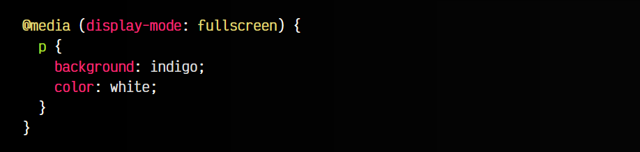

html:
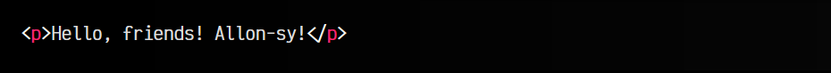

vista:

Ten en cuenta que el modo fullscreen no es estrictamente el mismo que el de la API fullscreen, gestionado normalmente con la pseudoclase :fullscreen, por lo que pueden tener diferencias.

## Capacidad de scripting
Otra feature muy útil es la de scripting, que permite indicar al navegador que se apliquen ciertos estilos si el navegador tiene capacidades de ejecución de Javascript. Esto puede ser muy interesante para mostrar u ocultar elementos si el usuario no dispone de Javascript:

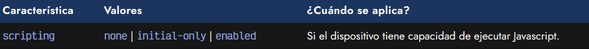

Las opciones disponibles son las siguientes:

   - 1️⃣ none: El navegador del usuario no dispone de capacidades para ejecutar Javascript.
   - 2️⃣ initial-only: El navegador del usuario sólo dispone de Javascript en la carga inicial.
   - 3️⃣ enabled: El navegador del usuario dispone de capacidades para ejecutar Javascript.

Un ejemplo podría ser el siguiente:

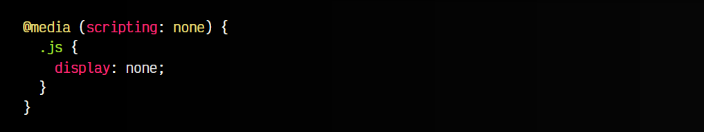

En este fragmento de código, estamos ocultando los elementos con clase js, que en nuestro ejemplo son elementos que se generan/controlan con Javascript. Como no tiene sentido mostrarlo en un navegador que no dispone de Javascript, los ocultamos.

Obviamente, ten en cuenta que lo ideal sería proporcionar una alternativa a la funcionalidad hecha con Javascript, y no sólo ocultar las zonas que funcionan con Javascript.

## Características de calidad
Aunque son menos utilizadas, las siguientes features nos permiten indicar estilos particulares a pantallas que tienen una calidad diferente de lo normal, ya sea porque son muy antiguas o tienen características límitadas:

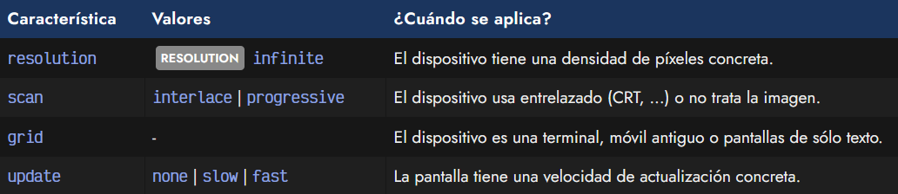

Veamos varios ejemplos de uso de estas features:

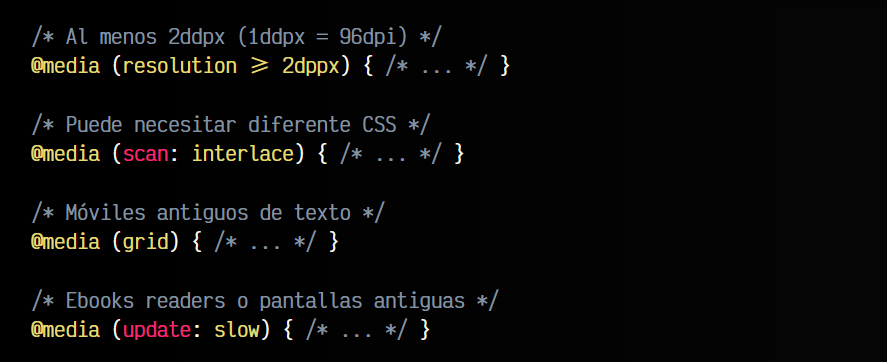

## Características de color y video
Algunas features muy específicas para media queries son las relacionadas con el color. Si tenemos necesidades muy concretas donde necesitamos saber las capacidades de mostrar color del dispositivo, podemos hacer uso de ellas:

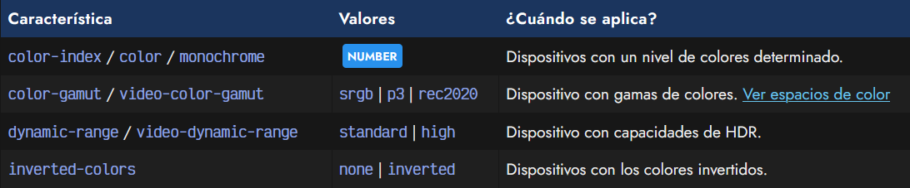

En el caso de los colores, tenemos los siguientes features:

   - 1️⃣ color-index: Determina la cantidad de colores que tiene un dispositivo.
   - 2️⃣ color: Determina la profundidad de colores (8 bits, 16 bits, etc...).
   - 3️⃣ monochrome: Determina si se está usando o no una pantalla monocromo.

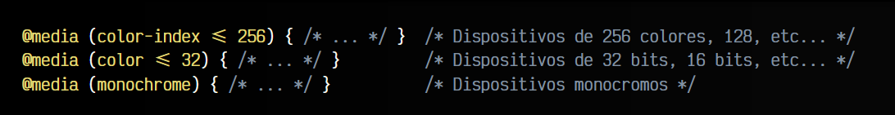

En el caso de la feature dynamic-range, podemos saber si el dispositivo permite mostrar imágenes o videos HDR, mientras que la feature inverted-colors nos permite saber si los colores del dispositivo están invertidos.

## Características de interacción
En muchas situaciones, nos interesa saber si el dispositivo desde donde ve la web el usuario está utilizando ratón (donde tiene una mayor precisión) o no. Esto se puede generalizar mucho mediante las features pointer y hover, donde podemos saber que tipo de precisión tiene, y si se trata de un dispositivo con capacidades de mover el elemento apuntador y hacer «hover» sin seleccionar el elemento.

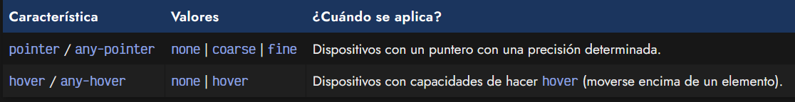

Los valores que se pueden utilizar son los siguientes:

   - 1️⃣ none: El dispositivo no tiene mecanismo apuntador/capacidad hover.
   - 2️⃣ coarse: El dispositivo tiene un mecanismo apuntador muy limitado (dedo o touch).
   - 3️⃣ fine: El dispositivo tiene un mecanismo apuntador preciso (ratón).
   - 4️⃣ hover: El dispositivo tiene capacidad de hacer hover (ratón o similares).

css:
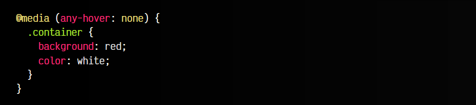

html:
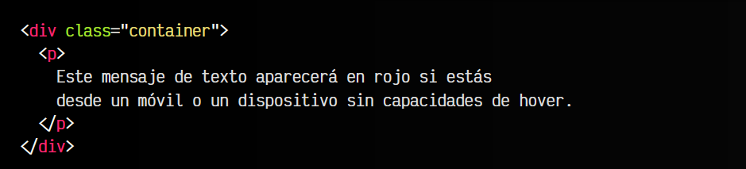

vista:
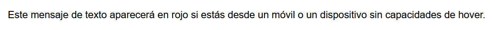

La diferencia entre pointer / hover y su versión any-* es que la primera hace referencia al dispositivo primario, mientras que las versiones con el prefijo any- hacen referencia a que tengan al menos un dispositivo, aunque no sea el primario.