# 
CSS Media Features

Los media queries o regla @media son un mecanismo de CSS para dar estilo a elementos dependiendo de si se cumple una cierta condición, que generalmente tiene que ver con el tamaño, orientación o cierta característica de la página o dispositivo en el que nos encontramos. Es uno de los mecanismos principales del responsive design.

Si has llegado hasta aquí, es muy probable que ya conozcas el concepto de media queries. Si no es así, te recomiendo echarle un vistazo antes de continuar.

## ¿Qué son los Container Queries?
Los CSS Container Queries son el mismo concepto de las Media Queries, pero en lugar de estar orientados a modificar los estilos dependiendo del tamaño de la página o dispositivo, lo hace dependiendo de un contenedor padre (o ancestro) específico. De esta forma, podemos cambiar el tamaño de ciertos elementos y hacer que tengan una forma o unos estilos concretos dependiendo del contexto donde se encuentren.

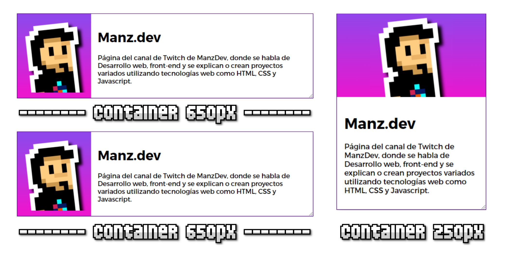

## El contenedor
Para empezar, tenemos que determinar cuál será el elemento contenedor al que vamos a hacer referencia. En dicho elemento, necesitaremos establecer las siguientes propiedades, donde container-name es siempre obligatoria:

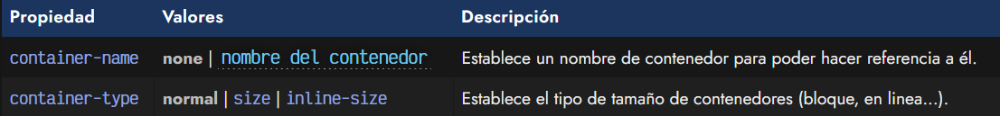

La propiedad container-name le da un nombre de contenedor al elemento en el que nos encontramos. Sin este nombre no podremos hacer referencia luego, en la regla @container.

Por otro lado, la propiedad container-type, si la definimos, establecerá el tipo de tamaño que va a tener el contenedor en cuestión, donde puede ser size para elementos de tipo bloque, o inline-size para elementos de tipo en línea. Por ejemplo, en el caso de establecer un elemento inline-size, no tendrá en cuenta la altura, si la colocamos en la regla @container, al contrario que si usamos size.

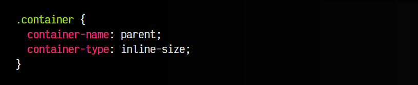

Tienes más información sobre elementos en línea y en bloque, en la sección la [propiedad display](https://lenguajecss.com/css/maquetacion-y-colocacion/propiedad-display/).

## Atajo: La propiedad container
Una forma de escribir menos código es utilizar la propiedad de atajo container, a la cuál le podemos indicar dos valores: el valor de la propiedad container-name y el valor de la propiedad container-type, siempre separadas por un /:

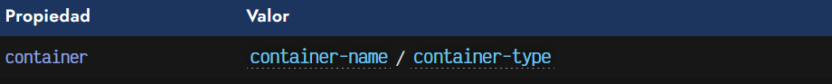

El ejemplo anterior, se podría simplificar como se ve a continuación:

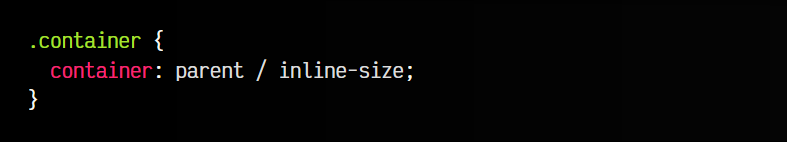

Muchas veces no necesitaremos establecer el valor de la propiedad container-type, por lo que podemos indicarle simplemente el primer valor, de la propiedad container-name y nada más.

## La regla @container
Una vez tenemos nuestro contenedor definido, debemos establecer una regla @container que, de forma muy similar a las reglas @media va a establecer una condición dependiendo de un elemento contenedor específico.

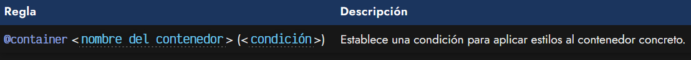

Por ejemplo, en este ejemplo que tenemos a continuación, vamos a establecer nuestro elemento con clase .container con un elemento contenedor parent, y creamos una regla @container que afecta a los hijos del contenedor parent cuando, como máximo, tenga 500px de ancho:

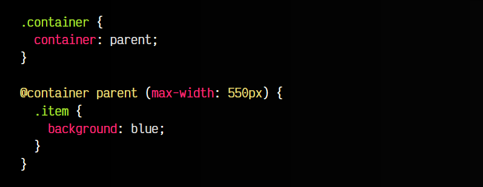

Vamos ahora a aplicar este detalle a un ejemplo completo. Observa que la tarjeta aparece en formato horizontal. Sin embargo, si forzamos a reducir el ancho de la ventana, comprobaremos que el elemento reacciona al cambio y se muestra en versión vertical. Esto puede parecer lo mismo que un media query, pero realmente podemos hacer lo mismo reduciendo el tamaño de la tarjeta (esquina inferior-derecha), y también reacciona a su cambio de tamaño.

Esto ocurre porque hemos usado un Container Query en lugar de un Media Query:

css:
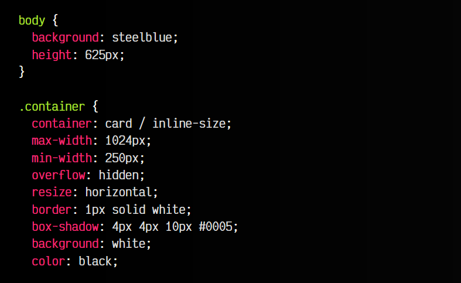
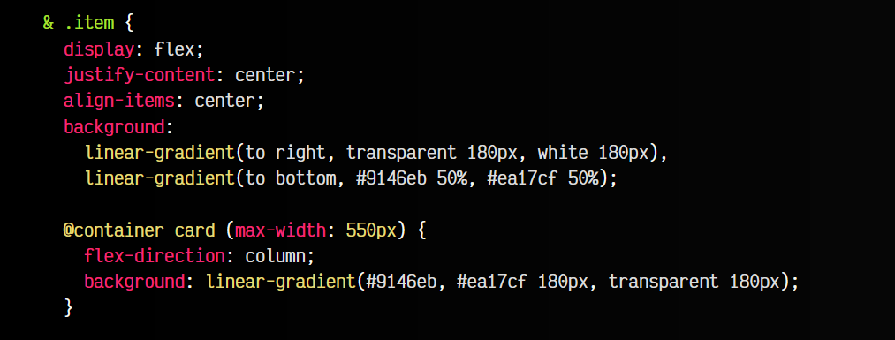
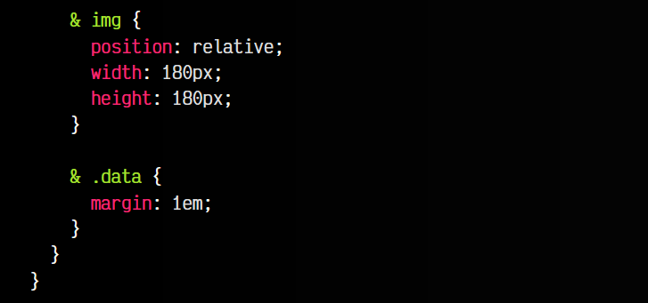
html:
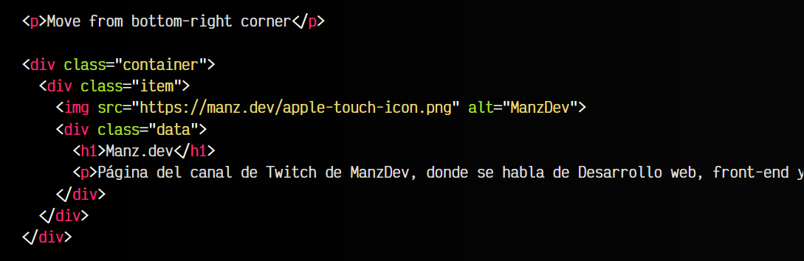

vista:
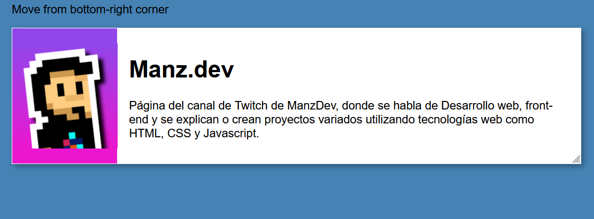

En este caso, cuando el elemento .item se encuentre dentro del contenedor .container y este último, tenga menos de 500px de ancho, el estilo del elemento .item cambiará a lo definido en la regla @container.

## Unidades de contenedores
Cuando nos encontramos en el interior de una regla @container podemos utilizar ciertas unidades especiales como cqw, cqh, cqi, cqb, cqmin o cqmax. Básicamente, la idea es que si desconocemos el tamaño concreto del contenedor, podemos utilizar estas medidas para aplicar un porcentaje de su tamaño.

De esta forma, si utilizamos 50cqw, significa que va a establecer un tamaño del 50% del ancho del contenedor. Funcionan de forma muy similar a las unidades vw, vh, vmin y vmax.

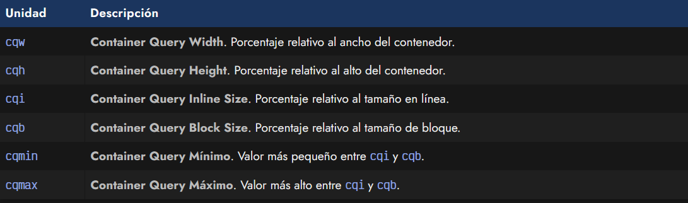

Las unidades cqi y cqb son las propiedades lógicas equivalentes al ancho y alto. Si tienes curiosidad, echa un vistazo al artículo [Propiedades lógicas CSS](https://lenguajecss.com/css/modelo-de-cajas/propiedades-logicas-css/).

## Condiciones con función style()
Aunque aún no tiene muy buen soporte, es posible utilizar la función css style() para realizar comprobaciones concretas en variables CSS y determinar si se deberían aplicar los estilos. Por ejemplo, observa el siguiente ejemplo:

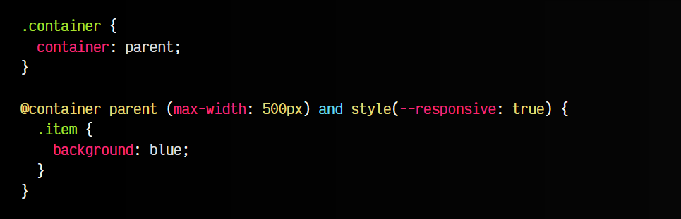

La función style(--responsive: true) comprueba si existe una variable --responsive y está establecida a true, cosa que se puede hacer desde nuestro código CSS, o establecerla desde Javascript y guardarla en una variable CSS, permitiendo hacer nuestras condiciones de contenedores mucho más flexibles.