# 
Preferencias de usuario

Hay que saber que las [media queries](https://lenguajecss.com/css/responsive-web-design/media-queries/) tienen un apartado especial donde podemos utilizar preferencias de usuario. Las preferencias de usuario son reglas @media especiales que nos permiten dar estilo según la preferencia establecida por el usuario en su sistema operativo, adaptándose a su caso particular.

Veamos las reglas de preferencias de usuario que existen:

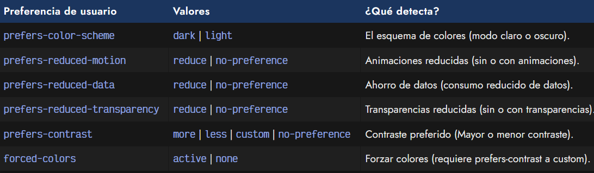

Echemos un vistazo detenidamente a cada una de ellas.

## Dark mode / Light mode
Una de las características más recurrentes en interfaces de usuario es la posibilidad de elegir un dark mode o dark theme, es decir, un sistema que permita al usuario seleccionar un tema claro (generalmente con fondo blanco) o un tema oscuro (generalmente con fondo negro).

Aunque podemos hacer esto de forma manual, existe una regla @media especial denominada prefers-color-scheme donde podemos detectar si el usuario tiene preferencia por uno de estos dos valores (establecido en las opciones del sistema operativo) y actuar en consecuencia.

Las reglas de preferencias de usuario se utilizan como una @media query normal, indicando el valor en cuestión y aplicándole estilos CSS. Observa el siguiente ejemplo, donde usamos la preferencia de usuario prefers-color-scheme asignada al valor dark:

css:
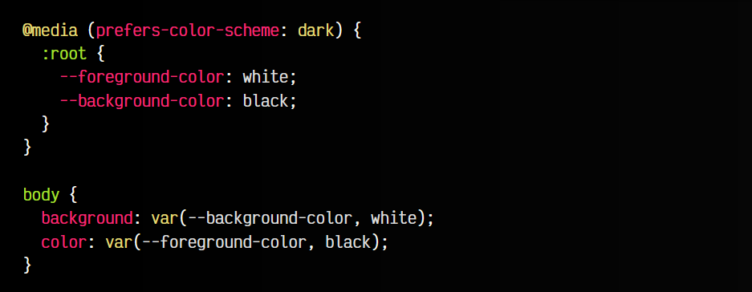

html:

vista:

Observa que hemos establecido para toda la página, con la pseudoclase :root, las variables CSS --foreground-color y --background-color sólo para aquellos usuarios que tengan establecido en el sistema operativo que prefieren interfaces de usuario en modo oscuro. Los valores que es posible indicar son light o dark.

## Movimiento reducido
Las interfaces modernas en la actualidad suelen apostar por diseños con animaciones y transiciones que hacen más agradables los cambios de estado y acciones específicas en una web. Sin embargo, por cuestiones de accesibilidad estas animaciones también pueden suponer molestias a usuarios que son especialmente sensibles a este tipo de estímulos.

En CSS tenemos una característica que permite notificar al desarrollador web si un usuario ha elegido en su sistema que prefiere eliminar o desactivar este tipo de animaciones o transiciones, mediante prefers-reduced-motion, la cuál tiene los valores no-preference o reduce:

css:
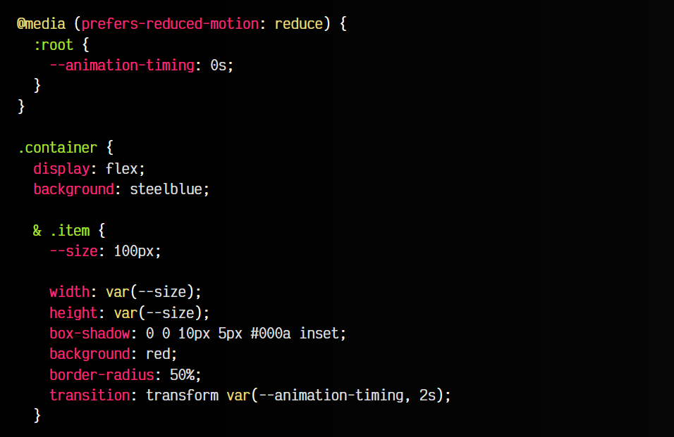
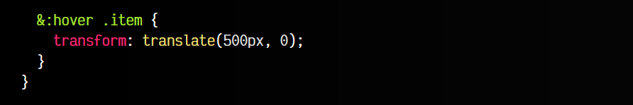

html:
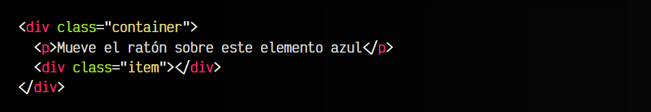

vista:
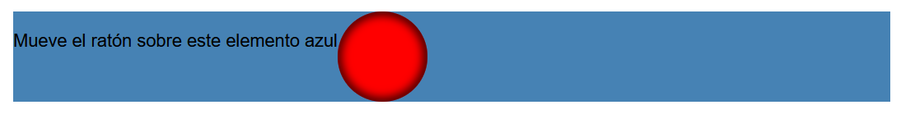

En el ejemplo anterior, utilizamos la variable --animation-timing para indicar el tiempo dedicado para la animación. Si el usuario tiene la preferencia de no usar animaciones, tendrá establecido 0s y no habrá animación, sino que se verá el movimiento instantáneamente. Si el usuario las tiene habilitadas, se utilizará 2s de animación, por lo que si se apreciará.

## Ancho de banda reducido
De la misma forma que en ejemplos anteriores, el usuario puede preferir usar su ancho de banda disponible de forma reducida, evitando así descargas que consuman gran cantidad de datos, con su correspondiente gasto que en ciertas situaciones puede ser un ancho de banda límitado.

La característica prefers-reduced-data nos permite recuperar del sistema o navegador del usuario la opción reduce o no-preference para saber que preferencia tiene seleccionada. De esta forma podemos crear estilos donde se establezcan imágenes de bajo tamaño, o incluso utilizar gradientes o colores sólidos en lugar de imágenes.

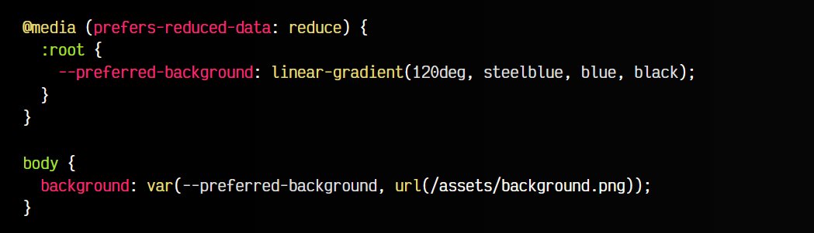

## Efectos de transparencia reducidas
De la misma forma que las preferencias anteriores, podemos indicar en nuestro sistema que preferimos interfaces de usuario donde no se utilicen transparencias o elementos traslúcidos, ya que muchas veces dificultan la visión o lectura, y puede resultar molestos.

Con esta media query, deberíamos poder modificar la opacidad de los elementos para retirar la opacidad. Como siempre, se recomienda usar variables para que sea más sencillo.

css:
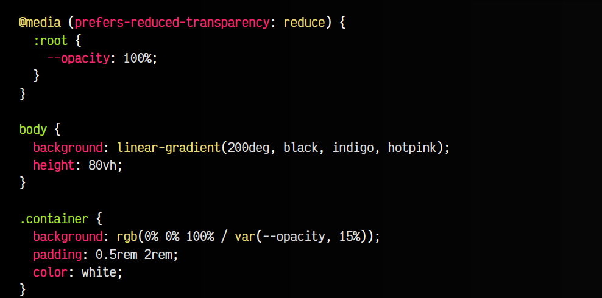

html:
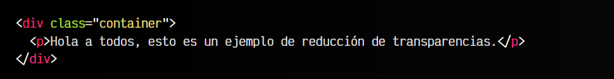

vista:
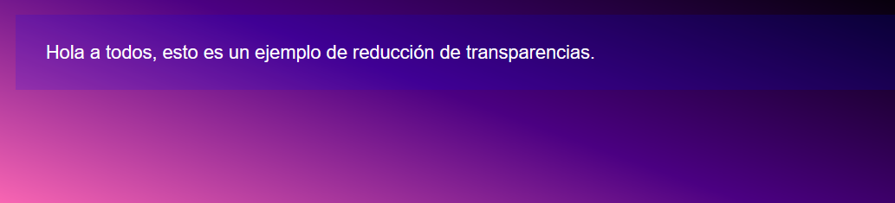

## Preferencia de contraste
Por último, las preferencias de usuario prefers-contrast permiten al usuario establecer que tipo de contraste prefiere. Existen cuatro opciones disponibles:

   - less: Prefiere interfaces con menor contraste.
   - more: Prefiere interfaces con mayor contraste.
   - custom: Prefiere un conjunto de colores personalizado por las palabras clave del sistema.
   - no-preference: El usuario no ha indicado ninguna preferencia especial.

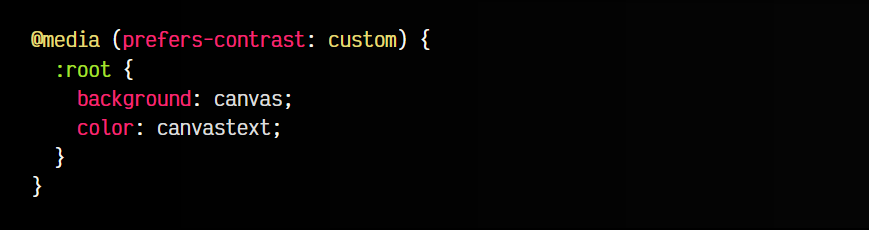

En este ejemplo, estamos usando los [colores del sistema](https://lenguajecss.com/css/colores/codigos-color/#colores-del-sistema).

Por otro lado, mediante la preferencia forced-colors con valor active podemos indicar al navegador que fuerce a utilizar unos colores personalizados si prefers-contrast está establecido a custom.

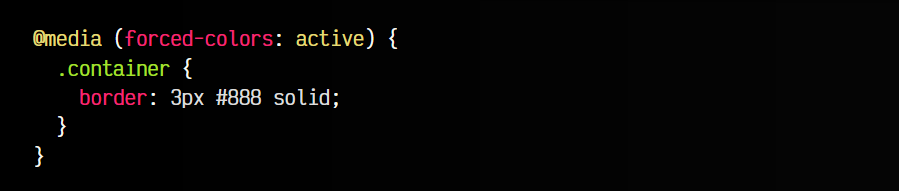

En el caso de tener forced-colors a none, se utilizará el conjunto de colores indicado por el sistema, como se mencionó en el apartado anterior.

