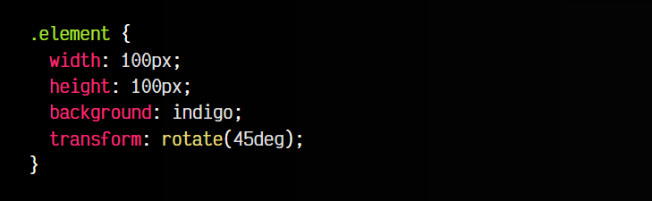
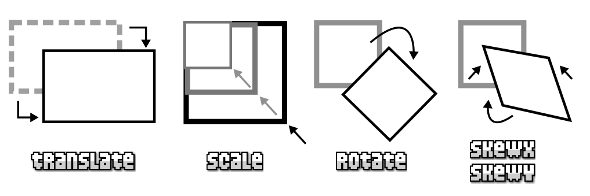
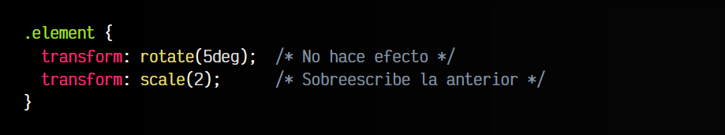
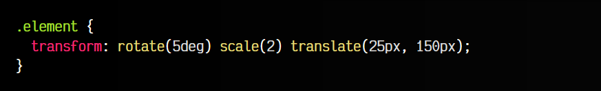
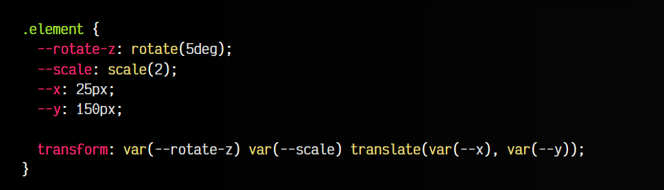
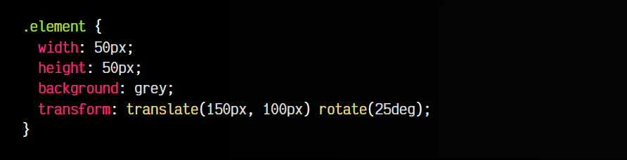
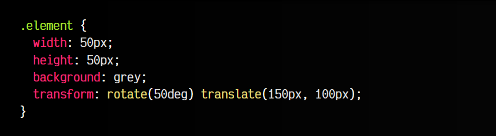
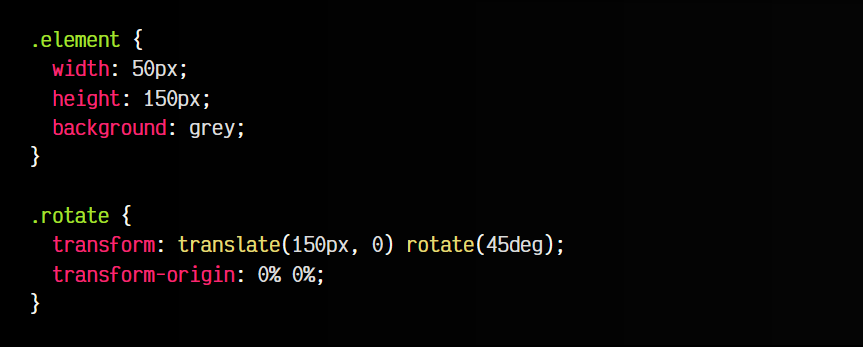

# 
Transformaciones CSS

Las transformaciones son una de las características de CSS más interesantes y potentes que se introducen en el lenguaje para convertir las hojas de estilo en un sistema capaz de realizar efectos visuales 2D y 3D. Con ellas podemos hacer cosas como mover elementos, rotarlos, aumentarlos o disminuirlos y otras transformaciones relacionadas o combinadas.

## La propiedad transform
Estas transformaciones se pueden efectuar en CSS mediante la propiedad transform que permite recibir una función de transformación determinada, la cuál será aplicada en el elemento HTML en cuestión seleccionado mediante CSS. Dicho elemento HTML se verá transformado visualmente.

Así pues, una vez elegimos una de las transformaciones de la lista anterior, las podemos aplicar mediante esta propiedad, escogiendo su función de transformación relacionada. Por ejemplo, imagina que queremos transformar el elemento HTML con clase element y rotarlo 45 grados:

css:

html:

vista:

En este ejemplo, se aplica una función de transformación, concretamente rotate(), con un valor específico en grados. Sin embargo, aún no conocemos bien las funciones disponibles, así que veamos que tipos de transformaciones existen en CSS.

## Funciones 2D

En los enlaces anteriores podrás encontrar más información sobre cada una de las funciones de transformación. Pero además, como veremos más tarde, también podemos realizar transformaciones en el ámbito 3D.

## Transformaciones múltiples
Recuerda que si estableces varias propiedades transform en el mismo elemento con diferentes funciones de transformación, siguiendo la herencia y cascada que se aplica siempre en cualquier propiedad CSS, la segunda propiedad transform sobreescribirá a la anterior propiedad transform, perdiendo el valor de la primera y aplicando sólo el de la segunda:

Para evitar este comportamiento, se pueden emplear múltiples transformaciones separándolas mediante espacio. En el siguiente ejemplo, aplicamos una función de rotación, una función de escalado y una función de traslación de forma simultánea:

Recuerda que también es posible usar propiedades personalizadas de CSS (variables CSS), permitiendo ser más flexibles a la hora de cambiar transformaciones:

Observa que puedes tanto crear variables con las funciones de transformación (en el ejemplo, rotate() y scale()), como guardar los valores directamente (en el ejemplo, --x e --y) y luego utilizarlos en el interior de la función de transformación.

## Orden de transformación
Otro detalle que conviene tener en cuenta a la hora de aplicar múltiples transformaciones es que el orden de transformación importa. No es lo mismo realizar una rotación y luego una translación, que la misma translación primero y luego la misma rotación. Veámoslo en un ejemplo:

css:

html:

vista:

En este primer ejemplo, trasladamos el elemento 150 píxels a la derecha y 100 píxels hacia abajo. Posteriormente, rotamos 50 grados el elemento sobre sí mismo.

Veamos que ocurre si alternamos el orden:

css:

html:

vista:

En este segundo ejemplo, primero realizamos la rotación de 50 grados sobre sí mismo, por lo que al realizar la translación posteriormente, no se hace en horizontal como en el primer ejemplo, sino que se realiza teniendo en cuenta la rotación previa realizada.

## Punto de origen
La propiedad transform-origin nos permite cambiar el punto de origen de una transformación, cosa que en algunos casos puede resultar bastante útil. Dicha función recibe por parámetro la posición de origen de cada eje (X e Y), que podemos indicar, por ejemplo, con porcentajes, y que por defecto, está establecida a 50% 50%:

Para ejemplificar esto, vamos a ver la rotación de un rectángulo, donde se ve muy claramente:

css:

html:

vista:

Observa que hemos cambiado el punto de origen de 50% 50% (valores por defecto) a 0% 0%. Es decir, hemos pasado de el punto central del rectángulo, a el extremo superior-izquierdo del rectángulo. Por lo tanto, a la hora de hacer la rotación tomará ese punto como referencia.
