# 
Bordes con gradientes

Quizás no lo sabías, pero es posible crear bordes con gradientes mediante CSS. No existe una propiedad específica, pero podemos aprovechar que si que hay una propiedad para bordes con imágenes y los gradientes en CSS se clasifican como un tipo de imagen, por lo que se pueden utilizar.

En este artículo utilizaremos la técnica 9-slice para crear el gradiente. Si no la conoces, sería conveniente leer primero el artículo [La técnica 9-slice](https://lenguajecss.com/css/modelo-de-cajas/bordes-imagenes/).

## Crear un botón.
El primer paso es crear los botones. Para ello, utilizaremos dos elementos button, y a uno de ellos le añadimos la clase .fill. Ahora mismo serán iguales, pero más adelante le añadiremos una pequeña diferencia.

Establecemos una tipografía, eliminamos el borde, relleno con padding y colores:

css:
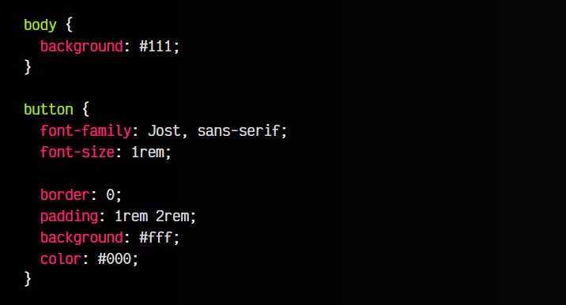

html:
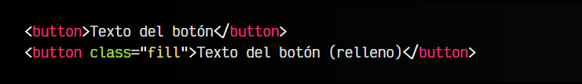

👓vista:
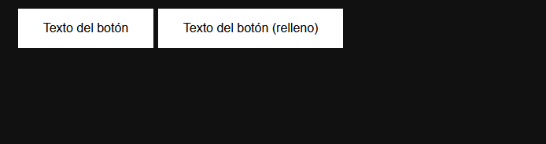

No tiene interacción, se la daremos más adelante.

## Crear un borde con gradientes.
Eliminamos el fondo con none y establecemos el color de texto a blanco. Ahora, vamos a añadir las propiedades de la técnica 9-slice, que es con las que podremos darle un gradiente:

   - 1️⃣ Con border-image-source se suele dar una imagen. Como CSS puede usar gradientes en donde se pueden usar imágenes, añadimos un gradiente lineal, con tres colores.
   - 2️⃣ Con border-image-slice se indica que el borde usará el gradiente completo. Se puede abreviar a 1.
   - 3️⃣ Con border-image-width se indica el tamaño del gradiente.

Nos quedará algo así:

css:
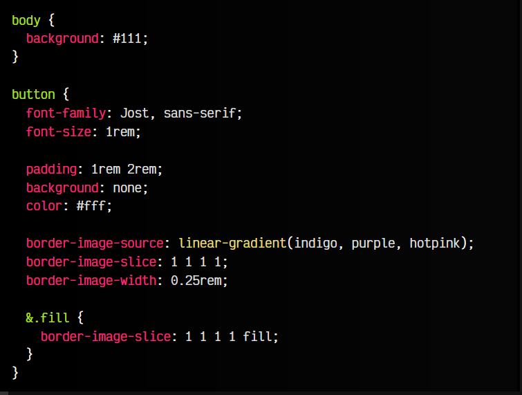

html:
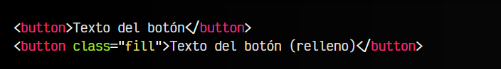

👓vista:
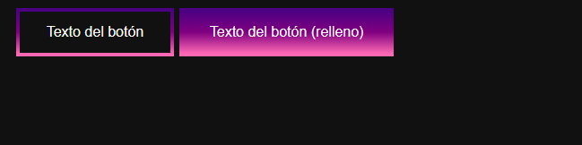

Observa que el segundo botón le hemos establecido un valor 1 1 1 1 fill, esto se comporta exactamente igual que 1 1 1 1, pero sin descartar el relleno, por lo que pinta también el interior.

Podemos cambiar la orientación del gradiente, añadiendo un parámetro antes de los colores con los grados de la dirección, como 74deg o 184deg. También podemos poner diferentes colores, usar transparentes o utilizar otro tipo de gradientes.

La propiedad border-image-source sólo soporta una imagen. No se le pueden establecer múltiples imágenes.

## Borde con gradiente animado.
Si utilizamos un gradiente cónico, podemos establecer que los colores cambien de golpe en un punto concreto, establecido por la palabra clave from 0deg, donde 0deg son los grados donde aparece ese cambio de color.

Sabiendo esto, vamos a modificar el gradiente anterior, y a animarlo utilizando algunos trucos:

css:
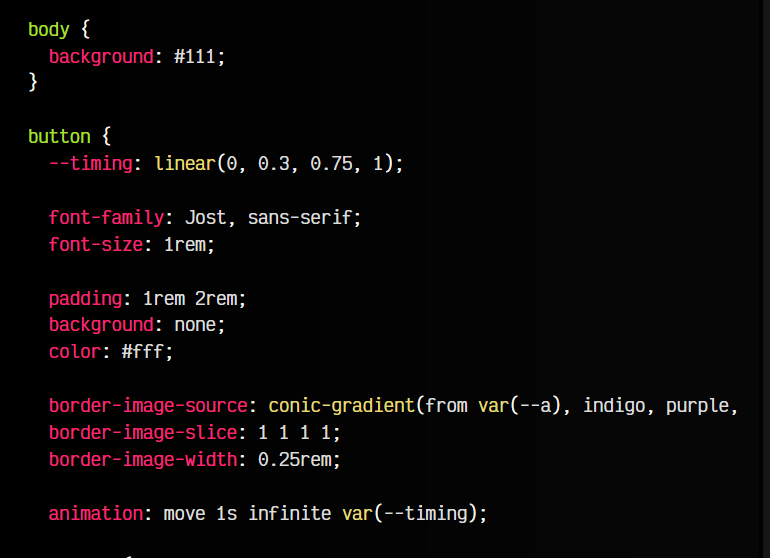
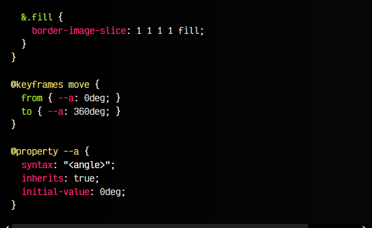

html:
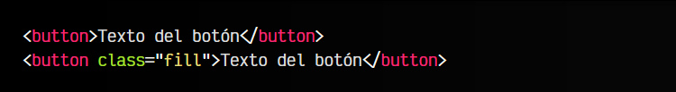

👓vista:
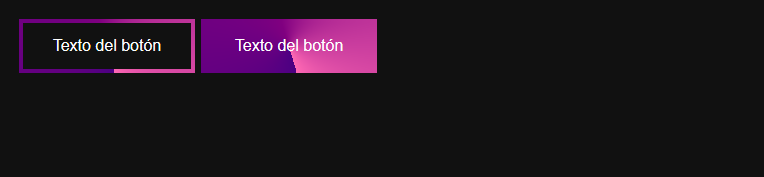

Observa que hemos hecho algunos añadidos:

   - 1️⃣ Cambiamos a un gradiente cónico con conic-gradient().
   - 2️⃣ Los grados donde se coloca inicialmente el gradiente los establecemos en una variable CSS --a.
   - 3️⃣ Animamos el elemento del gradiente, cambiando el valor de --a desde 0deg a 360deg.
   - 4️⃣ Por defecto, esa variable CSS no es animable ya que el navegador no conoce su tipo de dato. Se lo añadimos mediante @property para convertirla en animable.
   - 5️⃣ El ritmo de la animación la definimos en la variable --timing, usando la función linear().

¡Listo!

Por último, puedes añadir algunos detalles para hacer que el botón tenga interacción y no sea tan estático como hemos hecho en estos ejemplos:

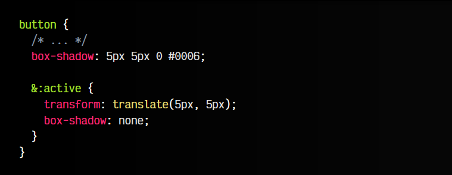