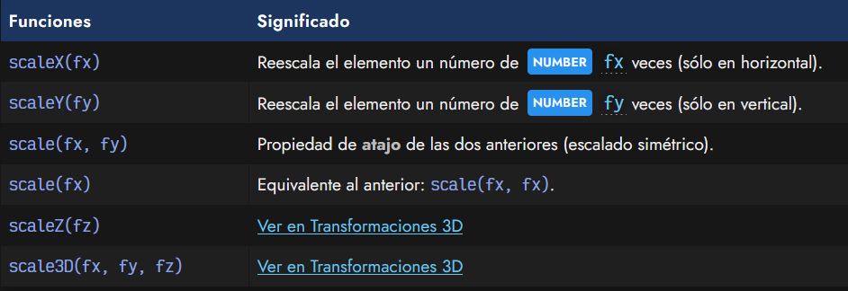
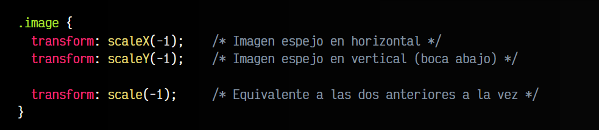
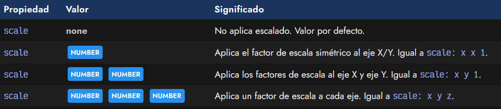

# 
Escalado 2D

Las funciones de escalado son aquellas que realizan una transformación en la que aumentan o reducen el tamaño de un elemento. Para ello, las utilizaremos en el interior de la propiedad CSS transform y elegiremos una de las siguientes funciones de escalado.

## Funciones de escalado
Disponemos de las siguientes funciones de escalado:

Por ejemplo, la propiedad transform: scale(2, 0.5) realiza una transformación de escalado del elemento, ampliándolo al doble de su tamaño original en el eje X (horizontal) y a la mitad en el eje Y (vertical).

## Efecto espejo con CSS
Con la función de escalado de CSS se puede hacer un efecto «mirror» y darle la vuelta a una imagen, por ejemplo, de forma muy sencilla. Basta con utilizar la función scale(-1) con valor negativo. Si 1 representa a la imagen tal cual está, -1 es la imagen invertida.

## La propiedad scale
En nuevas versiones de los navegadores, ya se soporta la propiedad individual scale, y no hace falta utilizarla dentro de la propiedad transform.

También es posible utilizar porcentajes en lugar de números. Por ejemplo, scale: 50% 100% sería equivalente a scale: 0.5 1.