# 
Perspectivas CSS

Cuando trabajamos con 3D en CSS, en muchas ocasiones es necesario dotar a nuestro trabajo de perspectiva. Con la propiedad perspective de CSS podemos establecer un punto de fuga con una cierta distancia:

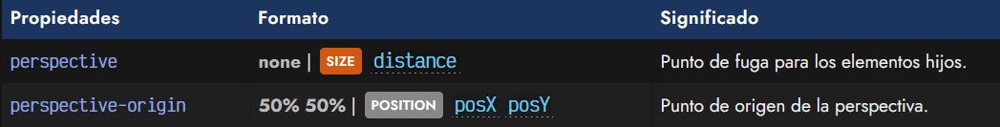

La propiedad perspective nos permite darle un determinado punto de fuga al elemento hijo de un contenedor (debemos utilizarlo desde el contenedor padre), y se le aplica una cierta distancia, por ejemplo 400px. Mediante la propiedad perspective-origin podemos cambiar el punto de origen de la perspectiva, y con backface-visibility, podemos ocultar la cara «trasera» de un elemento, como explicaremos más adelante.

## La propiedad perspective
Por defecto, la propiedad perspective-origin tiene un valor de 50% 50%, pero podemos cambiar estos valores (eje x y eje y) que representan el desplazamiento del origen de la perspectiva desde el punto superior izquierda del contenedor de referencia.

Al margen de cantidades, por ejemplo, en píxeles, también podemos indicar o valores como top, bottom, left, right o center.

Veamos un pequeño ejemplo donde se puede ir disminuyendo y ampliando el valor de perspective para ver como influye:

css:
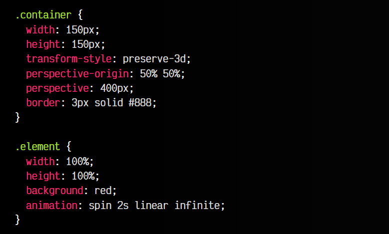

html:
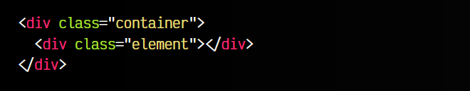

vista:
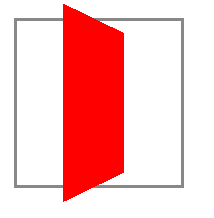
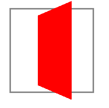

Observa que el valor de perspective-origin es el valor que tiene por defecto. Puedes cambiarlo para observar como repercute en el ejemplo.

## La propiedad backface-visibility
Es posible que cuando tengamos un espacio 3D con elementos HTML, perspectiva y transformaciones, queramos que el elemento gire y en un momento concreto se visualice la cara A de nuestro elemento (una imagen, un cubo, etc...) y cuando haya girado completamente se vea la cara B del elemento.

Por la forma en la que trabaja CSS, puede que eso no ocurra y se vea siempre la misma cara, ya que no estamos trabajando con objetos 3D reales. Para ello, podemos utilizar la propiedad backface-visibility.

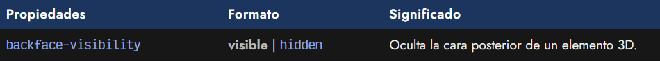

La propiedad backface-visibility puede tomar dos valores: visible, el valor por defecto, y hidden. Mientras que el primero es que muestra siempre las caras, el segundo es el que nos permitirá ocultarla cuando la cara trasera de un elemento se este mostrando al usuario.

Veamos como funciona:

css:
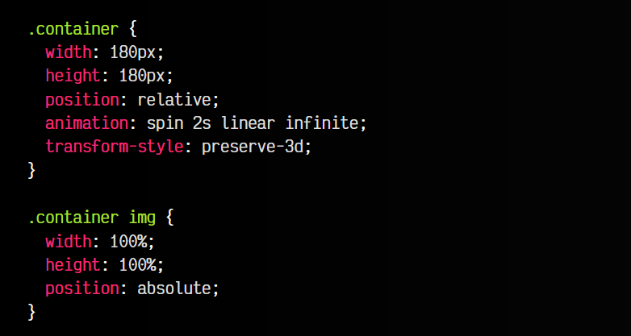
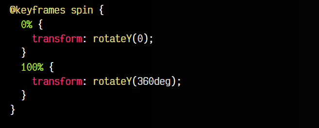
html:
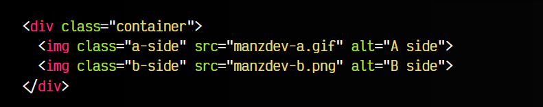

vista:
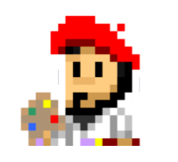
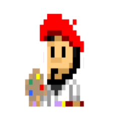

Si nos fijamos en este ejemplo, hemos creado dos imágenes dentro de un contenedor. Ambas están posicionadas de forma que estarán superpuestas y si les aplicamos una animación que rote el contenedor en 360 grados sobre el eje Y, podremos comprobar que siempre veremos la imagen B, la última de ellas puesto que es la que tiene preferencia porque es la última que aparece en el orden de HTML.

Si ahora le añadimos la propiedad backface-visibility a hidden en la imagen B, entonces el navegador la ocultará cuando detecte que se encuentra en la cara posterior, simulando el 3D real:

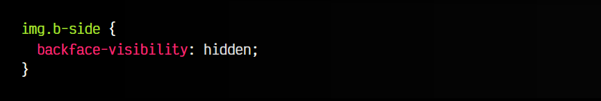

Observa que ahora el resultado sería el adecuado. Aquí tienes una demo donde puedes comprobar la diferencia:

css:
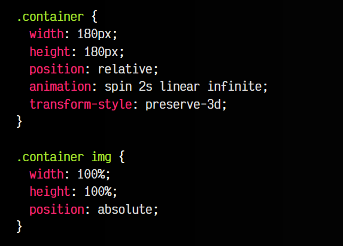
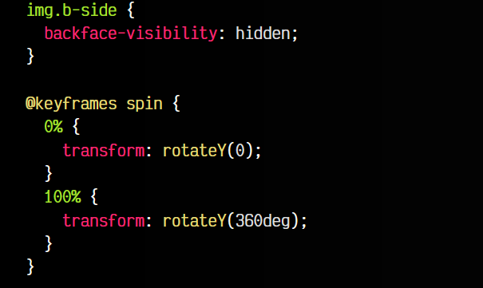

html:
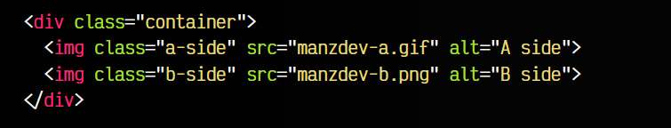

vista:
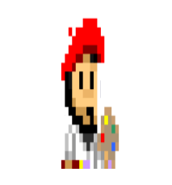
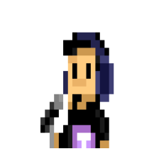

