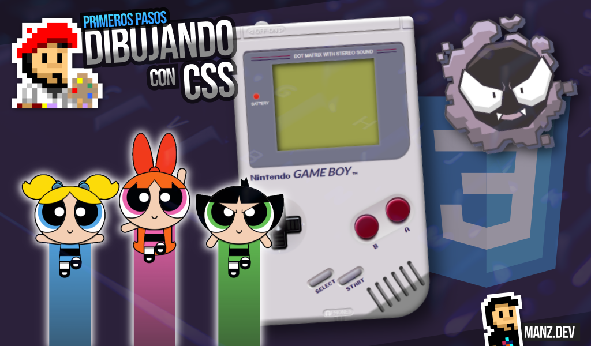
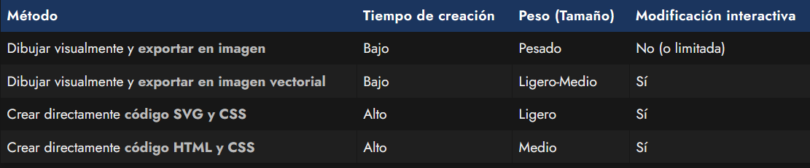
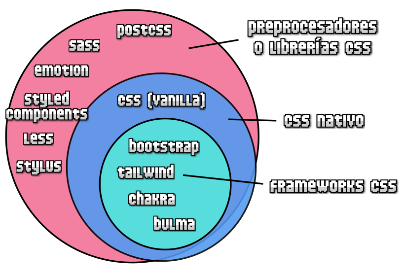

# 
¿Cómo dibujar con CSS?

Quizás hayas escuchado hablar de ciertos conceptos normalmente denominados CSS Art (Arte CSS) o Dibujos CSS. Se refieren a la acción de escribir código CSS para crear dibujos o ilustraciones sin utilizar imágenes, es decir, en lugar de dibujar con un programa de diseño gráfico o ilustración, lo hacemos solamente mediante código HTML y dándole estilo con código CSS.

Esto, en principio, nos podría resultar sorprendente, llamativo (o incluso inútil), pero conviene tener un poco más de contexto y entender bien por qué puede ser interesante, por lo que voy a profundizar en ello.

## ¿Dibujar con CSS es práctico?
Quizás una de las preguntas más frecuentes sobre este tema es si dibujar con CSS es algo práctico. Normalmente, la respuesta es no, aunque depende del caso y de como se dibuje. Si pensamos exclusivamente en la cuestión práctica, dibujar con HTML/CSS no suele ser lo habitual, ya que en muchos aspectos será más práctico hacerlo con SVG/CSS o directamente ilustrar mediante un programa de diseño gráfico. La siguiente tabla muestra un resumen generalizado:

Normalmente, cuanto más arriba en esta lista estamos, más rápido suele ser el proceso de elaboración (y menos control tenemos sobre la imagen para interactuar sobre ella). Cuanto más abajo, más lento es el proceso de elaboración, y por ello, lo más probable es que menos práctico.

Sin embargo, hay que tener en cuenta que una de las ventajas de tener una ilustración en código, es que suele ser mucho más fácil de modificar ciertos detalles de forma interactiva como cambiar colores, modificar coordenadas o ubicaciones de elementos, o es mucho más sencillo animar la ilustración ante interacciones del usuario en una web.

## ¿Por qué dibujar con CSS?
Entonces, si es menos práctico que otras opciones... ¿por qué elegir la opción de dibujar con CSS? Desde mi punto de vista, hay varias respuestas para esta pregunta. Las detallo a continuación:

   - Ayuda a entender, profundizar y mejorar nuestros conocimientos de CSS.
   - En ejemplos complejos, te fuerza a aprender a organizar CSS (imprescindible).
   - Te obliga a buscar vías alternativas o diferentes de diseñar o crear prototipos.
   - Te reta a exprimir al máximo CSS y te fuerza a buscar soluciones.
   - ¡Es entretenido, divertido y sorprendente!

Si eres capaz de dibujar algo con CSS... luego, diseñar una web te resultará un juego de niños.

## Dibujar con CSS no es real
Dibujar con CSS no es real

Otro detalle muy mencionado alrededor de los dibujos con CSS es que «no tiene que ver con el mundo real». Es cierto que al dibujar con código se puede llegar a abusar de muchas prácticas que no se usan en el día a día del diseño y desarrollo web, pero esto depende mucho de como se dibuje y del tipo de dibujo o ilustración a conseguir.

Dentro del mundo del desarrollo web, respecto a CSS, se puede elegir varias formas de trabajar: con CSS nativo, con frameworks CSS o con librerías o preprocesadores (o similares). Cada uno de ellos abarca un cierto ámbito de posibilidades, que he intentado reflejar en este gráfico:

En resumen: Con CSS vanilla, podemos hacer cosas que no se pueden hacer con los frameworks CSS, ya que estos últimos son una «versión reducida» de las cosas más prácticas y usadas al diseñar o desarrollar una web. Normalmente, con los frameworks CSS puedes conseguir esa parte común de una forma mucho más rápida y práctica que con CSS puro. De la misma forma, hay cosas que con CSS vanilla no es posible hacer y, sin embargo, si usamos preprocesadores, transformadores o librerías que hacen uso de Javascript o lenguajes de programación, si es posible.

Cuando dibujamos con CSS ocurre algo parecido. Hay ciertas estrategias que podemos utilizar que se salen del ámbito de frameworks CSS (que habitualmente se centra en diseñar interfaces de usuario) pero siguen formando parte del estándar de CSS y existen para casos concretos.

Por estas razones, yo aconsejo seguir esta serie de pautas cuando dibujamos con CSS:

   - Escribir HTML semántico: cada etiqueta es un elemento "lógico" del dibujo.
   - Intentar utilizar el menor número de capas posibles.
   - Promover el uso de flex o grid para colocar elementos.
   - Dejar como última opción propiedades como position o transform.
   - Promover el uso de nesting o webcomponents para encapsular, organizar y reutilizar.
   - Usar la potencia del CSS nativo (estándar y características futuras).

De esta forma, a parte de estar dibujando con CSS, estaremos aprendiendo buenas prácticas y estrategias que nos servirán en el futuro, que harán que seamos más ágiles al pensar y que podremos complementar cuando estemos diseñando interfaces de usuario.

