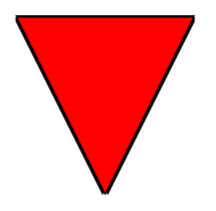
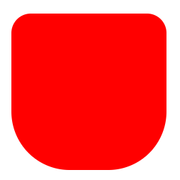

# 
Primeros pasos: Estructura CSS

Para crear un dibujo con código CSS, es bueno tener en cuenta una buena estrategia a la hora de crear código HTML, y también tener en cuenta algunos avisos y advertencias que he escrito en los artículos anteriores. Pero probablemente, la parte más importante es como escribir el código CSS, y una serie de consejos y estrategias para dibujar con código que voy a explicar a continuación.

Para dibujar con CSS la parte de organizar el código CSS es clave, por lo que recomiendo hacer especial hincapié en este tema e intentar ser lo más organizado posible.

Entre estas estrategias nos encontraremos las siguientes:

## Usar variables CSS
Un buen consejo a la hora de trabajar con dibujos CSS es parametrizar en variables todo lo susceptible a reutilizar. Importante: No se trata de meter en variables todo lo que vayas a usar. No hay que sobreparametrizar, una buena estrategia sería utilizar variables si vamos a utilizar en más de 2 ó 3 lugares un determinado valor (colores, unidades, etc...).

Por ejemplo, si estamos haciendo un personaje, es muy posible que el color de la piel lo vayamos a utilizar en la cara, manos, piernas, etc. por lo que quizás podría ser interesante crear una variable --skin-color con el código de color. De este modo, si en el futuro queremos cambiarle el color de la piel, sólo tendremos que hacerlo en esa variable y no en todos los lugares donde se usa.

Es muy importante también intentar que el ámbito de esa variable sea lo más reducido posible. Por ejemplo, si esa variable se utiliza en todo el documento, la definimos en :root (equivalente a html), pero si sólo lo utilizamos dentro de la clase .character-body, entonces la definimos en dicho elemento. Las variables CSS siempre se definen en las primeras líneas de un grupo de estilos y se separa con una línea en blanco.

► Leer más: CSS [Custom Properties (Variables CSS)](https://lenguajecss.com/css/cascada-css/css-custom-properties/)

## Organizar código CSS
Quizás con dibujos muy pequeños no sientas la necesidad de hacerlo, pero si intentas hacer un dibujo medianamente grande, las líneas de código necesarias de CSS pueden ascender muy rápidamente. Por ejemplo, la GameBoy con CSS tiene aproximadamente unas 800 líneas de código CSS y el Funko POP con CSS cerca de 900 líneas de código. Es muy difícil tener en la cabeza toda esa cantidad de código, cantidad de clases y subclases sin solapamientos ni problemas de especificidad, y mucho menos, que sea fácil de mantener a lo largo del tiempo, por lo que una de las mejores formas de organizar todo esto es organizar (y encapsular) tu contenido.

Existen múltiples formas de organizar tu código CSS. Una de las más populares (utilizadas en los frameworks Javascript actuales) es usar sistemas como CSS Modules, que nos permiten separar en ficheros diferentes. También puedes hacer uso de los módulos de Sass con @use para poder importar desde archivos externos. Otras estrategias interesantes pueden ser utilizar metodologías CSS o nomenclaturas como BEM (o similares), que ayudan a que el código sea más intuitivo y fácil de gestionar.

Una de mis estrategias preferidas para organizar código es utilizar Nesting CSS. Es una característica que permite anidar clases y código CSS dentro de otras clases, lo que nos aporta una mayor organización del CSS, clasificándolo por la estructura que lo contiene. El Nesting CSS se puede hacer tanto con preprocesadores de CSS (Sass) como con PostCSS o Parcel CSS (u otras herramientas similares). En el futuro, está planteado que tenga soporte desde CSS vanilla, pero actualmente es necesario utilizar alguna de estas herramientas ya que los navegadores aún no lo soportan.

► Más: [Nesting CSS: Código CSS anidado](https://lenguajecss.com/postcss/plugins/css-nesting/)

## Reutiliza código CSS
Muy relacionado con el apartado anterior, está el tema de la encapsulación. Dibujando (o escribiendo código CSS en general), al igual que en la programación, estamos expuestos a repetir código que se podría reutilizar, ahorrando espacio y facilitando modificaciones futuras. Además, una característica deseable es la encapsulación, una forma de dividir pequeñas partes de nuestro diseño, encapsularlas en una más simple y «olvidarnos» de su interior, de forma que sea más fácil gestionarlo desde fuera. Sin embargo, la naturaleza global de CSS hace que este tipo de encapsulación no sea trivial... ¡Pero no es imposible!

Por ejemplo, en frameworks como Vue utilizan los estilos scoped, es decir, cada componente de Vue decide si utilizará estilos globales o que solo afecten al componente. En el caso de React es más complejo, porque hay mucha variedad de formas. Una de mis preferidas es utilizar WebComponents con Shadow DOM, es decir, create tus propias etiquetas HTML decidiendo si encapsular estilos o no.

► Más: [¿Qué son los WebComponents?](https://lenguajejs.com/webcomponents/componentes/que-son-webcomponents/)

## Posicionar elementos
Cuando dibujamos con CSS es muy habitual utilizar la propiedad position para ubicar y colocar elementos en el espacio de la página, algo que no es tan habitual al desarrollar páginas web.

Una de las prácticas más comunes es colocar un elemento interno con position: absolute, mientras su elemento contenedor (sea padre, abuelo, bisabuelo o un ancestro superior) tiene position: relative. De esta forma, conseguirás posicionar el elemento interno en base al contenedor. Luego, con las propiedades top, bottom, left y right, o su propiedad de atajo inset, se puede colocar y desplazar en el espacio.

► Más: [La propiedad position ](https://lenguajecss.com/css/posicionamiento/position/)de CSS

## Usando ::after y ::before
En los dibujos con CSS también es muy habitual utilizar los pseudoelementos ::after y ::before. Básicamente, se trata de unos pseudoelementos que dan la posibilidad de dar estilo al inicio y al final de los elementos y nos ahorran tener que modificar el HTML para añadir elemento sencillos.

Imaginemos por ejemplo el siguiente código:

css:

html:

vista:

En este caso, creamos un ojo con CSS, con su iris y su pupila. Observa que sólo tenemos un elemento HTML simple, con clase .eye. Como dentro solo vamos a tener dos elementos extra (iris y pupila), se los asignamos a ::before y ::after respectivamente y esto nos evita tener que estar reestructurando el HTML y todos los cambios que necesitaríamos.

Sin embargo, este código puede modificarse fácilmente en lo siguiente, sin utilizar ::before y ::after:

css:

html:

vista:

Como puedes ver, en los dibujos con CSS es muy habitual utilizar ::before y ::after, pero no es absolutamente necesario, sólo que muchas veces es muy práctico.

► Más: [Los pseudoelementos CSS](https://lenguajecss.com/css/pseudoelementos/que-son/)

## Gradientes compuestos
Cuando necesites dibujar elementos complejos, piensa siempre en la posibilidad de usar gradientes. Los gradientes son simples, sí, pero recuerda que tenemos 3 tipos de gradientes en CSS:

   - [Gradiente lineal](https://lenguajecss.com/css/gradientes/linear-gradient/), un gradiente en una dirección definida
   - [Gradiente radial](https://lenguajecss.com/css/gradientes/radial-gradient/), un gradiente con forma circular o elíptica
   - [Gradiente cónico](https://lenguajecss.com/css/gradientes/conic-gradient/), un gradiente cónico (punto de vista de un cono desde arriba)

Además, podemos superponer varios de ellos, uno encima de otro. Por si fuera poco, los gradientes están formados por 2 o más colores, y uno de ellos, podría ser un color transparente (o semi transparente), de modo que se visualice el gradiente que está por debajo, consiguiendo posibilidades muy interesantes y fabricando mecanismos muy potentes para realizar cosas mucho más complejas.

## Recortes con clip-path
Si hay una parte de un elemento que quieres descartar, recuerda que puedes aplicar la propiedad clip-path y recortar un elemento para quedarte sólo con la parte que te interesa. Se pueden realizar recortes de múltiples formas:

   - Recortes rectangulares con inset()
   - Recortes circulares con circle()
   - Recortes elípticos con ellipse()
   - Recortes poligonales con polygon()
   - Recortes de trayectos SVG con path() o url(file.svg)

Los dos últimos puntos, de los más potentes, si queremos formas muy irregulares y específicas.

► Más: [La propiedad clip-path de CSS](https://lenguajecss.com/css/mascaras-y-recortes/clip-path/)

## Bordes con drop-shadow
En algunos casos nos puede interesar hacer un recorte CSS y quedarnos con una porción de un elemento, por ejemplo, utilizando clip-path y recortando una porción. Por ejemplo, en el siguiente código, vamos a crear un triángulo en el elemento con clase .element:

css:

html:

vista:

Comprobarás que si queremos colocar un borde a dicho elemento con border, no funcionará, ya que al estar recortado el elemento, también lo están sus bordes, por lo que sólo se aprecia el borde superior (el único que está fuera de la región recortada). Lo mismo ocurriría si intentamos usar una sombra a modo de borde con box-shadow o con filter: drop-shadow.

Sin embargo, podemos añadir un contenedor al elemento (o elementos, pueden ser varios) recortado, y aplicarle un filter: drop-shadow al contenedor, lo que hará que cree una sombra respetando los recortes que hicimos en los elementos internos:

css:

html:

vista:

En este caso, observa que el contenedor tiene un filter múltiple, con 4 funciones drop-shadow(), una para cada borde:

   - 0 -3px 0 black Un borde por la parte superior
   - 0 3px 0 black Un borde por la parte inferior
   - -3px 0 0 black Un borde por la parte izquierda
   - 3px 0 0 black Un borde por la parte derecha

Si lo deseas, puedes modificar estas cantidades, añadir más drop-shadow o meter los elementos en variables CSS para que sea más cómodo de modificar.

► Más: [La propiedad filter de CSS](https://lenguajecss.com/css/efectos/filtros-css/)

## Ocultar desbordamientos
A efectos de dibujar con CSS, es muy interesante conocer estrategias para ocultar desbordamientos. Por ejemplo, una de las más sencillas es utilizar la propiedad overflow en el elemento contenedor.

Pero primero, establezcamos un ejemplo básico:

css:

html:

vista:

Tenemos un circulo rojo en un fondo azul celeste. Mi intención es quedarme con la mitad izquierda del círculo. ¿Cómo podemos conseguir esto? Principalmente, dos variaciones, ambas usando la propiedad overflow. La primera, reducir el tamaño del contenedor:

css:

html:

vista:

Observa que overflow con su valor hidden indica al navegador que todos los hijos que se salgan de la región del contenedor, desaparezcan, y sólo sea visible lo que esté dentro de ese elemento de 100x200.

También tenemos otra opción, que es la de desplazar el elemento interior un 50% a la derecha, lo que hará que la mitad del círculo se salga del contenedor y, nuevamente, con overflow desaparezca lo que sobre:

css:

html:

vista:

La única diferencia, que en este caso, el semicírculo está desplazado hacia la derecha.

► Más: [La propiedad overflow de CSS](https://lenguajecss.com/css/modelo-de-cajas/overflow/)

## Formas con border-radius
En algunos casos, puede que necesitemos crear una forma particular que se puede crear con la propiedad border-radius.

Muchos saben y conocen que border-radius se utiliza para redondear esquinas, donde podemos darle un valor con el radio a utilizar. Sin embargo, no es tan conocido que existe una sintaxis con varios parámetros del border-radius que es mucho más potente:

css:

html:

vista:

Con este ejemplo, comprobarás que tendremos un cuadrado rojo, donde las esquinas superiores están un poco redondeadas (25px), y las esquinas inferiores están bastante más redondeadas (75px).

El primer valor antes del / simboliza el radio horizontal de la esquina superior izquierda, mientras que el primer valor después del / es el radio vertical de la esquina superior derecha, y así respectivamente con cada uno. Si los valores antes del / son los mismos que después del / (como en el ejemplo anterior) sería equivalente al siguiente ejemplo:

css:

html:

vista:

Recuerda que desde que uses un valor de 0 en uno de los extremos, el opuesto también estará a 0. Valores negativos no están permitidos.

► Más: [La propiedad border-radius de CSS](https://lenguajecss.com/css/modelo-de-cajas/border-radius/)

## Sombras combinadas
Es importante tener en cuenta que las sombras combinadas son una herramienta muy potente a la hora de trabajar para hacer dibujos con CSS. Aportan textura a los diseños y los hace más vistosos.

Recuerda que tienes a tu disposición 3 tipos de sombras:

   - Sombras de caja, mediante [box-shadow](https://lenguajecss.com/css/sombras/box-shadow/), permitiendo blur, spread e inset.
   - Sombras de texto, mediante [text-shadow](https://lenguajecss.com/css/sombras/text-shadow/), permitiendo blur.
   - Sombras idénticas, mediante [filter: drop-shadow()](https://lenguajecss.com/css/sombras/drop-shadow/), permitiendo blur.

Cada una de ellas se pueden combinar y acumular, en los dos primeros casos, separando por comas, y en el último, separando las funciones drop-shadow() con espacios.

## Restar formas con máscaras
Existe una forma interesante de crear formas específicas en un elemento. Se trata de crear máscaras con la propiedad mask-image. Para ello, podemos utilizar imágenes mediante la función url(), o gradientes, mediante las funciones linear-gradient(), radial-gradient() o conic-gradient().

En el siguiente ejemplo, creamos un .element que tiene un color de fondo gradiente de negro a azul marino. Con la propiedad mask-image establecemos las partes que van a ser visibles con un color, y las partes transparentes utilizando transparent o colores con canales alfa para transparencias parciales.

Veamos un ejemplo donde combinamos un gradiente radial con uno cónico (ambos con repetición) en una máscara CSS:

css:

html:

vista:

Observa que la propiedad CSS mask-image requiere el prefijo -webkit para funcionar en ciertos navegadores. Echa un vistazo a su compatibilidad en [mask-image](https://caniuse.com/mdn-css_properties_mask-image) en CanIUse.

► Más: [Máscaras en CSS](https://lenguajecss.com/css/mascaras-y-recortes/mask-image/)